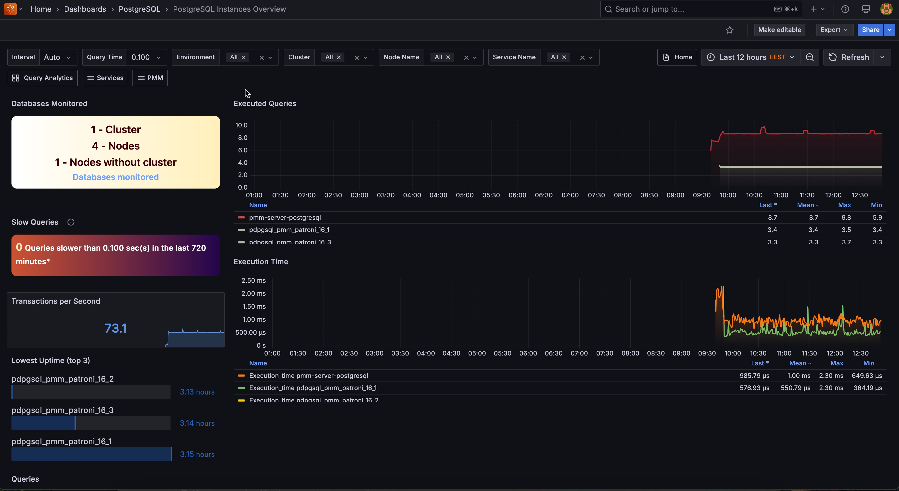

# PostgreSQL Instances Overview

This dashboard shows a high-level overview of all your PostgreSQL instances to help you quickly identify performance trends across your entire database infrastructure.

Start here when you need to compare performance across all your databases, identify slow queries affecting multiple services, or get a bird's-eye view of your PostgreSQL infrastructure health.

## Databases Monitored
Shows a summary of your PostgreSQL monitoring coverage including the number of clusters, total nodes, and nodes without cluster configuration. The **Databases monitored** link takes you to the full inventory of monitored services for detailed management.

## Executed Queries  
Shows query execution trends for your top 5 busiest PostgreSQL services over time. Sudden spikes may indicate performance issues or unexpected workload changes that need investigation.

## Slow Queries
Shows the total count of queries that exceeded your configured slow query threshold across all monitored services over the selected time range. 

Focus on reducing this number across your infrastructure. High slow query counts indicate widespread performance problems that need systematic optimization.

## Transactions per Second
Shows the current transaction rate across all your PostgreSQL services combined. Use this as a high-level health indicator. Dramatic changes in TPS may indicate infrastructure issues, application problems, or significant workload shifts.

## Execution Time
Shows average query execution time trends for your PostgreSQL services over time. 

Watch for services with increasing execution times. Rising trends indicate performance degradation that needs investigation and optimization.

## Queries
Shows a detailed table of recent queries across all your PostgreSQL services with execution times, sorted by performance. Focus optimization efforts on queries with the highest execution times. This cross-service view helps you identify the most impactful slow queries across your entire infrastructure.