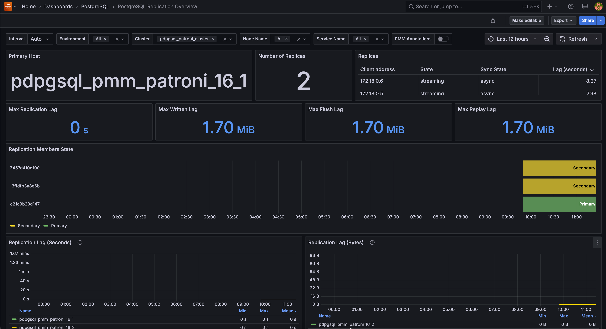

# PostgreSQL Replication Overview 

This dashboard monitors PostgreSQL streaming replication health, tracks lag between primary and replica nodes, and identifies replication issues. 

This information is essential for database administrators managing high-availability PostgreSQL setups who need to verify replication status, troubleshoot lag problems, or investigate failover readiness. 

Start here when you need to check if your replicas are keeping up with the primary, diagnose replication conflicts, or verify your disaster recovery setup is working properly.

## Primary Host
Shows which server currently acts as the primary (master) node in your replication setup. 

Monitor this to verify the correct node is serving as primary - unexpected changes indicate failover events or configuration issues.

## Number of Replicas
Shows how many replica servers are currently connected and replicating from your primary. 

Watch for drops in replica count - missing replicas reduce your high availability protection and may indicate network or configuration problems.

## Replicas
Shows detailed information about each replica including client address, replication state, sync state, and current lag in seconds. 

Focus on replicas with high lag values or "streaming" state issues - these indicate replication problems that need immediate attention.

## Max Replication Lag
Shows the longest delay (in seconds) between when the primary processes a transaction and when your slowest replica applies it. 

Set alerts based on your data loss tolerance because if your primary fails, you'll lose any transactions from the lag period when failing over to a replica.

## Max Written Lag  
Shows the maximum lag in bytes for WAL data written to replicas. 

Monitor for consistently increasing values because growing written lag indicates network or replica performance issues.

## Max Flush Lag
Shows the maximum lag in bytes for WAL data flushed to disk on replicas. 

Watch for spikes during heavy write periods because high flush lag can indicate storage performance bottlenecks on replica nodes.

## Replication Members State
Shows the timeline of which nodes served as primary (green) versus secondary (yellow) over time. 

Look for frequent role changes because excessive switching may indicate cluster instability or configuration problems.

## Replication Lag (Seconds)
Shows replication lag trends over time measured in seconds for each replica. 

Set alerts for lag spikes above your SLA requirements because sustained high lag indicates replicas cannot keep up with primary workload.

## Replication Lag (Bytes)
Shows replication lag trends over time measured in bytes for each replica. 

Monitor for consistently growing lag because increasing byte lag often precedes time-based lag increases.

## Top 10 Replication Conflicts by Node
Shows nodes experiencing the highest rates of replication conflicts. 

Investigate nodes with consistent conflicts because frequent conflicts indicate query interference between primary workload and replica recovery.

## WAL Activity
Shows Write-Ahead Log activity including WAL writes and data transfer rates to replicas. 

Monitor for unusual spikes or drops because changes in WAL patterns can indicate performance issues or configuration changes.

## Replication Slots Status
Shows the status of replication slots with `1` indicating active slots and `0` indicating inactive slots. 

Ensure critical replicas maintain active slots because inactive slots can cause WAL retention issues and storage problems on the primary.

## Top 10 Replication Conflicts
Shows databases experiencing the highest rates of replication conflicts. 

Focus optimization efforts on databases with frequent conflicts considering that high conflict rates can slow replica recovery and affect read query performance.