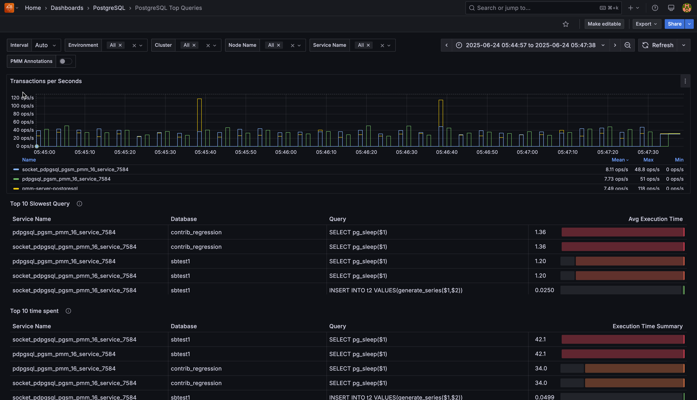

# PostgreSQL Top Queries

This dashboard analyzes query performance across your PostgreSQL instances, helping you identify and optimize slow queries that impact database performance.

### Transactions per Second
Shows the rate of committed transactions for each PostgreSQL instance. The metric combines both regular and replicated transactions, displayed as operations per second with step interpolation for accurate counting between data points.

Use this to monitor database activity levels and identify workload patterns across your instances. The table below the graph shows mean, max, and min values for each service.

### Top 10 Slowest Queries

Displays queries with the highest average execution time across your PostgreSQL databases. Each row shows:

- **Service Name**: PostgreSQL instance running the query
- **Database**: database where the query executed
- **Query**: normalized query fingerprint
- **Avg Execution Time**: average time per query execution, visualized with a color-coded gauge

System queries and PostgreSQL internal operations (`pg_stat_*`, `pg_replication_slots`, etc.) are automatically filtered out to focus on application queries.

The gauge visualization uses a gradient from green to red, making it easy to spot the worst-performing queries at a glance.

Use this table to prioritize query optimization efforts for maximum performance impact.

### Top 10 time spent
Shows queries that consumed the most total execution time across all your PostgreSQL services, ranked by cumulative time spent. 

Focus optimization efforts on the top queries in this list because reducing their execution time will have the biggest impact on overall system performance.

### Top 10 Queries Executed the most
Shows queries that ran most frequently across your PostgreSQL infrastructure, regardless of individual execution time. 

Monitor these for optimization opportunities because even small performance improvements to frequently-executed queries can significantly reduce overall system load.

### Top 10 Queries writing the most
Shows queries that affected the most rows through write operations (INSERT, UPDATE, DELETE) across your services. 

Review these queries for efficiency because high row counts may indicate bulk operations that could benefit from batching or optimization to reduce lock contention.

### Top 10 Queries Affected the most rows
Shows queries that processed the largest number of rows (both read and write operations) across all your PostgreSQL services. 

Investigate these queries for potential optimization because they represent the highest data processing workload and may benefit from indexing or query restructuring.

### Top 10 User Executed the most queries
Shows which database users generated the most query activity across your PostgreSQL infrastructure. 

Use this to identify heavy database users and understand usage patterns that may require capacity planning or access optimization.