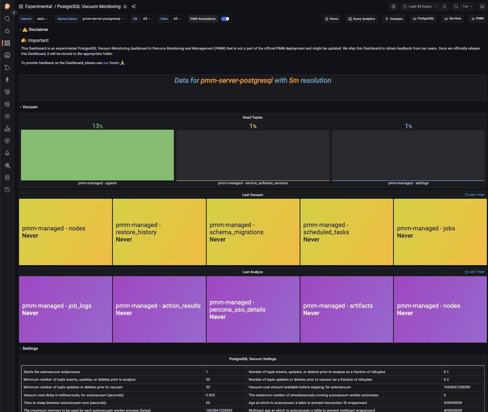

# Experimental PostgreSQL Vacuum Monitoring

!!! caution alert alert-warning "Disclaimer"
    This is an Experimental Dashboard that is not part of the official Percona Monitoring and Management (PMM) deployment and might be updated. We ship this Dashboard to obtain feedback from our users.

This dashboard provides timely insights into the autovacuum process in PostgreSQL.

This dashboard contains the following:

- Dead tuples - Identifies the number of dead rows in each table even though the rows are physically removed from the table.

- Last time vacuum ran - Tracks the last time a vacuum or autovacuum process successfully ran on each of your tables.

- Number of rows modified since last Analyze - The number of rows changed since the last time ANALYZE ran.

- Manual vacuum events - Tracks the number of times a manual vacuum was run on each table.

- Table disk usage - Tracking the disk space used by each table is crucial as it enables you to gauge expected changes in the query performance over time - but it can also help you detect potential vacuuming-related issues.

