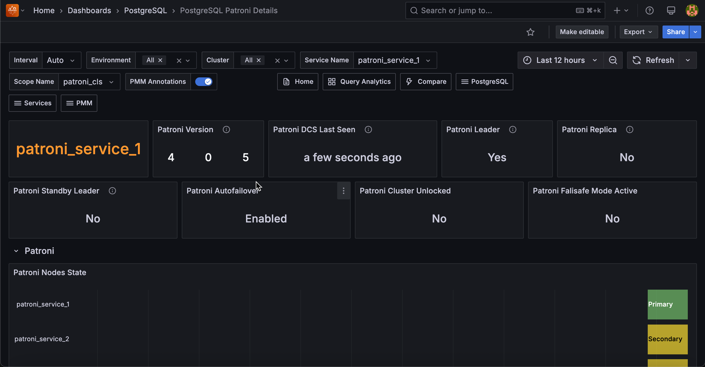

# PostreSQL Patroni Details 

This ashboard provides comprehensive monitoring for PostgreSQL clusters managed by Patroni, focusing on cluster member status, replication health, and WAL (Write-Ahead Log) synchronization. 

Use this dashboard when you need to monitor high-availability PostgreSQL clusters, troubleshoot replication issues, or verify cluster member roles and status.

This is essential for database administrators managing production PostgreSQL clusters with automatic failover capabilities.

## Patroni 

### Patroni Version
Shows the current version of Patroni running on your selected service. 

Monitor this panel to ensure all nodes in your cluster run compatible Patroni versions.

Version mismatches can cause unexpected behavior during failover operations or cluster management tasks. 

### Patroni DCS Last Seen
Shows the last time Patroni contacted the distributed configuration store (DCS) for your selected service. 

This critical metric indicates how recently your Patroni instance communicated with etcd, Consul, or ZooKeeper.

The timestamp appears as "time ago" format (e.g., "2 minutes ago") to quickly assess connection freshness. 

If this value shows more than a few minutes ago, investigate your DCS connectivity immediately. This could indicate network issues, DCS outages, or Patroni process problems that may prevent automatic failover from working properly.

### Patroni Leader
Shows whether your selected service node currently serves as the primary cluster leader. 

This displays **Yes** or **No** to confirm leadership status.

Only one node in your cluster should show **Yes** at any time. 
If multiple nodes show **Yes** or no nodes show **Yes**, you have a split-brain condition or leader election failure that requires immediate attention.

A properly functioning cluster always maintains exactly one leader for write operations and cluster coordination.

### Patroni Replica
Shows whether your selected service node operates as a replica (standby) in the cluster. 

This panel displays **Yes** for replica nodes and **No** for the primary leader.

This status complements the Leader panel - most nodes in your cluster should show **Yes** here.

If a node shows **No** for both Leader and Replica panels, investigate the node's cluster membership status as it may be isolated or experiencing configuration issues that prevent proper cluster participation.

### Patroni Standby Leader
Shows whether your selected service node serves as the standby cluster leader. 

This applies to clusters configured with standby leader functionality for cascading replication or disaster recovery scenarios.

In clusters with standby leaders, exactly one replica should show **Yes** here. 

If you expect a standby leader but see **No** across all replicas, check your Patroni configuration and replication topology to ensure standby leader election works correctly for your high availability setup.

### Patroni Autofailover
Shows the current state of automatic failover capability for your cluster. The panel displays **Enabled** when autofailover is active or **Disabled** when it's paused.

This setting controls whether Patroni automatically promotes a replica to leader when the current primary fails. 

When you see **Disabled**, your cluster will not automatically recover from primary failures - you'll need manual intervention to restore service. 

This state typically occurs during maintenance windows or when administrators pause autofailover for troubleshooting.

### Patroni Cluster Unlocked
Shows whether your Patroni cluster currently operates in unlocked mode. The panel displays **Yes** for unlocked clusters or **No** for normally locked clusters.

Clusters typically remain locked for safety - unlocked mode allows potentially dangerous operations. 

If you see **Yes** unexpectedly, verify whether someone intentionally unlocked the cluster for maintenance. Leaving clusters unlocked long-term increases the risk of accidental data loss or cluster corruption during administrative operations.

### Patroni Failsafe Mode Active
Shows whether Patroni currently operates in failsafe mode for your cluster. This safety mechanism activates when Patroni detects potentially dangerous conditions that could compromise data integrity.

Failsafe mode typically engages during network partitions, DCS connectivity issues, or other scenarios where automatic actions might cause data loss. When you see **Yes**, investigate the underlying issue immediately - your cluster may have reduced functionality or inability to perform automatic failover until the condition resolves.

### Patroni Nodes State
Shows the leadership state timeline for all nodes in your cluster over the selected time range. This state timeline visualization uses color coding to track primary role transitions across your cluster nodes.

Green sections indicate when a node served as primary leader, while yellow sections show secondary (replica) status. 

Look for frequent color changes that might indicate unstable leadership or unnecessary failovers. 

A healthy cluster typically shows stable leadership with minimal transitions, except during planned maintenance or actual failure events. 

Use this timeline to correlate leadership changes with performance issues or outages in your application.

## PostreSQL

### PostgreSQL Version
Shows the PostgreSQL major and minor version numbers running in your cluster. 

Use this to verify version consistency across cluster nodes and plan upgrades.

### Service Name
Displays the service name identifier for the selected Patroni cluster member. This helps you identify which specific node you're monitoring within the cluster.

### Uptime
Shows when PostgreSQL was last started on this node, displayed as time elapsed since startup. 

Long uptimes indicate stable operations, while recent restarts may suggest issues or maintenance.

### Running
Indicates whether PostgreSQL is currently running on this node. 

Shows **Yes** (green) when PostgreSQL is active, **No** (red) when stopped.

Any **No** status requires immediate investigation.

### Timeline
Shows the PostgreSQL timeline identifier for this cluster member. 

All cluster members should normally have the same timeline—different timelines may indicate split-brain scenarios or recovery issues.

### Pending Restart
Indicates whether this PostgreSQL instance needs to be restarted to apply configuration changes. 

Shows **No** (green) for normal operation, **Yes** (orange) when restart is required. 

Plan maintenance windows for nodes showing **Yes**.

### WAL Replay
Shows whether WAL replay is currently enabled or paused on replica nodes. **Enabled** (green) is normal for active replicas, **Paused** (red) indicates replication is stopped. Paused replication will cause replicas to fall behind.

### In Archive Recovery
Indicates whether this node is currently in archive recovery mode (typically a replica). **Yes** indicates this is a standby server, **No** indicates this is the primary server.

### Streaming
Shows whether this replica is receiving WAL data via streaming replication. **Yes** indicates active streaming replication, **No** on a replica suggests connectivity issues with the primary.

### Sync Standby
Indicates whether this replica is configured as a synchronous standby. Synchronous standbys provide higher data safety by requiring confirmation before primary commits complete.

### Primary WAL Location
Shows the current WAL position on the primary server in bytes.

This value continuously increases as the primary generates new WAL data. 

Use this to monitor write activity and calculate replication lag.

### Replicas Received WAL Location
Shows the WAL position that replicas have received from the primary. 

Compare with Primary WAL Location to identify network replication lag—large differences indicate slow WAL transmission.

### Replicas Replayed WAL Location
Shows the WAL position that replicas have actually applied to their local database. 

Compare with Received WAL Location to identify replay lag—differences indicate the replica is behind in processing received WAL.

### WAL Replay Paused
Displays whether WAL replay is currently paused on replica nodes with both status and cluster identification. 

**False**(red) indicates normal operation, **True** (green) means replay is intentionally paused. 

This is the inverse of the simpler **WAL Replay** panel and provides cluster context.