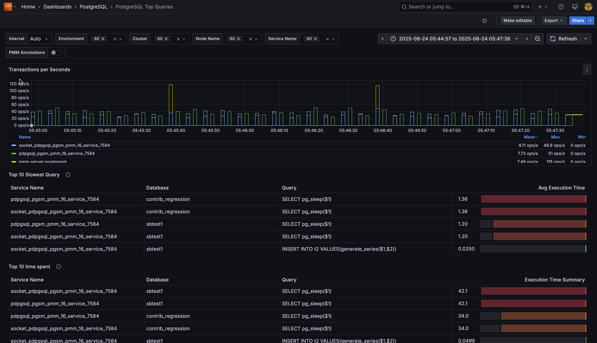

# PostgreSQL Top Queries

This dashboard analyzes query performance across your PostgreSQL instances, helping you identify and optimize slow queries that impact database performance.

### Transactions per Second
Shows the rate of committed transactions for each PostgreSQL instance. The metric combines both regular and replicated transactions, displayed as operations per second with step interpolation for accurate counting between data points.

Use this to monitor database activity levels and identify workload patterns across your instances. The table below the graph shows mean, max, and min values for each service.

### Top 10 Slowest Queries

Displays queries with the highest average execution time across your PostgreSQL databases. Each row shows:

- **Service Name**: The PostgreSQL instance running the query
- **Database**: The database where the query executed
- **Query**: The normalized query fingerprint
- **Avg Execution Time**: Average time per query execution, visualized with a color-coded gauge

System queries and PostgreSQL internal operations (`pg_stat_*`, `pg_replication_slots`, etc.) are automatically filtered out to focus on application queries.

The gauge visualization uses a gradient from green to red, making it easy to spot the worst-performing queries at a glance.

Use this table to prioritize query optimization efforts for maximum performance impact.