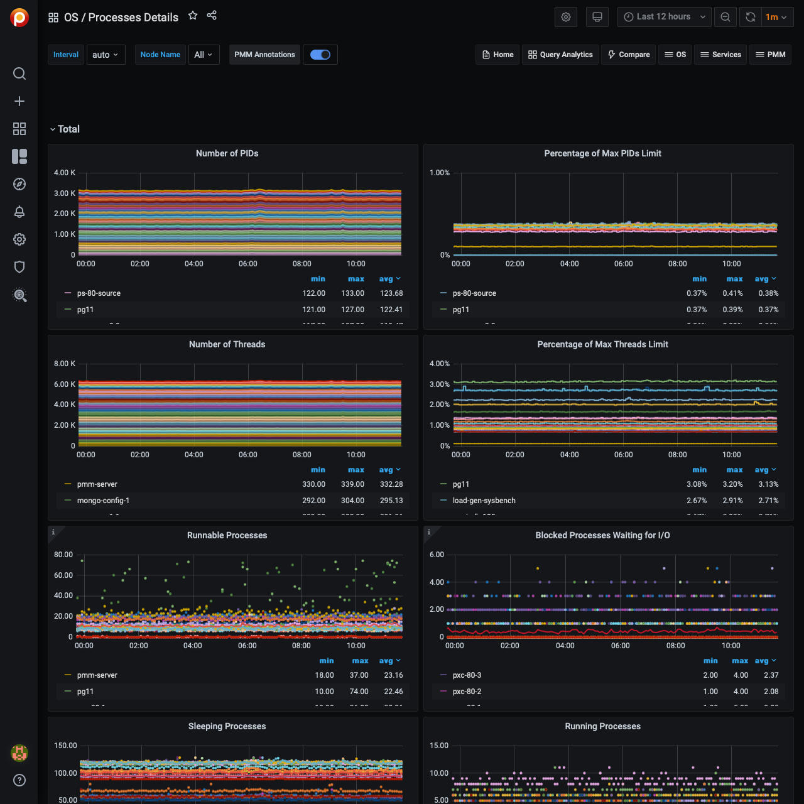

# Processes Details

This dashboard displays Linux process information - PIDs, Threads, and Processes.  The dashboard shows how many processes/threads are either in the kernel run queue (runnable state) or in the blocked queue (waiting for I/O). When the number of process in the runnable state is constantly higher than the number of CPU cores available, the load is CPU bound. When the number of process blocked waiting for I/O is large, the load is disk bound. The running average of the sum of these two quantities is the basis of the `loadavg` metric.

The dashboard consists of two parts: the first section describes metrics for all hosts, and the second part provides charts for each host.

Charts for all hosts, available in the first section, are the following ones:

- States of Processes
- Number of PIDs
- Percentage of Max PIDs Limit
- Number of Threads
- Percentage of Max Threads Limit
- Runnable Processes
- Blocked Processes Waiting for I/O
- Sleeping Processes
- Running Processes
- Disk Sleep Processes
- Stopped Processes
- Zombie Processes
- Dead Processes

The following charts are present in the second part, available for each host:

- Processes
- States of Processes
- Number of PIDs
- Percentage of Max PIDs Limit
- Number of Threads
- Percentage of Max Threads Limit

## Runnable Processes

### Processes

The Processes graph shows how many processes/threads are either in the kernel run queue (runnable state) or in the blocked queue (waiting for I/O).  When the number of process in the runnable state is constantly higher than the number of CPU cores available, the load is CPU bound.  When the number of process blocked waiting for I/O is large, the load is disk bound.  The running average of the sum of these two quantities is the basis of the `loadavg` metric.

## Blocked Processes Waiting for I/O

### Processes

The Processes graph shows how many processes/threads are either in the kernel run queue (runnable state) or in the blocked queue (waiting for I/O).  When the number of process in the runnable state is constantly higher than the number of CPU cores available, the load is CPU bound.  When the number of process blocked waiting for I/O is large, the load is disk bound.  The running average of the sum of these two quantities is the basis of the `loadavg` metric.

