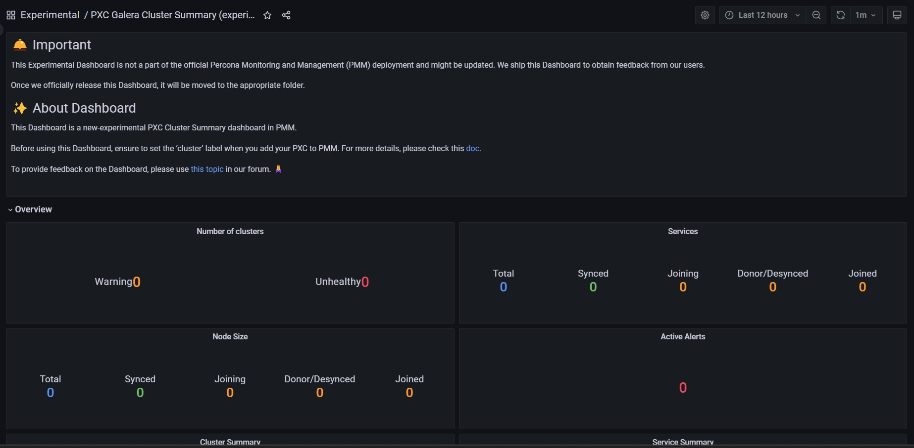

# Experimental PXC/Galera Cluster Summary

!!! caution alert alert-warning "Disclaimer"
    This is an Experimental Dashboard that is not part of the official Percona Monitoring and Management (PMM) deployment and might be updated. We ship this Dashboard to obtain feedback from our users.

The experimental PXC/Galera Cluster Summary dashboard provides a high level information about the clusters, resource utilization and its state for MySQL databases.

