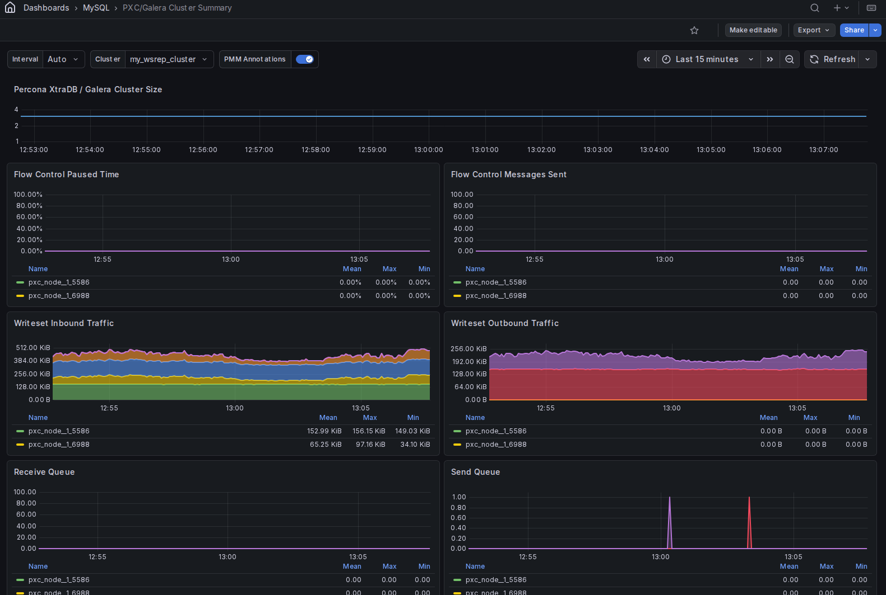

# PXC/Galera Cluster Summary

This dashboard shows replication health and traffic metrics for your Percona XtraDB Cluster or Galera cluster. It covers cluster size, writeset throughput, flow control activity, queue depths, transaction counts, IST progress, and replication latency.

Use it to monitor cluster stability, detect flow control pressure, and diagnose replication lag across cluster members.

## Percona XtraDB / Galera cluster size

Shows the number of nodes currently active in the cluster over time.

A drop in cluster size means one or more nodes left the cluster — through a crash, a network partition, or a deliberate shutdown. A value of 1 means the cluster has lost quorum or is operating in a split-brain scenario and needs immediate attention.

## Flow control messages sent

Shows the rate of flow control messages sent per second, broken down by cluster member.

Galera uses flow control to slow down the primary when a node's receive queue fills up faster than it can apply writesets. Any non-zero value means at least one node is struggling to keep up and is throttling the entire cluster's write throughput. A sustained or rising rate points to an underpowered node or excessive write load.

## Writeset inbound traffic

Shows the rate of writeset data received from other cluster members in bytes per second, stacked by service.

This is the replication traffic flowing into each node. A sudden spike means another node committed a large transaction or a burst of transactions. Sustained high inbound traffic alongside a growing receive queue suggests the node cannot apply changes fast enough.

## Writeset outbound traffic

Shows the rate of writeset data replicated to other cluster members in bytes per second, stacked by service.

This is the traffic originating from each node's own writes. Compare with **Writeset Inbound Traffic** to understand which nodes are primarily writers versus readers in your workload.

## Receive queue

Shows the average number of writesets waiting in each node's receive queue over time.

The receive queue holds writesets that have been received from the cluster but not yet applied locally. A queue above zero means the node is falling behind. A growing queue is an early indicator of replication lag and may trigger flow control if it reaches the high limit. Check **FC Trigger High Limit** to see what threshold applies.

## Send queue

Shows the average number of writesets waiting in each node's send queue over time.

The send queue holds locally committed transactions waiting to be replicated to other cluster members. A non-zero send queue means the network or remote nodes are not consuming writesets fast enough. A persistently growing send queue can indicate network saturation or slow receiving nodes.

## Transactions received

Shows the rate of transactions received from other cluster members per second.

Use this alongside **Writeset Inbound Traffic** to understand whether high inbound byte volume comes from many small transactions or fewer large ones. A rising rate with stable byte volume means transaction count is increasing but individual transactions are small.

## Transactions replicated

Shows the rate of transactions replicated to other cluster members per second.

This reflects write activity originating on each node. Compare with **Transactions Received** to see the balance between local writes and replicated writes across your cluster.

## Average incoming transaction size

Shows the average size in bytes of writesets received from other cluster members.

A rising average size means incoming transactions are getting larger, which increases the time needed to apply each writeset and puts more pressure on the receive queue. Large transactions are a common cause of flow control events.

## Average replicated transaction size

Shows the average size in bytes of writesets replicated from each node to the rest of the cluster.

Use this alongside **Average Incoming Transaction Size** to compare the write patterns of different cluster members. A node with consistently larger outbound transaction sizes is likely running bulk operations or large writes.

## FC trigger low limit

Shows the low threshold of the flow control interval over time, per cluster member.

When the receive queue drops below this value, flow control pauses and the cluster resumes normal write throughput. Use this alongside **FC Trigger High Limit** and **Receive Queue** to understand how flow control is being triggered and released on each node.

## FC trigger high limit

Shows the high threshold of the flow control interval over time, per cluster member.

When a node's receive queue exceeds this value, it sends flow control messages to slow down the cluster. A high limit that is frequently reached means the node consistently struggles to keep up. Consider tuning `wsrep_flow_control_interval` or investigating the node's apply throughput.

## IST progress

Shows the progress of an Incremental State Transfer (IST) in sequence numbers, with three series per node: **first** (the starting sequence number), **current** (progress so far), and **last** (the target sequence number).

IST happens when a node rejoins the cluster after a short absence and needs to catch up on missed transactions without a full SST. When **current** equals **last**, the IST is complete and the node is back in sync. A **current** value that stops moving means the IST has stalled. This panel only shows data when an IST is actively in progress.

## Average Galera replication latency

Shows the average round-trip latency in seconds for Galera group communication over time, per cluster member.

Galera uses the EVS protocol to replicate writesets across all nodes before committing. Higher average latency means each transaction waits longer before it can commit, which directly increases application-level write latency. Network congestion, a slow node, or geographic distance between members are common causes.

## Maximum Galera replication latency

Shows the maximum round-trip latency in seconds for Galera group communication within each measurement interval, per cluster member. Values are plotted as individual data points to highlight spikes.

The maximum latency captures the worst-case commit delay experienced during each interval. Occasional spikes above the average are normal, but a maximum that is consistently many times higher than the average points to intermittent network issues or GC pauses on a cluster member. Use this alongside **Average Galera Replication Latency** to distinguish steady-state latency from outliers.