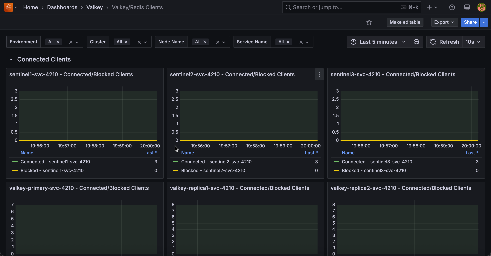

# Valkey/Redis Clients

This dashboard monitors client connection metrics and resource usage for Valkey/Redis nodes. Use this to track connection health, capacity limits, and communication efficiency.

## Connected Clients

Monitors client connection metrics for Valkey/Redis nodes.

### [Node name] - Connected/Blocked Clients

Displays the number of currently connected clients and blocked clients over time for each Valkey/Redis node.

Use this to monitor active client connections, identify connection growth patterns, and spot periods when clients are blocked waiting for operations to complete. The graph shows both metrics side-by-side, making it easy to correlate blocked clients with overall connection load.

Connected clients represent active database sessions, while blocked clients indicate operations waiting for locks or other resources. A sudden increase in blocked clients may signal lock contention or slow queries affecting system responsiveness.

### Config Max Clients
Shows the maximum configured client connection limit (`maxclients`) for each Valkey/Redis node in a table format.

Use this to verify connection capacity settings across all nodes and ensure they're configured appropriately for your workload. Compare this limit against current connection usage to determine if capacity adjustments are needed.

Having adequate connection limits prevents "too many connections" errors that could disrupt application access to the database.

### Evicted Clients
Displays the total count of clients that have been evicted from each Valkey/Redis node due to exceeding connection limits or idle timeouts.

Use this to identify connection pressure issues or applications that aren't properly closing connections. High eviction counts may indicate the need for connection pooling improvements or increased connection limits.

## Client Buffers

### [Node name] Client Buffers
Shows the rate of change in input and output buffer sizes for client connections over time, measured in bytes per second.

Use this to monitor memory consumption from client communication buffers and identify clients sending or receiving large amounts of data. Spikes in buffer usage could indicate inefficient queries returning large result sets or bulk write operations.

Compare input versus output buffer rates to understand the balance between data being sent to the database versus data being returned to clients, which can help optimize query patterns and application design.