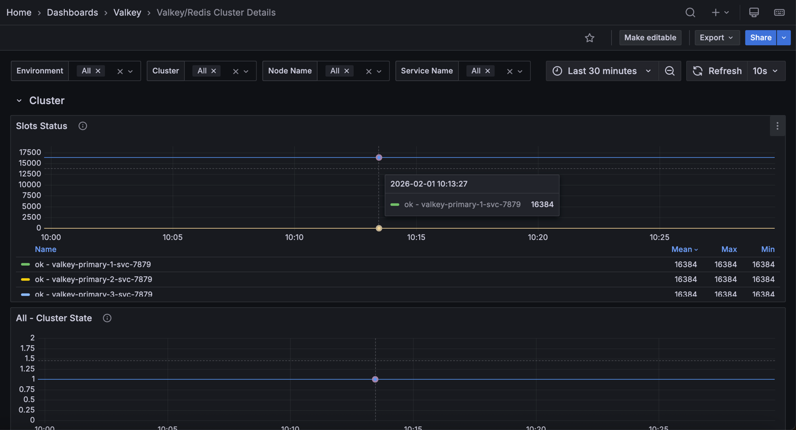

# Valkey/Redis Cluster Details

This dashboard provides in-depth monitoring of Valkey/Redis cluster topology, replication health, and synchronization status.

Use it to track cluster state, monitor node roles and failovers, analyze replication lag, and ensure proper data synchronization across primaries and replicas.

## Cluster

### Slots status
Provides visibility into cluster health and slot distribution across the Valkey/Redis cluster.

### Cluster State

Shows the overall cluster state for each service over time, indicating whether the cluster is operational.

Use this to monitor the health status of your cluster. A value of `1` indicates the cluster is in an `OK` state with all slots covered, while `0` indicates the cluster is in a `FAIL` state with some slots uncovered or unreachable. 

This is a critical health indicator. Any time spent in a failed state means the cluster cannot serve all key ranges and may result in application errors or data unavailability for certain keys.

### Cluster messages
Shows the rate of cluster communication messages sent and received across the cluster over time.

Use this to monitor inter-node communication health and identify potential network issues or excessive cluster chatter. 

High message rates may indicate cluster instability, frequent topology changes, or gossip protocol overhead. Compare sent versus received messages to ensure balanced communication patterns across nodes.

### [Node name] Known nodes

Shows the number of nodes known to each service in the cluster over time.

Use this to verify that all nodes have consistent views of the cluster topology. In a healthy cluster, all nodes should report the same count of known nodes, matching the total number of nodes in your cluster. 

Discrepancies in known node counts may indicate split-brain scenarios, network partitions, gossip protocol delays, or configuration issues preventing proper cluster formation. 

If a node reports fewer known nodes than expected, it may be isolated from part of the cluster and unable to participate fully in cluster operations.

## Replication nodes

### [Service name]

Shows the role timeline for each service, displaying whether each node is functioning as a primary (master) or replica (slave) over time.

Use this to track role changes, identify failover events, and monitor replication topology stability. Green bars indicate primary/master nodes that handle both reads and writes, while orange bars represent replica/slave nodes that replicate data from primaries. 

Sudden role changes may indicate planned failovers, automatic failover due to primary node failures, or manual cluster reconfiguration events. Monitoring this timeline helps you understand when and why nodes switched roles, which is crucial for troubleshooting performance issues or validating failover mechanisms.

## Replication offsets

### [Service name] - Replica vs Master Offsets

Displays the replication offset difference between primary nodes and their replicas, measured in bytes.

Use this to monitor replication lag and identify replicas falling behind. Lower values indicate replicas are closely synchronized, while higher values suggest lag that could impact data consistency and failover readiness. 

Summary statistics show mean, max, and min lag values sorted by average. High or growing differences may indicate network issues, resource constraints on replicas, or excessive write load. Zero or near-zero values indicate replicas are fully caught up.

### Replicas

Shows the total number of connected replicas across all services over time.

Use this to monitor replication topology health and ensure the expected number of replicas are connected and actively replicating data from their primaries. This aggregated view provides a quick overview of your entire deployment's replication status. 

Sudden drops in the count may indicate replica failures, network connectivity issues, configuration problems affecting replication relationships, or nodes being taken offline. 

A stable count matching your expected replica configuration indicates healthy replication across the cluster. If the count is lower than expected, investigate which replicas have disconnected and why.

### Connected Replicas

Displays a table showing the number of connected replicas for each node, including environment, service name, node name, and role information.

Use this to get a detailed, node-by-node view of replica distribution across your deployment and verify that each primary has the expected number of replicas. This snapshot view complements the time-series **Replicas** graph by providing current replica counts with full node context. 

The table helps you quickly identify which primaries have the correct number of replicas and which may be under-replicated, ensuring your redundancy and high availability requirements are met. 

If a primary shows fewer replicas than expected, it may be at risk during failover scenarios or already experiencing replica failures.

### Full Resyncs

Shows a table of full resynchronization events that have occurred on each node.

Use this to identify nodes that have required complete data resyncs from their primaries. Full resyncs are expensive operations that transfer entire datasets and typically occur when a replica has been disconnected too long for a partial resync, when replication is first established, or after certain failures. 

High full resync counts warrant investigation into replica stability, replication buffer sizing, or network reliability issues. 

Each full resync consumes significant network bandwidth, disk I/O, and can temporarily increase load on the primary node. Ideally, this count should remain low or increase only during planned maintenance or initial replica setup.

### Partial Resyncs

Displays a table of partial resynchronization events that have been accepted on each node.

Use this to monitor efficient replication recovery when replicas briefly disconnect from their primaries. 

Partial resyncs only transfer the missed changes from the replication backlog rather than entire datasets, making them much more efficient than full resyncs in terms of network bandwidth, disk I/O, and time to recovery. 

Higher partial resync counts compared to full resyncs indicate a healthy replication configuration with adequate backlog sizing. 

However, very high partial resync counts may indicate unstable network connections, frequent replica restarts, or intermittent connectivity issues between primaries and replicas that should be investigated.

### Backlog Size

Displays the current replication backlog size in bytes for each node in a table format.

Use this to monitor the size of the circular buffer that stores recent write operations for replica synchronization. A properly sized backlog allows replicas to perform partial resyncs after brief disconnections rather than requiring expensive full resyncs. 

Compare backlog sizes against your typical replica disconnection durations and write throughput to ensure adequate capacity. If replicas frequently require full resyncs despite brief disconnections, the backlog may be too small and should be increased using the `repl-backlog-size` configuration parameter.

Larger backlogs consume more memory but provide longer windows for successful partial resyncs.

### Backlog First Byte Offset

Shows the replication offset of the first byte in the replication backlog for each node.

Use this to understand the oldest replication data still available in the backlog buffer. This offset marks the beginning of the circular buffer's valid data range. When combined with the master's current replication offset, you can determine the time window available for partial resyncs. 

If a replica's offset is older than this first byte offset, it has fallen too far behind and will require a full resync instead of a partial resync. 

Monitor this value alongside replica offsets to predict when replicas might need full resyncs due to extended disconnections or slow replication.

### Backlog History Bytes

Displays the amount of historical replication data currently retained in the backlog for each node, measured in bytes.

Use this to monitor the effective depth of the replication backlog and understand how much replication history is actually available for partial resyncs. 

This value represents the actual amount of data stored in the backlog buffer at this moment, which may be less than the configured backlog size if the node hasn't accumulated that much write activity yet. 

Larger history sizes provide longer windows for replicas to reconnect and perform partial resyncs, reducing the likelihood of expensive full resyncs after temporary disconnections. Compare this value with the configured backlog size to see if the buffer is fully utilized.

### Replica Resync Info

Shows the trends for full resyncs, partial resyncs accepted, and partial resyncs denied over time for each service.

Use this to analyze replication synchronization patterns and identify issues with replica stability or backlog configuration. 
The graph displays three key metrics: full resyncs (complete dataset transfers), partial resyncs accepted (efficient incremental syncs), and partial resyncs denied (failed attempts at partial sync that forced full resyncs). 

In a healthy system, partial resyncs accepted should be the dominant metric, with full resyncs and denials remaining low or flat. High or increasing denial rates suggest the replication backlog size may need to be increased to accommodate longer disconnection periods or higher write throughput. 

Frequent full resyncs indicate serious replication issues requiring investigation into network stability, replica resources, or backlog sizing.
