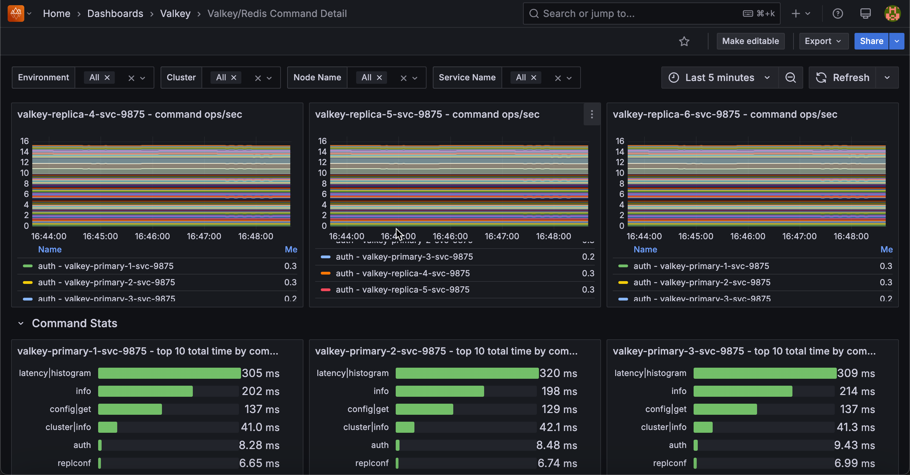

# Valkey/Redis Command Detail

This dashboard provides detailed command-level monitoring for Valkey/Redis instances, tracking throughput, execution time, latency distributions, and performance characteristics for individual command types. 

Use it to analyze workload patterns, identify slow operations, optimize command performance, and troubleshoot application behavior at the command level.

## Total Commands/sec

### [Service_name] - Total Commands/sec

Displays the rate of all commands executed per second across each service.

Use this to monitor overall database activity and workload intensity. This aggregated metric shows the total throughput of all command types combined, providing a high-level view of how busy your Valkey/Redis instances are. 

Sudden spikes may indicate traffic surges, batch operations, or potential issues like retry storms. Unexpected drops could signal application connectivity problems or reduced user activity. 

Compare values across services to identify load imbalances or detect if specific services are handling disproportionate traffic. This metric serves as a primary indicator of database utilization and helps with capacity planning.

## Read and Write Rates

### [Service name] - Read and Write Rate

Displays the rate of read and write operations processed per second for each service.

Use this to understand the balance between read and write workloads and identify whether your deployment is read-heavy, write-heavy, or balanced. 

Monitoring these metrics separately helps optimize configuration for your specific access patterns - for example, read-heavy workloads may benefit from more replicas, while write-heavy workloads may need primary node optimization. 

Sudden changes in the read/write ratio could indicate application behavior changes, caching issues, or potential problems.

Compare read rates across primaries and replicas to verify read distribution, and monitor write rates to ensure primaries can handle the write throughput without performance degradation.

## Operations/sec by Command

### [Service name] - Command ops/sec

Displays the rate of each individual command type executed per second, broken down by command name for each service.

Use this to analyze command-level traffic patterns and identify which operations dominate your workload. The stacked area chart shows the contribution of each command type (GET, SET, HGET, ZADD, etc.) to total throughput, making it easy to spot command usage trends and anomalies. 

This granular view helps optimize performance by revealing expensive commands that may need indexing improvements, identifying cache hit patterns through GET command frequency, and detecting unusual command patterns that might indicate application issues or inefficient queries. 

The legend displays mean, max, and min rates for each command, sorted by frequency, enabling quick identification of your most-used operations.

## Command Stats

### [Service name] - Top 10 Total Time by Command

Displays the top 10 commands that have consumed the most cumulative execution time for each service.

Use this to identify which commands are consuming the most database resources over time. Unlike commands per second which shows frequency, this metric reveals total time spent, making it excellent for finding performance bottlenecks. 

A command that runs frequently but quickly may appear high in ops/sec but low here, while a slow command that runs occasionally could dominate total time. 

This helps prioritize optimization efforts. Commands at the top of this list are the best candidates for performance tuning, query optimization, or adding indexes. 

### [Service name] - Total Time Spent by Command/sec

Shows the rate of time consumed by each command type per second, revealing which commands are actively using the most execution resources.

Use this to monitor real-time resource consumption patterns and identify performance bottlenecks as they occur. Unlike the cumulative "top 10 total time" panel, this shows the current rate of time being spent, making it ideal for correlating performance issues with specific time periods or events. 

The stacked area chart displays how execution time is distributed across different command types, with the total height representing overall database load. 

Commands consuming more time per second indicate either high frequency execution, slow individual operations, or both. Sort by mean in the legend to quickly identify the biggest time consumers and investigate why certain commands dominate execution time during specific periods.

### Commands Totals

Displays cumulative totals for reads, writes, and errors across each service in a bar gauge format.

Use this to get a quick overview of total command activity and error counts since service startup. The horizontal LCD-style gauges show the absolute numbers for read operations, write operations, and total errors, providing an at-a-glance comparison across these key metrics. 

High read totals indicate cache or query-heavy workloads, while high write totals suggest data ingestion or update-intensive operations. 

The error count is particularly important. Any non-zero value warrants investigation to identify failing commands, connection issues, or application problems. 

Compare these totals across services to understand workload distribution and identify services that may need scaling or optimization.

## Latencies

### [Service Name] - Command Percentiles

Displays latency percentiles for each command type, showing execution time distribution in microseconds.

Use this to understand command performance characteristics and identify outliers or slow operations. Percentile metrics reveal the latency experience for most requests, with higher percentiles (p99, p99.9) showing worst-case performance that affects tail latency. 

The horizontal bar chart format makes it easy to compare latency across different command types and identify which commands have the highest execution times. Commands with high percentile values may need optimization through indexing, query restructuring, or identifying resource bottlenecks. 

Statistics show mean, max, and min percentile values sorted by mean, helping prioritize commands with the biggest latency impact. Monitor this alongside command frequency to identify slow commands affecting user experience.

## Latency by Command

### [Service name] - Get Latency

Shows how GET command latency is distributed across different time ranges in microseconds.

Use this to understand GET performance patterns. The bar chart groups operations by latency, from fastest to slowest. A healthy distribution shows most operations in the lower latency ranges with few in the higher ones.

Spikes in higher latency ranges may indicate cache misses, large values being retrieved, or resource contention. Since GET is typically your most frequent command, improving its latency has the biggest impact on performance.

### [Service name] - Set Latency

Displays the latency distribution histogram for SET commands, showing how many operations fall into each latency bucket measured in microseconds.

Use this to analyze SET command performance and understand write operation latency patterns. The bar chart shows cumulative counts across latency buckets, revealing the distribution from fastest to slowest SET operations. 

SET is one of the most fundamental write commands in Redis/Valkey, so its performance directly impacts application write throughput. 

A healthy distribution shows most operations completing quickly in lower latency buckets. Higher latency SET operations may be caused by persistence overhead (AOF fsync, RDB snapshots), replication to replicas, memory fragmentation, or large value sizes. 

Since SET involves both memory allocation and potential persistence/replication, its latency is typically higher than GET operations. Compare this with GET latency to understand the read/write performance balance and identify if write operations are becoming a bottleneck.

### [Service name] - Lpop Latency

Displays the latency distribution histogram for RPOP commands, showing how many operations fall into each latency bucket measured in microseconds.

Use this to analyze RPOP command performance and understand latency patterns for list operations. The bar chart shows cumulative counts across latency buckets, revealing the distribution from fastest to slowest RPOP operations. 

RPOP is commonly used in queue and job processing patterns, so its performance directly impacts task processing throughput. A healthy distribution shows most operations completing quickly in lower latency buckets. Higher latency operations may indicate blocking on empty lists, large list traversals, or resource contention. 

Since RPOP modifies data structures, its performance can also be affected by persistence settings (AOF, RDB) and replication overhead. Monitor this alongside queue depth metrics to ensure your job processing systems maintain acceptable performance.

### [Service name] - Hset Latency

Displays the latency distribution histogram for HSET commands, showing how many operations fall into each latency bucket measured in microseconds.

Use this to analyze HSET command performance and understand write latency patterns for hash data structures. The bar chart shows cumulative counts across latency buckets, revealing the distribution from fastest to slowest HSET operations. 

HSET is commonly used to store structured data as field-value pairs within a hash, making it popular for representing objects, user sessions, or configuration data. A healthy distribution shows most operations completing quickly in lower latency buckets. 

Higher latency HSET operations may be caused by large hash sizes, memory fragmentation, persistence overhead (AOF/RDB), or replication to replicas. Since hashes are memory-efficient data structures in Redis/Valkey, HSET performance is typically good, but can degrade with very large hashes or when persistence is aggressive. 

Monitor this alongside hash key counts to ensure hash operations remain performant as data scales.

### [Service name] - Lrange Latency

Displays the latency distribution histogram for LRANGE commands, showing how many operations fall into each latency bucket measured in microseconds.

Use this to analyze LRANGE command performance and understand read latency patterns for retrieving ranges of elements from lists. The bar chart shows cumulative counts across latency buckets, revealing the distribution from fastest to slowest LRANGE operations. 

LRANGE returns a specified range of elements from a list and is commonly used for pagination, fetching recent items, or retrieving batch data. 

Latency is highly dependent on the range size. Small ranges (e.g., LRANGE key 0 10) complete quickly, while large ranges can be expensive. Higher latency operations typically indicate large range requests, long lists requiring traversal, or memory pressure. 

To optimize LRANGE performance, limit range sizes, use appropriate start/stop indices, and consider alternative data structures for very large datasets. Monitor this metric to identify applications requesting excessively large ranges that could impact overall performance.

### [Service name] - Psync Latency

Displays the latency distribution histogram for PSYNC commands, showing how many operations fall into each latency bucket measured in microseconds.

Use this to analyze replication synchronization performance and understand how long it takes for replicas to initiate and complete partial synchronization with primaries. 

The bar chart shows cumulative counts across latency buckets for PSYNC operations. PSYNC (partial synchronization) is an internal replication command used when replicas reconnect to primaries after brief disconnections, allowing them to catch up by receiving only missed changes rather than performing a full resync. 

Lower latencies indicate efficient replication with adequate backlog sizing and good network connectivity. 

Higher latencies may indicate large backlogs to transfer, network bandwidth constraints, or replicas that were disconnected longer than expected. 

Since PSYNC directly impacts replica recovery time and data consistency, monitoring its performance is critical for high availability deployments. 

Compare with full resync metrics to ensure partial syncs are successfully completing instead of falling back to expensive full resyncs.

### Rpush Latency

Displays the latency distribution histogram for RPUSH commands, showing how many operations fall into each latency bucket measured in microseconds.

Use this to analyze RPUSH command performance and understand write latency patterns for appending elements to the right/tail of lists. The bar chart shows cumulative counts across latency buckets, revealing the distribution from fastest to slowest RPUSH operations. 

RPUSH is commonly used in queue implementations where items are added to the tail and consumed from the head (with LPOP), making it critical for task queues, message processing, and event streams. A healthy distribution shows most operations completing quickly in lower latency buckets. 

Higher latency RPUSH operations may be caused by very long lists, memory fragmentation, persistence overhead (AOF/RDB), or replication to replicas. 

Since RPUSH is a write operation that modifies list structures, its performance can be affected by the same factors as other write commands. Monitor this alongside LPOP latency to ensure your queue operations maintain acceptable end-to-end performance.

