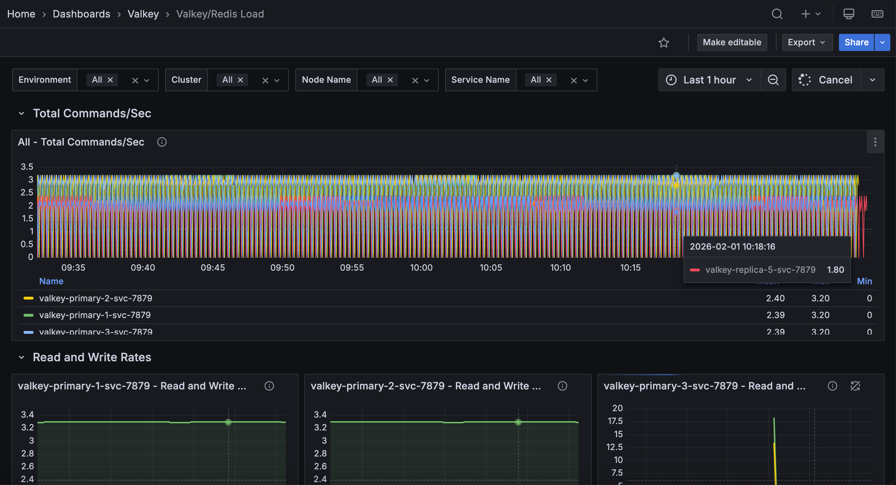

# Valkey/Redis Load

This dashboard monitors workload distribution, throughput, and resource utilization across Valkey/Redis nodes and services. 

Use it to track command rates, analyze read/write patterns, assess cache effectiveness, monitor I/O threading performance, and identify load imbalances that may require capacity adjustments or traffic redistribution.

## Total Commands/sec

### [Node name] - Total Commands/sec

Displays the rate of all commands executed per second for each node.

Use this to monitor overall database activity and workload intensity at the node level. This aggregated metric shows the total throughput of all command types combined, providing a high-level view of how busy individual nodes are. 

Sudden spikes may indicate traffic surges, batch operations, or potential issues like retry storms. Unexpected drops could signal application connectivity problems or reduced user activity. 

The legend displays mean, max, and min command rates sorted by average throughput, making it easy to identify which nodes handle the most traffic. 

Compare values across nodes to detect load imbalances that might require traffic redistribution or to verify that load balancing is working effectively. This metric serves as a primary indicator of node utilization and helps with capacity planning.

## Read and Write Rates

### [Service name] - Read and Write Rate

Displays the rate of read and write operations processed per second for each service.

Use this to understand the balance between read and write workloads and monitor how load is distributed between different operation types. 

Tracking these metrics separately helps identify whether services are read-heavy, write-heavy, or balanced, which informs optimization strategies and capacity planning. 

Read-heavy services may benefit from additional replicas to distribute read load, while write-heavy services may need primary node optimization or sharding. 

The legend displays mean, max, and min rates for both reads and writes, sorted by average rate, making it easy to identify peak load periods and typical operating levels. Sudden changes in the read/write ratio could indicate application behavior changes, caching issues, or workload shifts. 

Monitor these rates alongside total commands to understand what proportion of your traffic consists of reads versus writes.

## Operations/sec by command

### [Node name] - Command ops/sec

Displays the rate of each individual command type executed per second, broken down by command name for each node.

Use this to analyze command-level traffic patterns at the node level and identify which operations dominate each node's workload. 

The stacked area chart shows the contribution of each command type (`GET`, `SET`, `HGET`, `ZADD`, etc.) to total throughput, making it easy to spot command usage trends and load distribution patterns. This granular view helps identify whether nodes are handling similar workload compositions or if certain nodes are specialized for specific operation types. 

The legend displays mean, max, and min rates for each command, helping you understand both typical load and peak demands. 

Monitor this to detect load imbalances where some nodes handle disproportionate amounts of expensive commands, identify opportunities for workload optimization, and verify that command distribution aligns with your architecture expectations. High rates of slow commands on specific nodes may indicate the need for load rebalancing or additional capacity.

### Hits and Misses

### [Node name] - Hits/Misses per Sec

Displays the rate of cache hits and misses per second for each node.

Use this to monitor cache effectiveness and understand how well your Redis/Valkey instance is serving data from memory. Cache hits occur when requested keys exist in the database, while misses happen when keys are not found, typically requiring the application to fetch data from a slower backend store. 

A high hit rate indicates effective caching and good application performance, while a high miss rate may suggest cache warming issues, inappropriate TTLs, memory pressure causing evictions, or application queries for non-existent keys. 

The legend displays mean, max, and min rates sorted by average. Calculate hit ratio as hits/(hits + misses). Values above 80-90% indicate healthy cache performance. 

Monitor this metric alongside eviction rates and memory usage to optimize cache sizing and ensure your cache layer is providing the expected performance benefits.

## IO Threads

### IO thread R/W per Sec

Displays the rate of read and write operations processed by I/O threads per second across services.

Use this to monitor the effectiveness of Redis/Valkey's threaded I/O feature when enabled. I/O threading allows Redis/Valkey to use multiple threads for handling network I/O operations, improving throughput on multi-core systems by offloading socket reading and writing from the main thread. 

The graph shows separate lines for threaded reads and writes, helping you understand how much of your I/O workload is being parallelized. 

Higher values indicate that I/O threads are actively processing network operations, which can significantly improve performance under high connection counts or high throughput scenarios. 

If these metrics are zero or very low despite high overall command rates, I/O threading may not be enabled or configured optimally (check `io-threads` and `io-threads-do-reads` settings). 

The legend displays mean, max, and min rates to help you understand typical and peak I/O thread utilization. Monitor this alongside total command rates to assess whether I/O threading is providing the expected performance benefits.

### IO threads configured

Displays the number of I/O threads configured for each service in a table format.

Use this to verify I/O threading configuration across your deployment and ensure nodes are properly configured to leverage multi-threaded I/O. 

The table shows the `io-threads` setting for each service, indicating how many threads are allocated for handling network I/O operations. 

A value of `1` means I/O threading is effectively disabled (only the main thread handles I/O), while values of `2` or more indicate multi-threaded I/O is active. 

For optimal performance on multi-core systems with high throughput or many concurrent connections, Redis/Valkey recommends configuring 2-4 I/O threads, though the ideal number depends on your specific workload and hardware. 

Compare these configured values with the actual I/O thread processing rates in the previous panel to verify threads are being utilized effectively.

Inconsistent configurations across nodes may indicate deployment issues or deliberate differentiation based on node roles or hardware capabilities.

