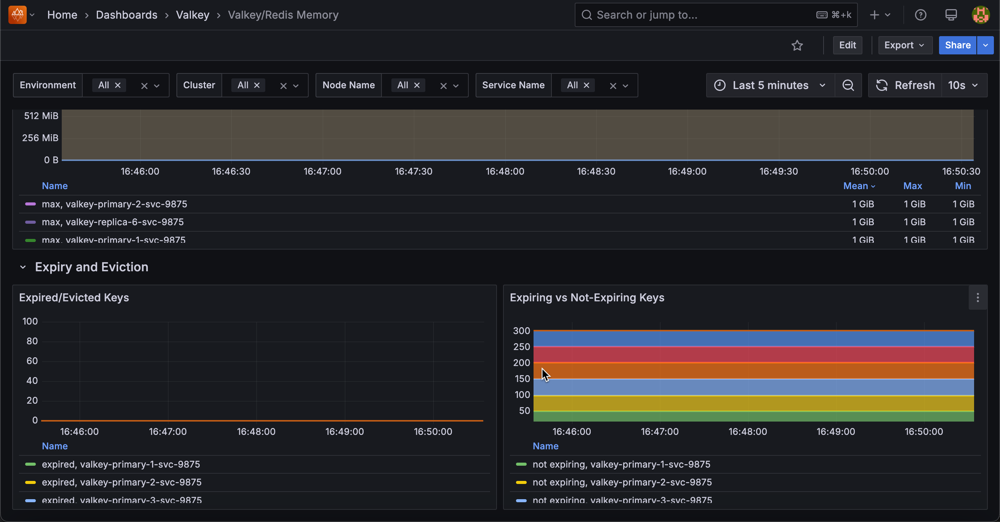

# Valkey/Redis Memory

This dashboard monitors memory usage, key distribution, and eviction patterns for Valkey/Redis instances. 

Use it to track memory consumption against configured limits, verify eviction policies, monitor key counts and TTL usage, and identify memory pressure through expiration and eviction rates.

## Memory

### Memory Usage

Displays memory utilization as a percentage of the configured maximum memory limit for each service.

Use this to monitor how close services are to their memory capacity and prevent out-of-memory conditions.

When usage approaches 100%, Redis/Valkey begins evicting data according to the configured eviction policy. 

Orange indicates 80% usage, and red indicates 95% usage. The legend shows mean, max, and min usage percentages to help identify services consistently operating near capacity. 

Monitor this alongside eviction rates to optimize memory allocation.

### Eviction Policy

Displays the configured eviction policy for each master/primary node in a table format.

Use this to verify eviction policy settings across your deployment. The eviction policy determines which keys Redis/Valkey removes when memory reaches the limit. 

Common policies include `allkeys-lru` (remove least recently used), `volatile-lru` (remove LRU keys with TTL), `allkeys-lfu` (remove least frequently used), and `noeviction` (return errors when full). Verify all nodes use appropriate policies for your workload.

### Number of Keys

Displays the total number of keys stored in each service in a table format.

Use this to monitor data volume and track key count growth over time. The table shows the minimum key count across all databases for each service, with color coding at 70% (orange) and 85% (red) thresholds. 

Rapidly growing key counts may indicate data accumulation requiring review of TTL policies or eviction settings. Compare key counts with memory usage to understand average key size and identify memory efficiency issues.

### Total Memory Usage

Displays memory usage in bytes, showing both currently used memory and the configured maximum memory limit for each service.

Use this to monitor absolute memory consumption and how close services are to their capacity limits. The graph shows two lines per service: used memory and max memory (shown in red). When used memory approaches the max limit, eviction begins. 

The legend displays mean, max, and min values to track memory trends over time. Compare used versus max to determine if memory limits need adjustment.

## Expiry and Eviction

### Expired/Evicted Keys

Displays the rate of expired and evicted keys per second for each service.

Use this to monitor memory pressure and TTL effectiveness. Expired keys are removed automatically when their TTL expires (normal operation), while evicted keys are forcibly removed due to memory pressure when usage reaches the `maxmemory` limit. 

High eviction rates (shown in red) indicate insufficient memory and may impact cache hit rates as useful data is removed prematurely. High expiration rates suggest active TTL management. Monitor evictions alongside memory usage to determine if memory limits need adjustment.

### Expiring vs Not-Expiring Keys

Displays the count of keys with TTL (expiring) versus keys without TTL (not expiring) for each service in a stacked area chart.

Use this to understand data retention patterns and identify potential memory management issues. Keys with TTL expire automatically, while keys without TTL persist indefinitely unless manually deleted or evicted. 

A high proportion of non-expiring keys may lead to memory growth over time, while appropriate TTL usage ensures automatic cleanup. The stacked view shows the total key count and the breakdown between the two types. Monitor this to verify TTL policies are applied where intended.