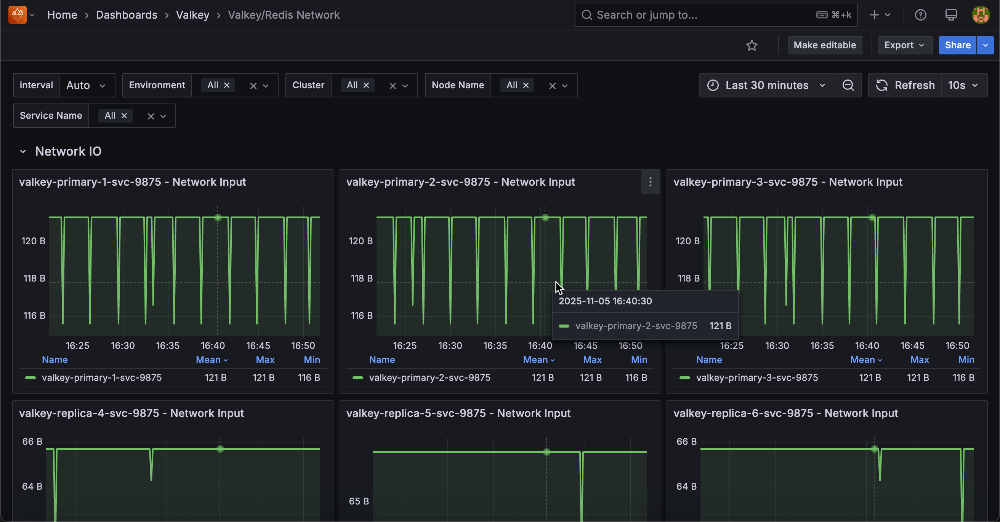

## Valkey/Redis Network

This dashboard monitors network traffic patterns for Valkey/Redis instances, tracking inbound and outbound bandwidth consumption. 

Use it to identify traffic trends, detect bandwidth bottlenecks, and understand the balance between read and write network activity across services.

## Network IO

### [Service name] - Network Input

Displays the rate of incoming network traffic in bytes per second for each service.

Use this to monitor inbound network bandwidth consumption and identify traffic patterns. High input rates may indicate heavy write operations, large value retrievals, or increased client activity. 

The legend shows mean, max, and min rates to help identify typical traffic levels and peak demands. Compare input with output rates to understand bidirectional traffic balance. Sudden spikes may indicate bulk operations or traffic surges requiring investigation.

### [Service name] - Network Output

Displays the rate of outgoing network traffic in bytes per second for each service.

Use this to monitor outbound network bandwidth consumption and identify data transfer patterns. High output rates typically indicate heavy read operations, large result sets being returned to clients, or replication traffic. 

The legend shows mean, max, and min rates to help identify typical traffic levels and peak demands. Compare output with input rates to understand traffic balance. Read-heavy workloads show higher output, while write-heavy workloads show higher input.