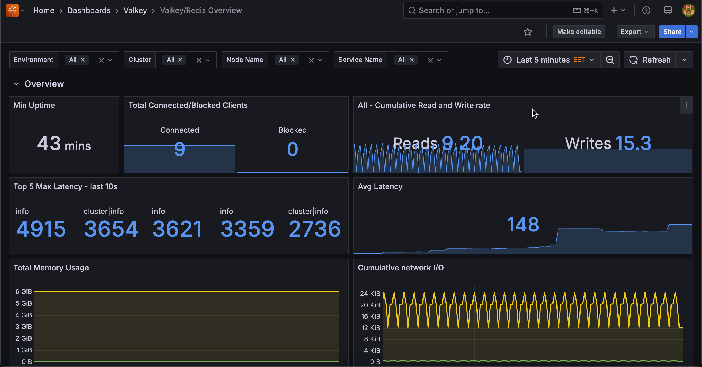

# Valkey/Redis Overview
This dashboard provides a high-level summary of Valkey/Redis deployment health and performance. 

Monitor uptime, client connections, workload rates, top latencies, memory usage, and network traffic to quickly assess system status and identify issues requiring deeper investigation.

## Overview 
### Min Uptime

Displays the minimum uptime in seconds across all selected services, showing how long the most recently restarted instance has been running.

Use this to quickly identify recent restarts or service disruptions. 

The minimum value indicates the shortest running instance, which helps detect if any nodes have been restarted recently due to crashes, deployments, or maintenance. 

Low values suggest recent restarts that may warrant investigation. Compare with individual node uptimes to identify which specific instance was restarted.

### Total Connected/Blocked Clients

Displays the total number of connected clients and blocked clients across all selected nodes.

Use this to monitor overall client connection health. Connected clients represent active database sessions, while blocked clients indicate operations waiting for resources (typically blocking list operations like BLPOP). 

High blocked client counts may signal application design issues or slow consumer processing. The stat panel shows both current values with a small area graph to visualize recent trends.

### [Node name] - Cumulative Read and Write rate

Displays the total rate of read and write operations per second across all selected nodes.

Use this to monitor overall database activity and understand workload balance. The panel shows aggregated reads and writes with both current rates and small area graphs for trend visualization. 

Compare read versus write rates to determine if your workload is read-heavy, write-heavy, or balanced. This high-level view helps assess total throughput and capacity utilization across your deployment.

### Top 5 Max Latency - Last 10s

Displays the five commands with the highest p99.9 latency over the last 10 seconds, measured in microseconds.

Use this to quickly identify the slowest operations currently impacting performance. The panel shows p99.9 percentile latency (worst-case for 99.9% of operations). 

Administrative and diagnostic commands are excluded. High latency values indicate performance bottlenecks requiring investigation.

### Average Latency

Displays the average latency across all commands and percentiles for selected services, measured in microseconds.

Use this to monitor overall system responsiveness and identify performance degradation. This metric averages all command latencies and percentile measurements, providing a general health indicator for query performance. 

Rising average latency suggests system-wide performance issues that may require investigation. Administrative and diagnostic commands are excluded. 

Compare with top latency metrics to distinguish between overall slowness and specific command issues.

### Total Memory Usage

Displays total memory usage in bytes across all selected nodes, showing both currently used memory and the configured maximum memory limit.

Use this to monitor aggregate memory consumption and capacity. The graph shows two lines: used memory and max memory (shown in red). 

When used memory approaches the max limit, eviction begins. The legend displays mean, max, and min values to track memory trends. This provides a cluster-wide view of memory utilization to assess overall capacity and identify when scaling is needed.

### Cumulative Network I/O

Displays total network input and output traffic in bytes per second across all selected nodes.

Use this to monitor aggregate bandwidth consumption. The graph shows input (inbound) and output (outbound) traffic. 

The legend displays mean, max, and min rates. Compare input versus output to understand traffic patterns. Read-heavy workloads show higher output, while write-heavy workloads show higher input. 

This cluster-wide view helps assess total network utilization and identify bandwidth constraints.