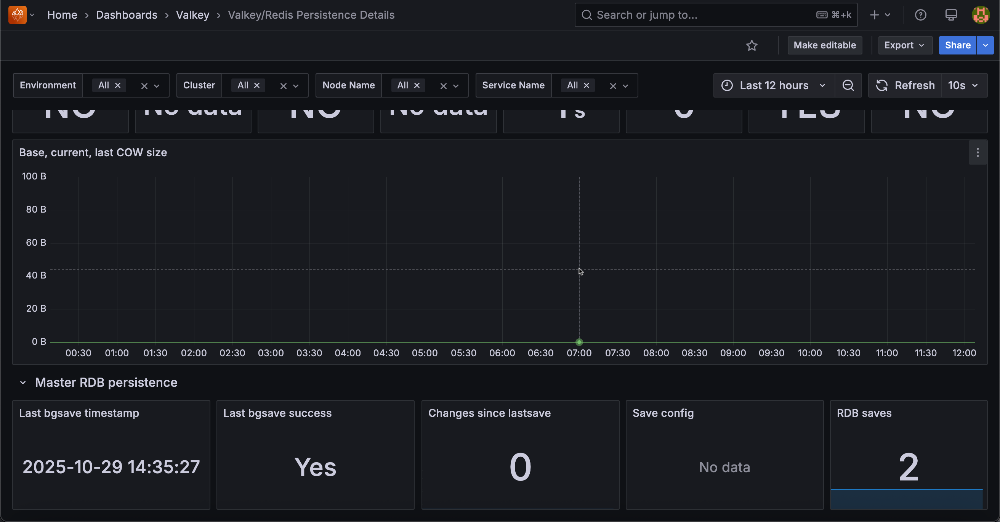

## Valkey/Redis Persistence Details

This dashboard monitors data persistence mechanisms for Valkey/Redis instances, tracking both AOF (Append-Only File) and RDB (snapshot) persistence. 

Use it to verify persistence configurations, monitor AOF and RDB operation health, track file sizes and memory overhead during rewrites, and ensure data durability through successful saves and syncs.

## Master AOF persistence

### Enabled

Displays whether Append-Only File (AOF) persistence is enabled on primary nodes.

Use this to verify that AOF persistence is configured as expected. AOF logs every write operation, enabling point-in-time recovery and better durability than RDB snapshots alone. 

A value of "YES" indicates AOF is active, while "NO" means only RDB snapshots (if configured) are used for persistence. Verify this setting aligns with your durability requirements and recovery objectives.

### Appendfsync

Displays the AOF fsync policy configured on primary nodes.

Use this to verify the durability and performance trade-off setting. The fsync policy determines how often AOF writes are synced to disk: `always` (sync every write, safest but slowest), `everysec` (sync every second, balanced), or `no` (let OS decide, fastest but least durable). 

Most deployments use `everysec` for a good balance between performance and durability. Verify this setting matches your data safety requirements.

### Loading Dump

Displays whether primary nodes are currently loading data from an RDB or AOF dump file.

Use this to detect when nodes are in the startup/recovery phase loading persisted data into memory. A value of "YES" indicates the node is still loading and not yet ready to serve requests, while "NO" means the node has finished loading and is operational. 

During large dataset loads, this process can take considerable time. Monitor this during restarts or failovers to track recovery progress.

### Delayed fsyncs

Displays the count of delayed AOF fsync operations on primary nodes.

Use this to detect when disk I/O cannot keep up with write load. When fsync operations take too long (typically >2 seconds), Redis/Valkey delays subsequent fsyncs to prevent blocking. 

Non-zero values indicate disk I/O bottlenecks that can impact write performance and potentially cause data loss if the system crashes during delays. High values suggest the need for faster storage or reduced write load.

### Last rewrite duration

Displays how long the last AOF rewrite operation took in seconds on primary nodes.

Use this to monitor AOF rewrite performance. AOF rewrites compact the append-only file by creating a fresh snapshot, removing redundant operations. Long rewrite durations may indicate large datasets, slow disk I/O, or insufficient system resources. 

Track this metric to understand rewrite impact on system performance and plan maintenance windows accordingly. Increasing durations over time suggest dataset growth requiring attention.

### Last COW size

Displays the copy-on-write (COW) memory size in bytes allocated during the last AOF rewrite on primary nodes.

Use this to understand memory overhead during AOF rewrites. When Redis/Valkey forks a child process for rewriting, copy-on-write creates copies of modified memory pages. 

This metric shows how much additional memory was consumed. High COW sizes indicate significant write activity during rewrites, requiring extra memory capacity. 

Monitor this to ensure sufficient memory is available during background operations and avoid out-of-memory conditions.

### Last rewrite success

Displays whether the last AOF write operation completed successfully on primary nodes.

Use this to verify AOF persistence health. A value of "YES" indicates the last AOF write succeeded, while "NO" signals a failure that could compromise data durability. 

Failed writes may result from disk space issues, permission problems, or I/O errors. 

Monitor this to ensure persistence is functioning correctly and investigate immediately if failures occur.

### Async Loading

Displays whether primary nodes are using asynchronous loading to serve requests during startup recovery.

Use this to verify if nodes can accept connections while still loading data from disk. 

When enabled, async loading allows the server to respond to some commands (like INFO) before completing the full data load, improving availability during restarts. 

A value of "YES" indicates async loading is active, while "NO" means the node blocks all requests until loading completes. This feature helps reduce downtime during large dataset recoveries.

### Base, current, last COW size

Displays AOF file sizes and copy-on-write memory usage over time for primary nodes, measured in bytes.

Use this to track AOF growth and memory overhead during rewrites. 

Base size is the AOF file size after the last rewrite, current size is the present AOF file size (growing as new operations append), and last COW size is the additional memory used during the most recent rewrite fork.

When current size significantly exceeds base size, a rewrite is needed to compact the file. Monitor COW size to ensure sufficient memory is available during background rewrite operations.

## Master RDB persistence

### Last bgsave timestamp

Displays the timestamp of the last successful RDB snapshot (BGSAVE) on primary nodes.

Use this to verify RDB snapshots are running as scheduled. The timestamp shows when the last background save completed, helping ensure your snapshot-based persistence is working. 

Large gaps between snapshots may indicate configuration issues, failed saves, or disabled RDB persistence. Compare with your configured save intervals to verify snapshots occur as expected. Old timestamps suggest investigating snapshot failures or confirming persistence settings.

### Last bgsave success

Displays whether the last RDB snapshot (BGSAVE) completed successfully on primary nodes.

Use this to verify RDB persistence health. A value of "Yes" indicates the last background save succeeded, while "No" signals a failure that could compromise data durability. 

Failed snapshots may result from disk space issues, permission problems, or I/O errors. Monitor this to ensure RDB persistence is functioning correctly and investigate immediately if failures occur.

### Changes since lastsave

Displays the number of write operations that have occurred since the last successful RDB snapshot on primary nodes.

Use this to assess potential data loss risk and determine if a new snapshot is needed. This counter increments with each write operation and resets to zero after each successful BGSAVE. 

High values indicate significant changes not yet persisted to an RDB file, representing data that would be lost if the server crashes (unless AOF is also enabled). 

Compare this with your configured save thresholds to verify automatic snapshots trigger as expected.

### Save config

Displays the configured RDB snapshot save rules for primary nodes in a table format.

Use this to verify automatic snapshot settings. The save configuration defines when Redis/Valkey automatically triggers BGSAVE based on time and change thresholds (e.g., "900 1" means save after 900 seconds if at least 1 key changed). 

Common configurations include multiple rules for different time/change combinations. An empty value means automatic snapshots are disabled. 

Verify these settings align with your recovery point objectives and data durability requirements.

### RDB saves

Displays the total count of RDB snapshot operations completed since startup on primary nodes.

Use this to track snapshot frequency and verify persistence activity. This cumulative counter increments with each successful BGSAVE operation, whether triggered automatically by save rules or manually. Monitor this to confirm snapshots are occurring as expected and to understand persistence workload over time. Compare the rate of increase with your configured save intervals to ensure automatic snapshots are functioning properly.