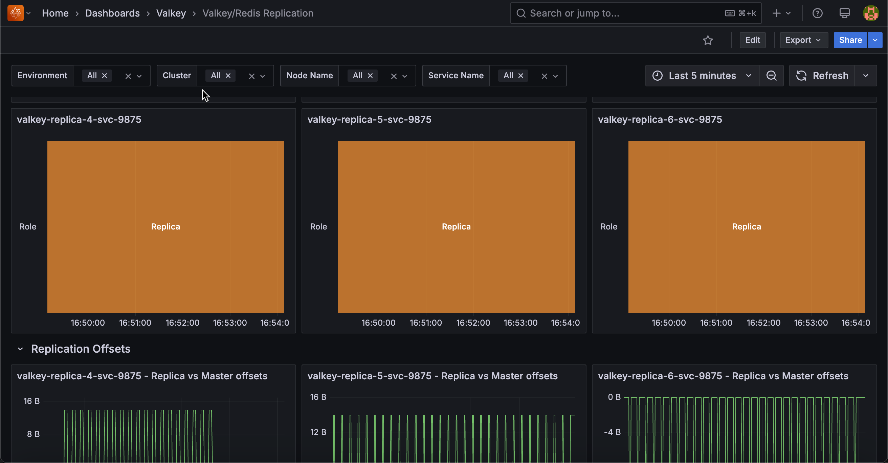

## Valkey/Redis Replication

This dashboard monitors replication health and synchronization across Valkey/Redis deployments. 

Track node roles, replica connectivity, replication lag through offset tracking, synchronization patterns (full vs. partial resyncs), and backlog configuration to ensure replicas stay current and high availability is maintained.

.

## Replication Roles

### [Service_name]

Displays the role (primary/master or replica/slave) of each node over time in a state timeline visualization.

Use this to track role changes and detect failovers or promotions. Green indicates primary/master nodes (write-capable), while orange indicates replica/slave nodes (read-only). 

Role changes appear as color transitions, making it easy to spot when failovers occur, replicas are promoted, or nodes change roles during maintenance. 

The timeline view shows historical role states, helping correlate role changes with performance issues or outages. Monitor this to verify replication topology matches expectations and to investigate unexpected role transitions.

## Replication Offsets

### [Replica service name] - Replica vs Master offsets

Displays replication offsets in bytes for both primary and replica nodes, showing how current each replica is with the primary's write operations.

Use this to monitor replication lag and ensure replicas stay synchronized. When primary and replica offsets match, the replica is fully caught up. Diverging lines indicate lag where replicas are processing operations behind the primary. 

Large or growing gaps suggest network issues, replica overload, or slow disk I/O. Statistics show mean, max, and min offsets to identify typical and peak lag. 

Monitor this to ensure read replicas serve current data and to detect replication problems before they impact availability.

### Replicas

Displays the total number of replicas connected to primary nodes over time.

Use this to monitor replication topology and detect replica disconnections. The count shows how many replicas are actively connected and receiving replication data from primaries. 

Drops in the count indicate replicas have disconnected due to network issues, crashes, or maintenance. Sustained lower counts than expected suggest replication problems requiring investigation. 

Monitor this to ensure your replication setup maintains the desired redundancy level for high availability and read scaling.

### Connected Replicas

Displays the number of connected replicas for each node in a table format, showing node name, service name, role, and replica count.

Use this to verify replication topology and identify which primaries have replicas connected. The table shows each node's role and how many replicas are connected to it. 

Primary nodes should show their replica count, while replica nodes typically show zero. Use this to ensure each primary has the expected number of replicas for redundancy and read scaling. 

Nodes with fewer replicas than expected may indicate connection issues or failed replicas requiring investigation.

### Full Resyncs

Displays the total count of full resynchronization operations for each node in a table format.

Use this to monitor expensive replication operations and identify sync issues. 

Full resyncs occur when replicas cannot use partial resync (typically after long disconnections or when the replication backlog is too small) and must receive a complete dataset copy from the primary. 

High or increasing counts indicate frequent disconnections, insufficient backlog size, or network instability. 

Full resyncs are resource-intensive, consuming significant CPU, memory, and network bandwidth. Monitor this to optimize replication backlog settings and investigate connection stability issues.

### Partial Resyncs

Displays the total count of accepted partial resynchronization operations for each node in a table format.

Use this to monitor efficient replication recovery. Partial resyncs occur when replicas reconnect after brief disconnections and can catch up using only the missed operations from the replication backlog, avoiding expensive full dataset transfers. 

High counts indicate good replication backlog sizing - replicas successfully reconnect without full resyncs. Compare with full resync counts to assess replication efficiency. 

A high ratio of partial to full resyncs indicates optimal configuration, while frequent full resyncs suggest increasing the backlog size. 

### Backlog Size

Displays the configured replication backlog size in bytes for each node in a table format.

Use this to verify replication backlog configuration across your deployment. 

The replication backlog buffers recent write operations, allowing replicas to perform partial resyncs after brief disconnections instead of expensive full resyncs. 

Larger backlogs enable replicas to reconnect after longer disconnections without full resyncs, but consume more memory. 

If you see frequent full resyncs in the previous panels, consider increasing the backlog size. Typical values range from 1MB to several hundred MB depending on write rate and expected disconnection duration.

### Backlog First Byte Offset

Displays the replication offset of the first byte in the replication backlog for each node in a table format.

Use this to understand the backlog's coverage window. The first byte offset marks the oldest operation still available in the backlog. Replicas with offsets older than this value cannot perform partial resyncs and must do full resyncs. 

Compare this with replica offsets to determine if disconnected replicas can still catch up via partial resync. If replicas frequently fall behind this offset, increase the backlog size to provide a larger recovery window.

### Backlog History Bytes

Displays the actual amount of data currently stored in the replication backlog in bytes for each node in a table format.

Use this to monitor backlog utilization. This shows how much of the configured backlog size is actually filled with replication data. 

A backlog near its maximum size indicates high write activity, while low values suggest light write load or recent backlog creation. Compare this with the backlog size to understand capacity headroom. 

If the backlog frequently fills to capacity during normal operations, consider increasing the configured backlog size to provide a better safety margin for replica recovery.

### Replica Resync Info

Displays cumulative counts of full resyncs, accepted partial resyncs, and denied partial resyncs over time for each service.

Use this to track replication synchronization patterns and efficiency. Full resyncs are expensive operations requiring complete dataset transfers, while partial resyncs efficiently send only missed operations. 

Denied partial resyncs occur when replicas fall too far behind (beyond the backlog window) and must fall back to full resyncs. 

The legend shows the last value for each metric. High denied partial resyncs indicate insufficient backlog size. Increase it to improve resync efficiency. 

Monitor trends to identify connection stability issues or configuration problems.