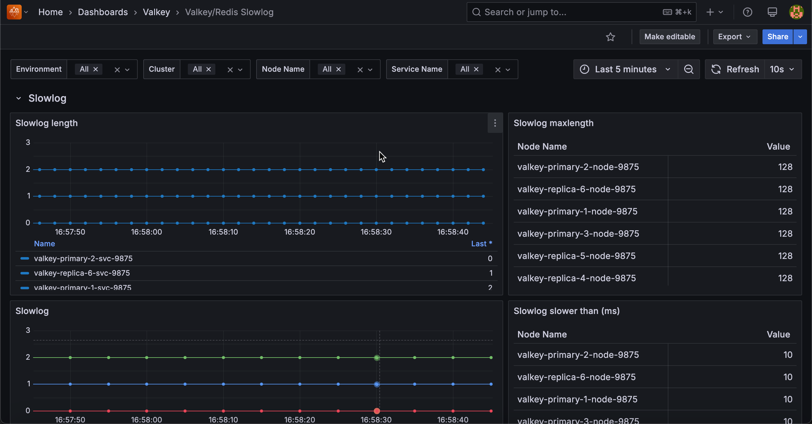

# Valkey/Redis Slowlog

This dashboard monitors slow command execution across Valkey/Redis instances using the slowlog feature. Track slowlog length and accumulation trends, verify slowlog capacity and threshold configurations, and identify performance degradation through slow query patterns.

## Slowlog

### Slowlog Length

Displays the number of entries currently in the slowlog for each service.

Use this to monitor slow command accumulation. The slowlog records commands that exceed the configured execution time threshold (set by `slowlog-log-slower-than`). 

A growing slowlog length indicates an increasing number of slow operations, while a stable length suggests consistent performance or that old entries are being rotated out. 

The slowlog has a maximum size (set by `slowlog-max-len`), so very high values may indicate the log is full and old entries are being discarded. Monitor this to identify when performance issues emerge and review slowlog entries to find problematic queries.

### Slowlog Maxlength

Displays the configured maximum number of slowlog entries that can be stored for each service in a table format.

Use this to verify slowlog capacity settings. The `slowlog-max-len` configuration determines how many slow command entries are retained before old entries are discarded. 

Common values range from 128 to several thousand. If the slowlog length frequently reaches this maximum, consider increasing it to retain more historical slow query data for analysis. 

Higher values consume more memory but provide better visibility into performance issues over time.

### Slowlog

Displays the total slowlog length aggregated across all services over time.

Use this to monitor overall slow command trends across your deployment. 

This aggregated view shows the sum of slowlog entries from all selected services, providing a cluster-wide perspective on performance issues. 

Rising trends indicate increasing slow operations that may require investigation. 

Compare with per-service slowlog length to identify which services contribute most to slow queries. Monitor this for early detection of performance degradation affecting multiple services.

### Slowlog Slower Than (ms)

Displays the configured threshold in milliseconds above which commands are logged to the slowlog for each service in a table format.

Use this to verify slowlog sensitivity settings. The `slowlog-log-slower-than` configuration determines which commands are considered "slow" and logged. 

Common values range from 10ms to 100ms depending on performance requirements. Lower thresholds capture more commands but may fill the slowlog quickly with marginally slow queries. 

Higher thresholds focus on truly problematic operations but may miss moderate performance issues. Adjust this value to balance between comprehensive monitoring and signal-to-noise ratio.

