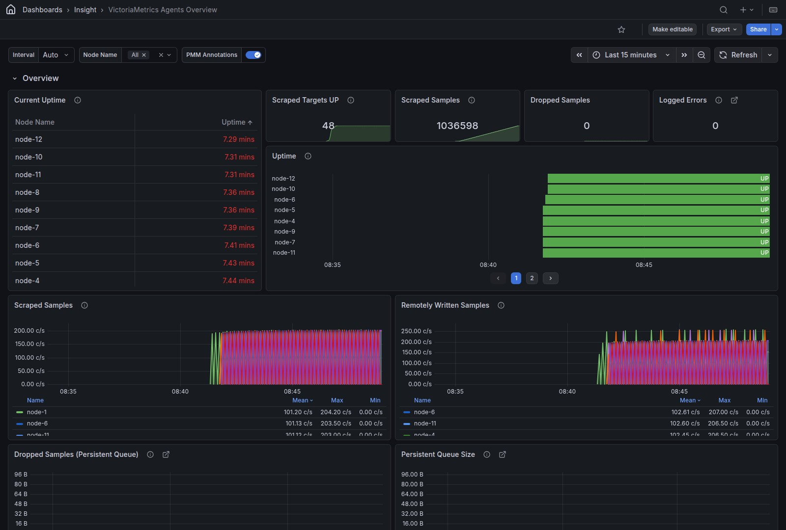

# VictoriaMetrics Agents Overview

<!-- TODO(doc): screenshot — retake on an instance with more than 8 monitored nodes so pagination is visible; current image predates pagination and still shows the removed legend -->

The **Uptime** panel shows up to 8 nodes per page, with pagination controls at the bottom of the panel when more nodes are selected. Nodes that stop reporting are grouped at the top. The panel has no separate legend: the UP (green) and DOWN (red) states and their labels appear directly on each bar. The **Current Uptime** table opens sorted with the shortest uptime first; click the column header to reverse the order.
