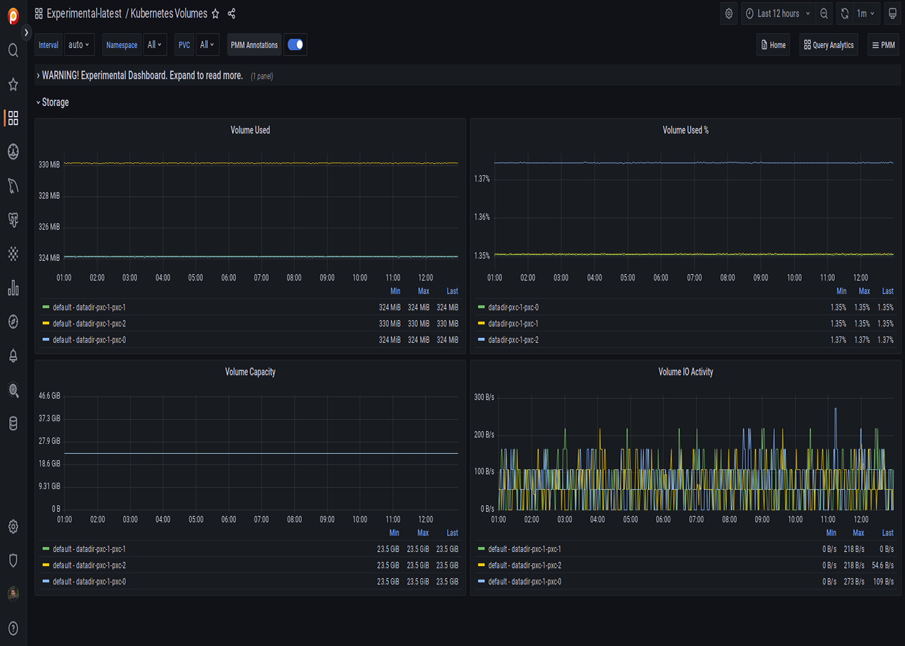

# Kubernetes Cluster Summary

!!! caution alert alert-warning "Disclaimer"
    This is an Experimental Dashboard that is not part of the official Percona Monitoring and Management (PMM) deployment and might be updated. We ship this Dashboard to obtain feedback from our users.

*Kubernetes Volumes* dashboard provides a comprehensive overview of your Kubernetes cluster, including:

- Resources
- Node Status
- [Pod](https://kubernetes.io/docs/concepts/workloads/pods/) Status
- [PVC](https://kubernetes.io/docs/concepts/storage/persistent-volumes/) status
- CPU Overview
- Kubernetes Resource Count
- Memory Overview and more

With this dashboard, you can view all workloads running in the cluster and optimize their performance.

