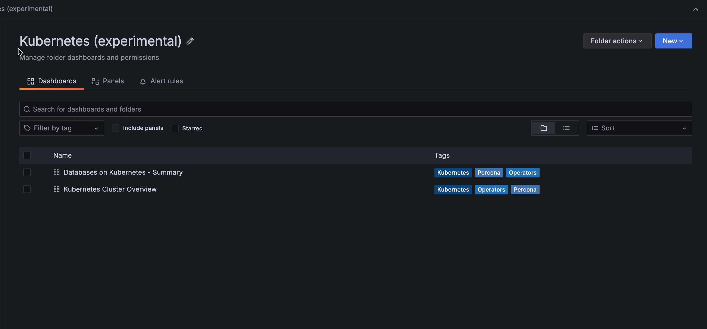

# Kubernetes Cluster Overview

This dashboard provides a comprehensive view of your Kubernetes cluster's health, resource utilization, and workload status.

## Overview

The overview section displays critical cluster metrics including node count, pod status, CPU and memory capacity, and resource utilization percentages. These metrics update in real-time to help you quickly assess cluster health and identify potential issues.

### Total Nodes
Displays the total number of nodes in the Kubernetes cluster. This metric helps you track cluster size and capacity planning.

### Not Ready Nodes
Shows the number of nodes that are not in Ready state. The gauge turns yellow when any node is not ready, alerting you to potential infrastructure problems that could affect workload availability.

### Total Pods
Displays the total number of pods across all namespaces in the cluster. Use this to monitor overall workload deployment and cluster utilization.

### Not Running Pods
Shows the count of pods not in Running or Succeeded status. The gauge turns yellow when pods are detected in Failed, Pending, or other non-healthy states, helping you quickly identify application deployment issues.

### CPU Capacity
Displays the total CPU cores available across all nodes in the cluster. This helps you understand the maximum computational resources available for workload scheduling.

### CPU Requests
Shows how many CPU cores have been requested by all containers. This metric indicates how much CPU capacity has been reserved by workloads, helping you assess resource allocation.

### CPU Requests %
Visualizes the percentage of total CPU capacity that has been requested by containers. The gauge changes from green to yellow at 70% and red at 90%, warning you when CPU allocation is approaching cluster limits and new workloads may face scheduling difficulties.

### CPU Limits
Displays the sum of CPU core limits set for all containers in the cluster. This shows the maximum CPU that containers can consume if available, which may exceed actual cluster capacity.

### Percona Clusters
Shows the total number of Percona database clusters (Custom Resources) deployed in the cluster, including PXC, Percona Server for MongoDB, and Percona Distribution for PostgreSQL. Use this to monitor your database infrastructure at a glance.

### Percona Clusters Not Ready
Displays the number of Percona clusters not in Ready state. The gauge turns yellow when any cluster is unhealthy, alerting you to database availability issues.

### Memory Capacity
Displays the total memory (RAM) available across all nodes in the cluster, helping you understand the maximum memory resources available for workload scheduling.

### Memory Requests
Shows how many memory bytes have been requested by all containers. This indicates how much memory capacity has been reserved by workloads.

### Memory Requests %
Visualizes the percentage of total memory capacity that has been requested by containers. The gauge changes from green to yellow at 70% and red at 90%, warning when memory allocation is approaching cluster limits.

### Memory Limits
Displays the sum of memory limits set for all containers. This shows the maximum memory that containers can consume if available, which may exceed actual cluster capacity.

## Cluster

### Node Status

Tracks the health of all nodes in the cluster over time, displaying various node conditions. Green lines indicate healthy Ready nodes, while other colors represent different node conditions like MemoryPressure, DiskPressure, or NetworkUnavailable. Use this to monitor node stability, identify patterns in node failures, and track infrastructure issues over time.

### Pod Status

Shows the status of all pods in the cluster over time, categorized by phase. Green represents Running pods, while other colors indicate different states like Pending, Failed, or Succeeded. This helps you monitor overall application health, spot deployment issues, and track pod lifecycle patterns.

### Percona Custom Resources - Clusters

Monitors the health of Percona database clusters deployed via Custom Resources. Green lines indicate clusters in Ready state, while orange represents Error states. Use this to track database cluster availability, identify unhealthy clusters, and monitor database infrastructure stability.

### Percona Custom Resources - Backups

Tracks the status of Percona database backups over time, showing backup states across all deployed database types. Use this to monitor backup health, ensure backups are completing successfully, and identify backup failures that could affect disaster recovery capabilities.

### Percona Custom Resources - Backups (Table)

Lists all Percona database backups with their current state, namespace, and type. The table shows only active backups (state = 1) and displays "No backups were created for databases" when no backups exist. Use this for detailed backup inventory and troubleshooting specific backup issues.

### PV and PVC Status

Displays the status of Persistent Volumes (PV) and Persistent Volume Claims (PVC) over time. Shows volumes in different states like Bound, Pending, or Failed. Use this to monitor storage provisioning, identify storage issues, and ensure applications have access to required persistent storage.

### Storage Class

Lists all storage classes available in the cluster with their provisioners, reclaim policies, and binding modes. Shows "Can't find any storage classes" when none exist. Use this to understand available storage options, verify storage configuration, and troubleshoot persistent volume provisioning issues.

## Custer - Compute Network

### CPU and Memory %

Tracks CPU and memory resource utilization as percentages of total cluster capacity over time. Displays both requests (reserved resources) and limits (maximum allowed) for CPU and memory. Use this to monitor resource consumption trends, identify capacity constraints, plan cluster scaling, and ensure efficient resource allocation across workloads.

## Cluster Network

Visualizes network traffic across the cluster, showing both received (incoming) and sent (outgoing) data rates in bytes per second. Use this to monitor network utilization, identify unusual traffic spikes, detect potential DDoS attacks or misconfigurations, and plan network capacity upgrades.