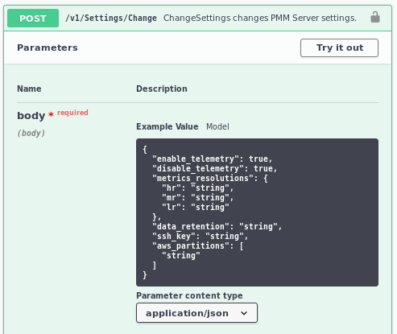

# FAQ

## How can I contact the developers?

- [Community forum](https://www.percona.com/forums/questions-discussions/percona-monitoring-and-management).
- [PMM project in JIRA](https://jira.percona.com/projects/PMM).

## What are the minimum system requirements?

See our detailed guides:

- [PMM hardware and system requirements](../install-pmm/plan-pmm-installation/hardware_and_system.md) for complete specifications
- [Setting up PMM Server](../install-pmm/install-pmm-server/index.md) for server installation  
- [Setting up PMM Client](../install-pmm/install-pmm-client/index.md) for client setup

Quick reference for typical deployment (up to 30 nodes):
- **Server**:
    - CPU: 4 cores (must support SSE4.2)
    - Memory: 8 GB
    - Storage: 100 GB (approximately 1 GB per node per week)
- **Client**:
    - Storage: 100 MB
    - Supports x86_64 and ARM64 architectures

!!! note alert alert-info "Note"
    For larger deployments (200+ nodes) or longer retention periods, see our [Hardware and system requirements](../install-pmm/plan-pmm-installation/hardware_and_system.md) for detailed sizing recommendations.

## How can I upgrade from version 2?

PMM 3 introduces significant architectural changes that require gradual transition from PMM 2. For detailed instructions, see [Upgrade from PMM2](../pmm-upgrade/migrating_from_pmm_2.md).


## Why does the PMM installation script fail during Docker installation?
If you encounter errors such as `ERROR: Unsupported distribution` when running the, follow these steps:
{.power-number}

1. [Install Docker manually](https://docs.docker.com/engine/install/).
2. Run the [PMM Easy-install script](../install-pmm/install-pmm-server/deployment-options/docker/easy-install.md) again.

## Retention

To control data retention, go to **PMM Configuration > Settings > Advanced Settings > Data retention** to adjust the value in days.

!!! seealso alert alert-info "See also"
    [Configure data retention](../configure-pmm/advanced_settings.md#data-retention)

## How are PMM Server logs rotated?

PMM Server embeds multiple components, like Victoria Metrics, Query Analytics, Grafana, `managed`, PostgreSQL, ClickHouse, etc. (components). All PMM Server component logs are rotated by `supervisord`. The components' log rotation settings are stored in `*.ini` files within the `/etc/supervisord.d` directory. Those settings define both the maximum size of a log file and the number of log files to keep. The log rotation takes place once the log file reaches its maximum size.

## What privileges are required to monitor a MySQL instance?

```sql
SELECT, PROCESS, SUPER, REPLICATION CLIENT, RELOAD
```

!!! seealso alert alert-info "See also"
    [Setting Up/Client/MySQL](../install-pmm/install-pmm-client/connect-database/mysql/mysql.md#create-a-database-account-for-pmm).

## Can I monitor multiple service instances?

Yes.

You can add multiple instances of MySQL or any other service to be monitored from the same PMM Client.

To do this, you provide a unique port and IP address, or a socket for each instance, and specify a unique name for each. (If a name is not provided, PMM uses the name of the PMM Client host.)

For example, to add MySQL monitoring for two local MySQL servers:

```sh
pmm-admin add mysql --username root --password root instance-01 127.0.0.1:3001
pmm-admin add mysql --username root --password root instance-02 127.0.0.1:3002
```

!!! seealso alert alert-info "See also"
    [`pmm-admin add mysql`](../use/commands/pmm-admin.md#mysql)

## Can I rename instances?

Yes, by removing and re-adding with a different name.

When you remove a monitoring service, previously collected data remains available in Grafana.  However, the metrics are tied to the instance name.  So if you add the same instance back with a different name, it will be considered a new instance with a new set of metrics.  So if you are re-adding an instance and want to keep its previous data, add it with the same name.

## Can I add an AWS RDS MySQL or Aurora MySQL instance from a non-default AWS partition?

By default, the RDS discovery works with the default `aws` partition. But you can switch to special regions, like the [GovCloud](https://aws.amazon.com/govcloud-us/) one, with the alternative [AWS partitions](https://docs.aws.amazon.com/sdk-for-go/api/aws/endpoints/#pkg-constants) (e.g. `aws-us-gov`) adding them to the *Settings* via the PMM Server [API](../api/index.md).



To specify other than the default value, or to use several, use the JSON Array syntax: `["aws", "aws-cn"]`.

## What resolution is used for metrics?

The default values (in seconds):

| Preset            | Low  | Medium | High |
|-------------------|------|--------|------|
| Rare              | 300  | 180    | 60   |
| Standard          | 60   | 10     | 5    |
| Frequent          | 30   | 5      | 1    |
| Custom (defaults) | 60   | 10     | 5    |

!!! seealso alert alert-info "See also"
    [Metrics resolution](../configure-pmm/metrics_res.md)

## How do I set up Alerting?

When a monitored service metric reaches a defined threshold, PMM Server can trigger alerts for it using embedded Grafana Alerting functionality.

For this, you must configure alerting rules that define conditions under which an alert should be triggered, and the contact points used to send the alert (e.g. email).

Percona templated alerts enable you to create alerts based on built-in or custom templates to simplify the alert setup process. Grafana managed alerts allows attaching rules to your dashboard panel and enables you to create more sophisticated alerting rules. In addition, it can be easier to manage installations with a large number of hosts. This additional flexibility comes at the expense of simplicity.

!!! seealso alert alert-info "See also"
    [Grafana Alerting](https://grafana.com/docs/grafana/latest/alerting/)

## How do I use a custom Prometheus configuration file?

Normally, PMM Server fully manages the [Prometheus configuration file](https://prometheus.io/docs/prometheus/latest/configuration/configuration/).

However, some users may want to change the generated configuration to add additional scrape jobs, configure remote storage, etc.

From version 2.4.0, when `pmm-managed` starts the Prometheus file generation process, it tries to load the `/srv/prometheus/prometheus.base.yml` file first, to use it as a base for the `prometheus.yml` file.

The `prometheus.yml` file can be regenerated by restarting the PMM Server container, or by using the `SetSettings` API call with an empty body.

!!! seealso alert alert-info "See also"
    - [API](../api/index.md)
    - [Percona blog: Extending PMM’s Prometheus Configuration](https://www.percona.com/blog/2020/03/23/extending-pmm-prometheus-configuration/)

## How to troubleshoot an upgrade?

See [Troubleshoot update](../troubleshoot/upgrade_issues.md).

## What are my login credentials when I try to connect to a Prometheus Exporter?

- User name: `pmm`
- Password: Agent ID

PMM protects an exporter's output from unauthorized access by adding an authorization layer. To access an exporter, you can use `pmm` as a user name and the Agent ID as a password. You can find the Agent ID corresponding to a given exporter by running `pmm-admin list`.

!!! seealso alert alert-info "See also"
    [`pmm-admin list`](../use/commands/pmm-admin.md#information-commands)

## How to provision PMM Server with non-default admin password?

Currently, there is no API available to change the `admin` password at deployment time. However, you can use the `GF_SECURITY_ADMIN_PASSWORD` environment variable to set the password for the default `admin` user.

```sh
docker run -d --name pmm-server \
  -e GF_SECURITY_ADMIN_PASSWORD="your_secure_password" \
  -p 443:8443 \
  percona/pmm-server:latest
```

## How to change the PMM password for the default admin user?

Once PMM has started, you can use either of the following to change the password  (assuming your container is named `pmm-server`):

- a helper script `change-admin-password`:

```sh
docker exec -t pmm-server change-admin-password your_secure_password
```

- or a code snippet:

```sh
PMM_PASSWORD="mypassword"
echo "Waiting for PMM to initialize to set password..."
until [ $(docker inspect -f '{{.State.Health.Status}}' pmm-server) = "healthy" ]; do sleep 1; done
docker exec -t pmm-server bash -c  "grafana cli --homepath /usr/share/grafana --config=/etc/grafana/grafana.ini admin reset-admin-password $PMM_PASSWORD"
```

## How to use a non-default listen-port for pmm-admin?

If you configure the PMM agent to use a non-default listen-port, for pmm-admin to communicate with the agent, use the global flag `--pmm-agent-listen-port=LISTEN_PORT`.

```sh
--pmm-agent-listen-port=LISTEN_PORT
```

Example: To use the listen-port 8000

```sh
pmm-admin --pmm-agent-listen-port=8000 add postgresql --username=pmm-agent --password=pmm-agent-password --query-source=pgstatmonitor nameofpostgres
```

If you are using OVF/AMI, you can change the default password through SSH by using the following command:

```sh
change-admin-password <new_password>
```

## How does PMM handle personal and confidential data?

Read our [Privacy Policy](https://www.percona.com/privacy-policy) to learn how PMM manages personal and confidential data. More technical details can be found in [Data handling in PMM](personal_data_handling.md).

## Why am I getting a "User already exists" error when logging back into PMM?

Following [CVE fix 2023-3128](https://grafana.com/blog/2023/06/22/grafana-security-release-for-cve-2023-3128/) in the 2.38 release, PMM increases security by only allowing authentications based on the unique user ID provided by the identity provider.

If you are trying to log into PMM via a third-party authentication provider which doesn't support a unique ID field, PMM will show this error on second and subsequent authentications.

**Solution**: we recommend logging into PMM using a Percona Account, as this is a highly secure authentication method.
**Workaround**: if you need to log into PMM via a third-party authentication provider which doesn’t support a unique ID field, you can use the following workaround to log into PMM:

  - pass the `GF_AUTH_OAUTH_ALLOW_INSECURE_EMAIL_LOOKUP=1` environment variable to the PMM container **OR**
  - set the `oauth_allow_insecure_email_lookup` config key in the auth section of the `grafana.ini` file. Keep in mind that any changes you make to this file are lost when upgrading PMM, so make sure to manually update this file after each upgrade.

!!! caution alert alert-warning "Important"
    We do not recommend using the above workaround for an extended period. Instead, ensure user uniqueness across multiple identity providers, while also encouraging your identity provider to support a unique ID field, or choose a provider who does.
