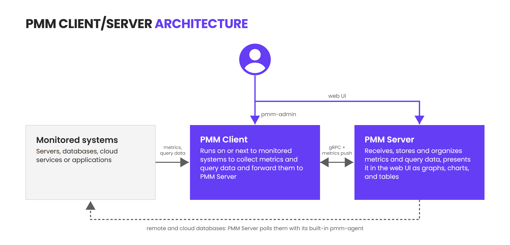
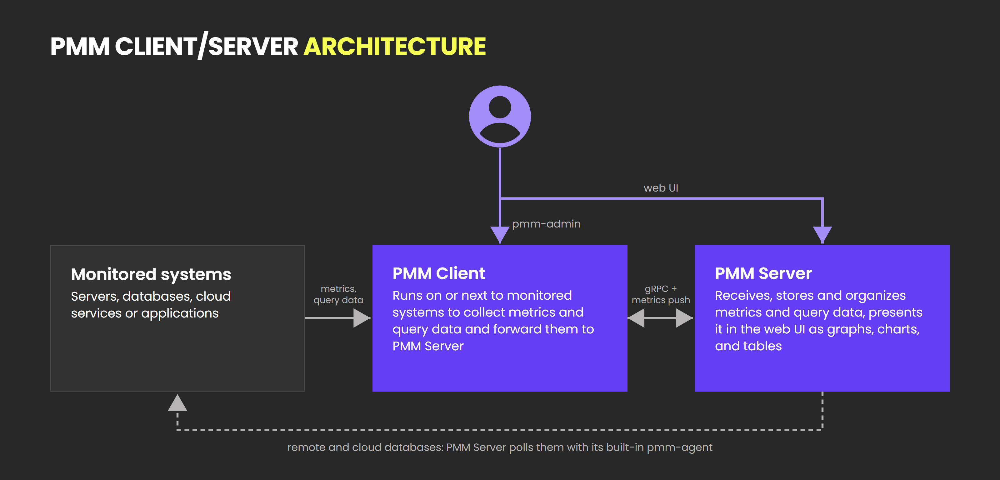
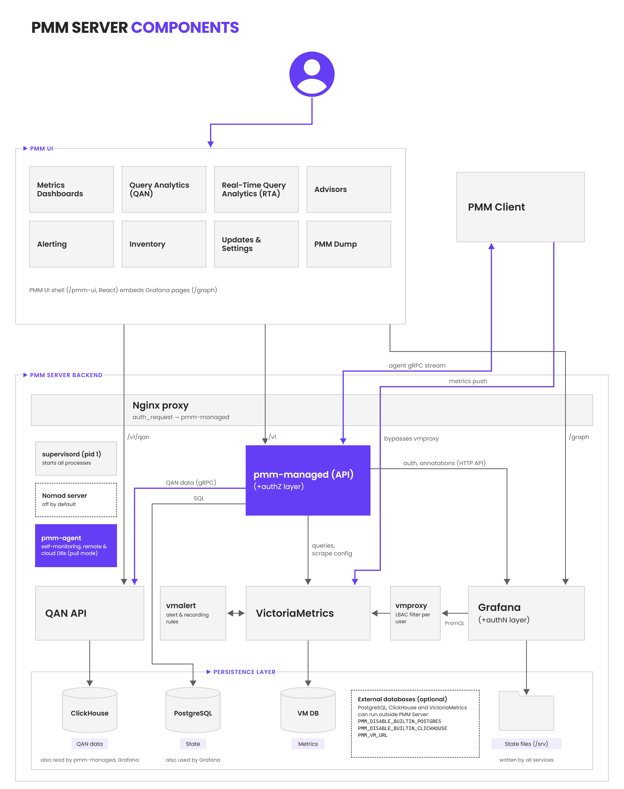
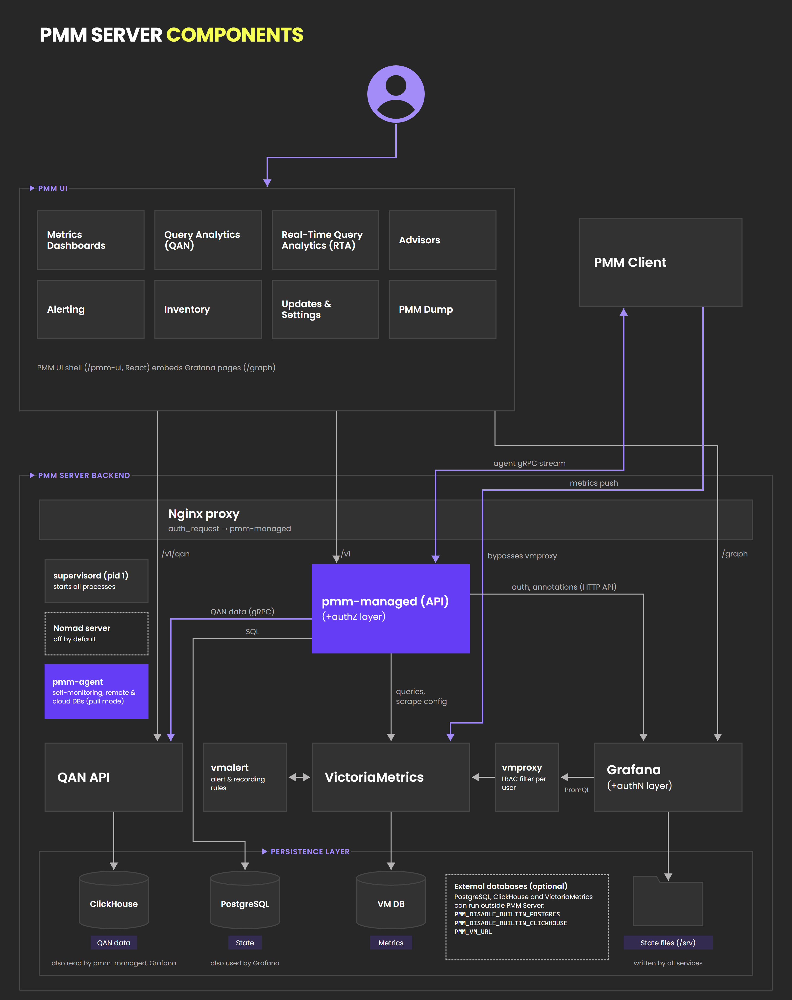
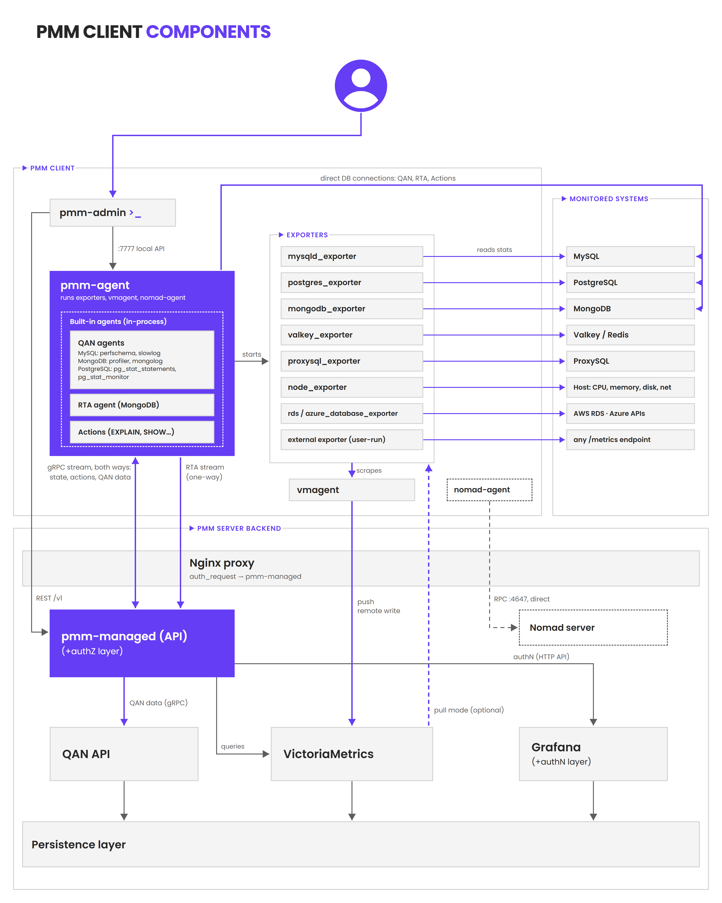
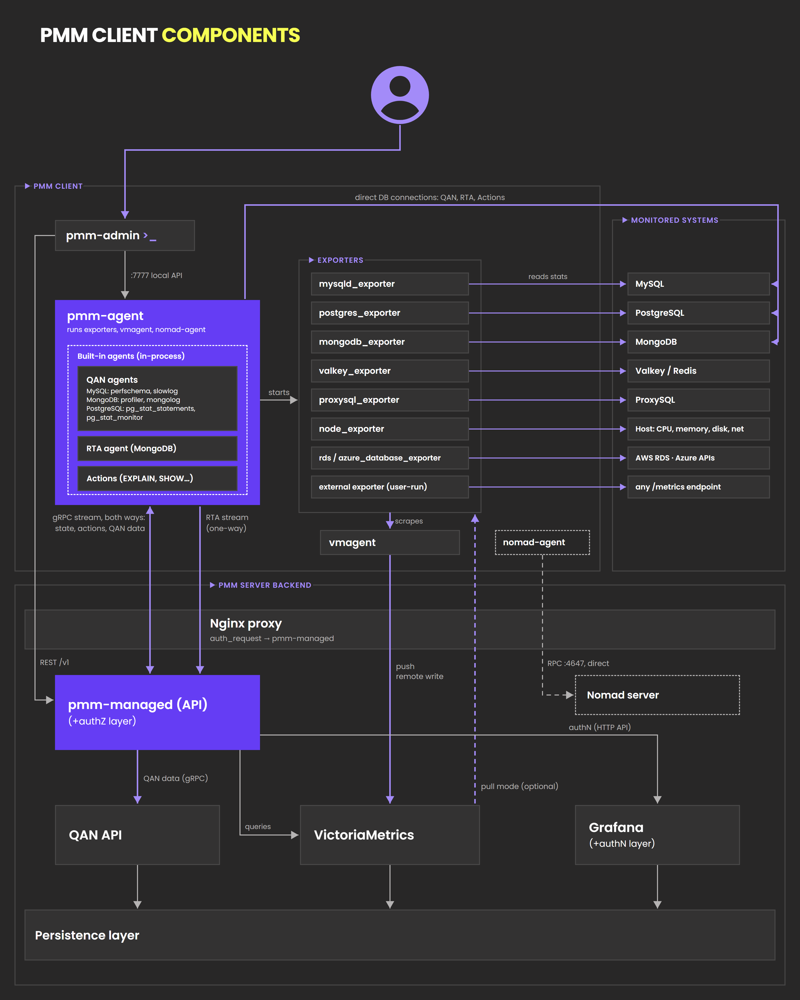
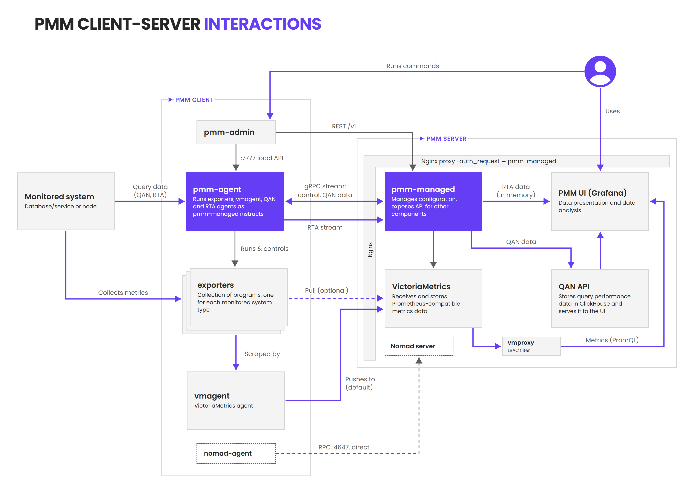
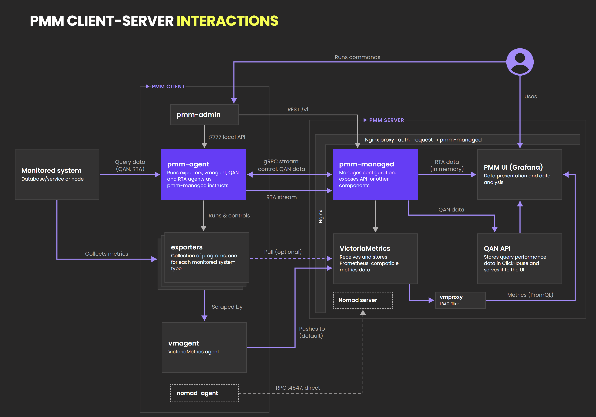

# PMM architecture

Percona Monitoring and Management (PMM) is a client/server application. PMM Client collects metrics and query data from the systems that you monitor and sends them to PMM Server. PMM Server stores the data and presents it in its web interface.

{ .only-light }
{ .only-dark }

You can also monitor remote databases and cloud services, such as [Amazon RDS](../install-pmm/install-pmm-client/connect-database/aws.md) and [Azure](../install-pmm/install-pmm-client/connect-database/azure.md), without installing PMM Client on their hosts. In that case, the `pmm-agent` built into PMM Server, or a PMM Client on another host, collects the data. For details, see [Connect remote instance to PMM](../install-pmm/install-pmm-client/connect-database/remote.md).

## PMM Server

PMM Server receives data from PMM Clients, stores it, and presents it in [dashboards](../use/dashboards-panels/index.md) and other views of the [web interface](../reference/ui/ui_components.md). In a standard deployment, PMM Server runs as a single container that holds all of the components in this section.

{ .only-light }
{ .only-dark }

### Web interface

The web interface, also called the PMM UI, is a web application that embeds Grafana. It brings together [Metrics Dashboards](../use/dashboards-panels/index.md), [Query Analytics (QAN)](../use/qan/index.md), [Real-Time Query Analytics (RTA)](../use/qan/QAN-realtime-analytics.md) for MongoDB, [Advisors](../advisors/advisors.md), [Alerting](../alert/index.md), [Inventory](../use/dashboard-inventory.md), [Updates](../pmm-upgrade/index.md) & [Settings](../configure-pmm/configure.md), and [PMM Dump](../troubleshoot/pmm_dump.md).

### Server components

PMM Server runs the following services:

- **Nginx** receives every request, on port 8443 (HTTPS) or 8080 (HTTP) inside the container. You usually publish port 8443 as 443. It asks `pmm-managed` to authorize requests, then routes them to the other services.
- **`pmm-managed`** manages the PMM Server configuration, the inventory of monitored services, and the connected PMM Clients. It forwards QAN data from PMM Clients to QAN API, and keeps RTA data in memory.
- **QAN API** stores and serves Query Analytics data.
- **[VictoriaMetrics](third-party/victoria.md)** stores metrics. It receives the metrics that PMM Clients push, and scrapes exporters that run in pull mode.
- **vmproxy** applies [label-based access control (LBAC)](../admin/roles/access-control/intro.md) filters to metrics queries before they reach VictoriaMetrics.
- **vmalert** evaluates alerting and recording rules against VictoriaMetrics.
- **[Grafana](https://grafana.com/docs/grafana/latest/)** renders dashboards, runs Alerting, and authenticates users.

PMM Server also runs these supporting processes:

- **supervisord** runs as process 1, and starts and restarts every other process.
- **`pmm-agent`** monitors PMM Server itself, and collects data from remote databases and cloud services in pull mode.
- **[Nomad server](nomad.md)** runs the Nomad workload orchestrator for future PMM extensions. It's disabled by default.

### Persistence layer

PMM Server keeps its data in the following stores:

- **[ClickHouse](third-party/clickhouse.md)** stores Query Analytics data. `pmm-managed` and Grafana also read from it.
- **[PostgreSQL](third-party/postgresql.md)** stores the `pmm-managed` state and the Grafana database.
- **VM DB**, the VictoriaMetrics storage, holds metrics.
- **State files** under `/srv` hold configuration, logs and, when you use the built-in databases, all stored data.

You can run PostgreSQL, ClickHouse and VictoriaMetrics outside PMM Server. For details, see [external PostgreSQL](third-party/postgresql.md), [external ClickHouse](third-party/clickhouse.md) and [external VictoriaMetrics](third-party/victoria.md#using-victoriametrics-external-database-instance), which is in Technical Preview. To run more than one PMM Server instance, see [Install PMM in High Availability (HA) mode](../install-pmm/HA.md).

## PMM Client

PMM Client is a set of programs that runs on, or next to, each system that you monitor. It collects metrics and query data, and sends them to PMM Server. To install it, see [PMM Client installation overview](../install-pmm/install-pmm-client/index.md).

{ .only-light }
{ .only-dark }

PMM Client includes the following components:

- **[`pmm-admin`](../use/commands/pmm-admin/pmm-admin.md)** is the command-line tool for adding and removing monitored services. It talks to the local `pmm-agent` on port 7777 and to the PMM Server API.
- **`pmm-agent`** is the daemon that connects PMM Client to PMM Server. It receives its configuration from PMM Server, then starts and stops the exporters and other agents.
- **Exporters** collect metrics from each monitored service and expose them for scraping.
- **`vmagent`** scrapes the local exporters and pushes the metrics to PMM Server in push mode, the default.
- **Built-in agents** run inside the `pmm-agent` process, and collect query data or run on-demand tasks.
- **`nomad-agent`** connects to the Nomad server when you [enable Nomad](nomad.md).

### Exporters

PMM Client includes an exporter for each supported service type:

| Exporter | Collects metrics from |
|----------|-----------------------|
| `node_exporter` | The host: CPU, memory, disk and network |
| `mysqld_exporter` | MySQL |
| `postgres_exporter` | PostgreSQL |
| `mongodb_exporter` | MongoDB |
| `valkey_exporter` | Valkey and Redis |
| `proxysql_exporter` | ProxySQL |
| `rds_exporter` | Amazon RDS, through Amazon CloudWatch |
| `azure_database_exporter` | Azure databases, through Azure Monitor |

You can also add an [external exporter](../install-pmm/install-pmm-client/connect-database/external.md) that you run yourself. PMM scrapes it like any other exporter.

### Built-in agents

`pmm-agent` runs the following agents in its own process:

- **QAN agents** collect query data from MySQL (Performance Schema, slow query log), PostgreSQL (`pg_stat_statements`, `pg_stat_monitor`) and MongoDB (profiler, log file).
- **The RTA agent** streams the queries that are running on MongoDB right now.
- **Actions** run on-demand tasks, such as `EXPLAIN`, `SHOW CREATE TABLE` and `pt-summary`.

## How PMM Client and PMM Server interact

The following diagram shows the connections between the PMM Client and PMM Server components.

{ .only-light }
{ .only-dark }

PMM Client and PMM Server communicate over these connections:

- **Control stream**: `pmm-agent` keeps a two-way gRPC stream open to `pmm-managed`. `pmm-managed` sends configuration and on-demand actions, and `pmm-agent` sends status and QAN data. RTA data travels on a separate gRPC stream.
- **Metrics in push mode** (default): `vmagent` scrapes the local exporters and pushes the metrics to VictoriaMetrics.
- **Metrics in pull mode**: VictoriaMetrics scrapes each exporter directly. To choose the mode, use the `--metrics-mode` flag. For details, see [Push/Pull modes](third-party/victoria.md#pushpull-modes).
- **Commands**: `pmm-admin` calls the local `pmm-agent` on port 7777 and the PMM Server API.

Inside PMM Server, the web interface reads metrics from VictoriaMetrics through vmproxy, and query data from QAN API. It reads RTA data from `pmm-managed`, which keeps that data in memory only.

### Connection security

Except for Nomad RPC, `pmm-agent` and its managed `vmagent` use HTTPS by default to connect to PMM Server on port 443 or 8443. Direct `pmm-admin` API calls can use HTTP when you specify an `http://` server URL. The default vmagent write endpoint follows the PMM Client's server URL. In development and testing, `without-tls` selects HTTP and sends metric samples and authentication credentials over that path (PMM Server credentials in standalone internal-VM mode; `PMM_VM_URL` credentials for HA clients). If you expose port 8080, Nginx serves API routes over HTTP without redirecting requests to HTTPS. Use HTTPS for authenticated requests. Nginx asks `pmm-managed` to authorize requests before it passes them on. To use your own certificates, see [SSL encryption](../admin/security/ssl_encryption.md).

`node_exporter`, `mysqld_exporter`, `postgres_exporter`, `mongodb_exporter` and `proxysql_exporter` require HTTP basic authentication, each with its own password by default. `valkey_exporter`, `rds_exporter` and `azure_database_exporter` don't require authentication. In pull mode, VictoriaMetrics connects to the exporters directly, on ports 42000–51999 by default, so PMM Server must be able to reach those ports. When you enable Nomad, `nomad-agent` also connects to PMM Server directly, on port 4647.

Exporters and QAN agents can use TLS to connect to the databases that they monitor.

## Next steps

To install PMM and plan its network access, continue with these pages:

- [PMM Server installation overview](../install-pmm/install-pmm-server/index.md)
- [PMM Client installation overview](../install-pmm/install-pmm-client/index.md)
- [Network and firewall requirements](../install-pmm/plan-pmm-installation/network_and_firewall.md)
