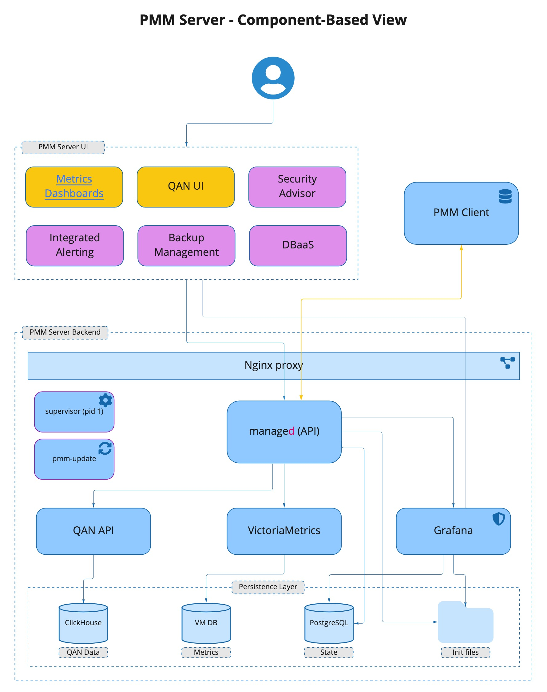
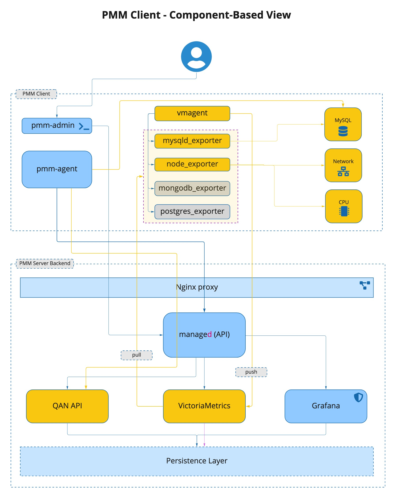

# PMM Architecture

PMM is a client/server application built by Percona comprising its own and third-party components and tools.

<!-- The source of this image is maintained at https://miro.com/app/board/uXjVOPgKgrE=/ -->

## PMM Server

PMM Server is the heart of PMM. It receives data from clients, collects it, and stores it. Metrics are drawn as tables, charts and graphs within [_dashboards_](../use/dashboards-panels/index.md), each a part of the web-based [user interface](../reference/ui/index.md).

## PMM Client

PMM Client is a collection of agents and exporters that run on the host being monitored.

PMM Client runs on every database host or node you want to monitor. The client collects server metrics, general system metrics, query analytics and sends it to the server. Except when monitoring AWS RDS instances, a PMM Client must be running on the host to be monitored.

## Percona Platform

[Percona Platform](../configure-pmm/percona_platform/integrate_with_percona_platform.md) provides value-added services for PMM.

## PMM context

The PMM Client package provides:

- Exporters for each database and service type. When an exporter runs, it connects to the database or service instance, runs the metrics collection routines, and sends the results to PMM Server.
- `pmm-agent`: Run as a daemon process, it starts and stops exporters when instructed.
- `vmagent`: A VictoriaMetrics daemon process that sends metrics data (_pushes_) to PMM Server.

The PMM Server package provides:

- `pmm-managed`
- Query Analytics
- Grafana
- VictoriaMetrics

### PMM Server

<!-- The source of this image is maintained at https://miro.com/app/board/uXjVOPgKgrE=/ -->

PMM Server includes the following tools:

- Query Analytics (QAN) enables you to analyze database query performance over periods of time. In addition to the client-side QAN agent, it includes the following:

    - QAN API is the back-end for storing and accessing query data collected by the QAN agent running on a PMM Client.
    - QAN App is a web application for visualizing collected Query Analytics data, which is part of the PMM Server's UI.

- Metrics Monitor provides a historical view of metrics that are critical to a MySQL or MongoDB server instance. It includes the following:

  - [VictoriaMetrics](https://github.com/VictoriaMetrics/VictoriaMetrics), a scalable time-series database. 
  - [ClickHouse](https://clickhouse.com) is a third-party column-oriented database that facilitates the Query Analytics functionality.
  - [Grafana](http://docs.grafana.org) is a third-party dashboard and graph builder for visualizing data aggregated (by VictoriaMetrics or Prometheus) in an intuitive web interface.
  - [Percona Dashboards](https://github.com/percona/grafana-dashboards) is a set of dashboards for Grafana developed by Percona.

### PMM Client

The PMM Client package consists of the following:

- `pmm-admin` is a command-line tool for managing PMM Client, for example, adding and removing database instances that you want to monitor. ([Read more](../details/commands/pmm-admin.md)).

- `pmm-agent` is a client-side component of a minimal command-line interface, which is a central entry point in charge of bringing the client functionality: it carries on client’s authentication, gets the client configuration stored on the PMM Server, manages exporters and other agents.

- `node_exporter` is an exporter that collects general system metrics.

- `mysqld_exporter` is an exporter that collects MySQL server metrics.

- `mongodb_exporter` is an exporter that collects MongoDB server metrics.

- `postgres_exporter` is an exporter that collects PostgreSQL performance metrics.

- `proxysql_exporter` is an exporter that collects ProxySQL performance metrics.

- `rds_exporter` is an exporter that collects Amazon RDS performance metrics.

- `azure_database_exporter` is an exporter that collects Azure database performance metrics.

To make data transfer from PMM Client to PMM Server secure, all exporters are able to use SSL/TLS encrypted connections, and their communication with PMM Server is protected by the HTTP basic authentication.

<!-- The source of this image is maintained at https://miro.com/app/board/uXjVOPgKgrE=/ -->

