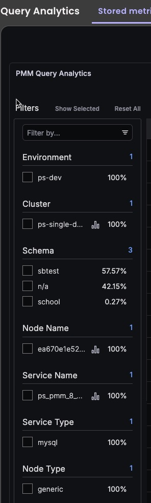
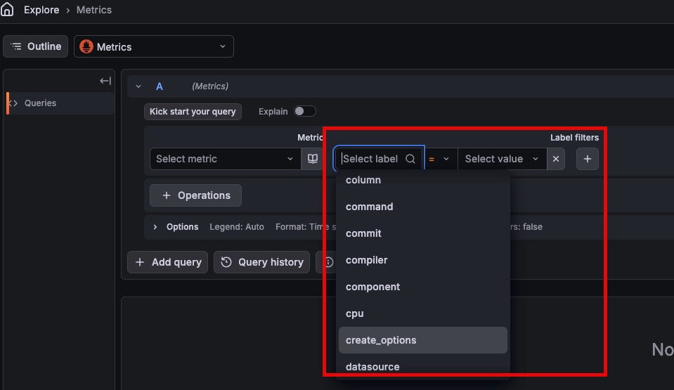
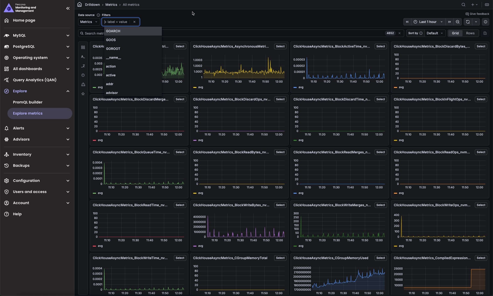

# Monitoring labels

PMM uses labels (key/value pairs) to tag the monitoring data it collects. Labels appear in both Prometheus metrics and Query Analytics (QAN), so you can use them to filter, group, and create alert rules across your entire infrastructure.

## Where labels appear in PMM

Labels are available as filters in both Query Analytics and the Metrics Explorer.

In **Query Analytics**, labels appear as filter groups in the Filters panel on the left. Use them to narrow query data by environment, cluster, service, node, and more.



In **Explore > PromQL builder**, labels appear as **Label filters** next to the metric selector. Select a label and value to narrow the metric results to a specific service or node.



If you prefer to browse metrics without writing queries, you can also enable the **Explore metrics** plugin. Once enabled, it appears under **Explore** in the left sidebar and supports the same label-based filtering. See [Enable Explore metrics](../ui/ui_components.md#enable-explore-metrics).



## Label types

PMM supports two types of labels:

=== "Standard labels"
    Standard labels are automatically assigned by PMM based on detected characteristics of the monitored object. Required standard labels are created when you add a Node, Service, or Agent. Those records cannot be created without them. Optional standard labels are populated when PMM can detect the value. You can set an initial value for a standard label when adding a service, but PMM may update it automatically if it detects a change.

    **Node**

    | Label | Required |
    |---|---|
    | `node_id` | Yes |
    | `node_name` | Yes |
    | `node_type` | Yes |
    | `machine_id` | No |
    | `node_model` | No |
    | `az` | No |
    | `region` | No |
    | `container_name` | No |
    | `container_id` | No |

    **Service**

    | Label | Required |
    |---|---|
    | `service_id` | Yes |
    | `service_type` | Yes |
    | `service_name` | Yes |
    | `environment` | No |
    | `cluster` | No |
    | `replication_set` | No |
    | `service_role` | No |
    | `external_group` | No |

    **Agent**

    | Label | Required |
    |---|---|
    | `agent_id` | Yes |
    | `agent_type` | Yes |

    You can update the following standard labels after a service is created without removing and re-adding it: `environment`, `cluster`, `replication_set`, and `external_group`. For all other standard labels, remove the service and re-add it with the correct values.

=== "Custom labels"
    Custom labels are defined and managed by you. Use them to organize your infrastructure by team, application, owner, or any other attribute that matters to your organization. PMM never overwrites custom labels.

    Custom labels can hold any value you choose. When naming custom labels:

    - Use letters, numbers, and underscores only. Dashes are not allowed.
    - A label name can start with a single underscore (`_`).
    - A label name cannot start with double underscores (`__`), which are reserved by Prometheus.

    Custom labels can be updated at any time via the PMM UI or the [API](https://percona-pmm.readme.io/reference/changeservice).

When PMM writes metrics, it merges standard and custom labels. If a custom label has the same name as a standard label, the custom label takes precedence.

## Set labels

Set labels when adding a service with `pmm-admin`:

```sh
# Set standard labels
pmm-admin add mysql --replication-set=MySet1 --environment=production ...

# Set custom labels
pmm-admin add mysql --custom-labels="owner=joe,team=backend" ...
```

You can also set labels through the PMM UI when adding a service under **Inventory > Add Service**, or via the [PMM API](https://percona-pmm.readme.io/reference/changeservice).

To view labels on existing services:

```sh
pmm-admin list
```

## Modify labels

You can update the following standard labels after a service is created, without removing and re-adding it:

- `environment`
- `cluster`
- `replication_set`
- `external_group`

For all other standard labels, remove the service and re-add it with the correct values. Custom labels can be updated at any time via the PMM UI or the [API](https://percona-pmm.readme.io/reference/changeservice).

## Related topics

- [Labels for access control](../admin/roles/access-control/labels.md)
- [pmm-admin add](../use/commands/pmm-admin/add.md)
