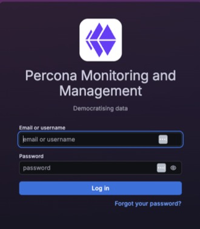

# Log into PMM

## Basic authentication

Basic authentication is the default method, using usernames and passwords stored in PMM.

To log into PMM with basic authentication:
{.power-number}

1. Open a web browser and enter the server name or IP address of the PMM Server host: 

   

2. Enter your username and password:
   - **Default credentials:** `admin`/`admin` 
   - **AWS deployments:** The default password is your EC2 Instance ID (found in the AWS Console).

3. Click **Log in**.

4. On first login, you'll be prompted to set a new password. Enter a new password and click **Submit**, or click **Skip** to keep the default (not recommended for production).

## Other authentication methods

PMM supports all authentication methods available in Grafana, including:

- **LDAP** - Integrate with your directory service
- **OAuth 2.0** - GitHub, GitLab, Google, Azure AD, Okta, and other providers
- **SAML** - Enterprise single sign-on

For setup instructions, see [Grafana's authentication documentation](https://grafana.com/docs/grafana/latest/setup-grafana/configure-security/configure-authentication/).

## Next steps

- [Create additional users](../../admin/manage-users/add_users.md)
- [Configure user roles and permissions](../../admin/roles/index.md)