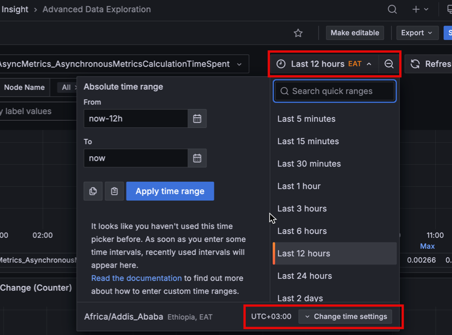

# Set time zone

By default, PMM uses the time zone from your web browser. You can change this in your profile preferences, and all dashboards will use your chosen time zone.

To set the time zone:
{.power-number}

1. On the main menu, go to **Account > Profile > Preferences**.
2. Select a time zone from the **Timezone** dropdown.
3. Click **Save**.

## Override time zone for a specific dashboard

You can also change the time zone directly from a dashboard using the time range picker in the top right. This overrides your profile preference for that dashboard only.

This change does not update your profile preference and does not affect other dashboards.
