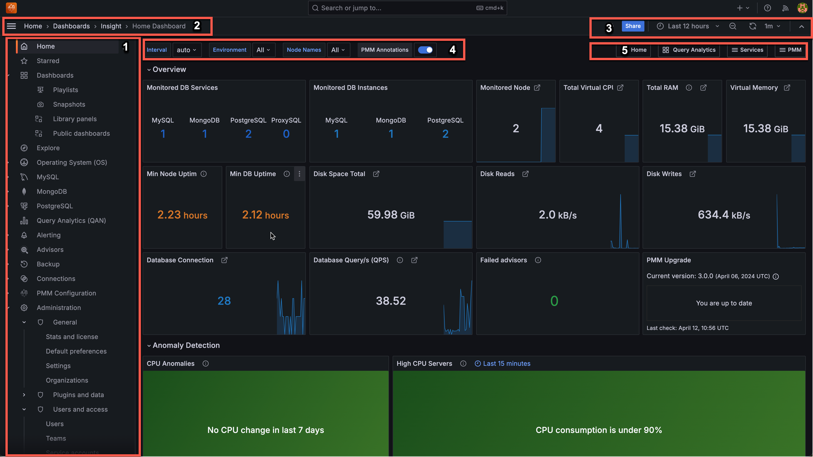

# UI components

This section explains how to access the interface, navigate the layout, and use the various controls within PMM.

Here's how the UI is laid out, and what the controls do:

1. [Main menu](#1-main-menu) (also called Grafana menu or side menu)
2. [Top navigation bar](#2-top-navigation-bar)
3. [View controls](#3-view-controls)
4. [View selectors](#4-view-selectors)
5. [Shortcut menu](#5-shortcut-menu)

## 1. Main menu

You'll find these options in the left-side menu:

| Icon | Name | What you can do |
|:----:|------|-----------------|
| <i class="uil uil-home"></i> | Home | Access the main dashboard with overview panels for database connections, queries, anomaly detection, and upgrade status. |
| <i class="uil uil-bookmark"></i> | Bookmarks | Create personal navigation shortcuts to any page in PMM. Bookmarks are private to your account and can include dashboards, settings pages, or any other PMM page for quick access. |
| <i class="uil uil-star"></i> | Starred | Mark important dashboards as favorites. Starred dashboards can be set as your home page and are visible to all users, helping teams identify important monitoring views. |
| <i class="uil uil-apps"></i> | Dashboards | Create and organize dashboards, create [folders](../../use/dashboards-panels/manage-dashboards/create-folders.md), import dashboards, create playlists, and manage snapshots. |
| <i class="uil uil-desktop"></i> | Operating System (OS) | Monitor server-level metrics including CPU, memory, disk, and network performance. |
| :simple-mysql:                  | MySQL | View specialized dashboards for MySQL database performance monitoring. |
| :simple-postgresql:             | PostgreSQL | Access PostgreSQL-specific monitoring dashboards and metrics. |
| <i class="uil uil-chart"></i> | Query Analytics (QAN) | Analyze database queries over time, identify slow queries, optimize performance, and troubleshoot issues. |
| <i class="uil uil-compass"></i> | Explore | Run ad-hoc queries with [PromQL](https://prometheus.io/docs/prometheus/latest/querying/basics/) to investigate specific metrics without creating dashboards. |
| <i class="uil uil-screw"></i> | Drilldown | Run detailed analysis with specialized views for database metrics. This enables you to dive deeper into specific metrics by clicking through related data points and exploring underlying patterns. Learn more about drilling down into metrics in the [Grafana documentation](https://grafana.com/docs/grafana/latest/explore/simplified-exploration/metrics/drill-down-metrics/). |
| <i class="uil uil-save"></i> | Backup | Configure and manage your [database backups](../../backup/index.md) and storage locations. |
| <i class="uil uil-check-circle"></i> | Advisors | Run health assessment checks on your databases and view recommendations for improving performance. |
| <i class="uil uil-bell"></i> | Alerting | Create and manage [alerts](../../alert/index.md) that notify you when metrics exceed thresholds. |
| <i class="uil uil-cog"></i> | PMM Configuration | Configure PMM-specific settings and manage your monitored database inventory. |
| <i class="uil uil-link"></i> | Connections | Set up and manage data sources to integrate additional metrics into PMM. |
| <i class="uil uil-setting"></i> | Administration | Access Grafana-specific settings for users, permissions, plugins, and system maintenance. |

## 2. Top navigation bar

The top bar helps you navigate and understand your current location:

- **Dashboard title and breadcrumbs**: Shows your current location and navigation path
- **Search**: Quickly find any dashboard by name
- **Keyboard shortcuts**: Access frequently used commands
- **Help**: Find documentation and support resources
- **User profile**: Manage your account settings and preferences

## 3. View controls

Customize how you view your dashboard data:

- **Time range selector**: Focus on specific time periods (last hour, day, week)
- **Refresh button**: Manually update dashboard data or set automatic refresh intervals
- **View mode**: Toggle between different display modes (fullscreen, TV mode)
- **Dashboard settings**: Access configuration options for the current dashboard

## 4. View selectors

Filter your monitoring data using these contextual options:

- **Interval**: Control the data granularity (Auto, 1m, 5m, etc.)
- **Environment**: Focus on specific deployment environments
- **Node Names**: Filter metrics to specific servers
- **Service Names**: View data for particular database instances
- **PMM Annotations**: Toggle visibility of important events on your timelines

These selectors change based on the dashboard you're viewing, showing only relevant options.

## 5. Shortcut menu

Quick links to related dashboards and features:

- **Home**: Return to the main dashboard
- **Query Analytics**: Jump to query performance analysis
- **Services**: Access service-specific dashboards
- **Compare**: View side-by-side metrics for different nodes
- **Additional shortcuts**: Based on your current context

!!! info alert alert-info "See also"
    - [How to render dashboard images](../../use/dashboards-panels/share-dashboards/share_dashboard.md#render-panel-image)
    - [How to annotate special events](../../use/dashboards-panels/annotate/annotate.md)

[grafana]: https://grafana.com/docs/grafana/latest/
[promql]: https://prometheus.io/docs/prometheus/latest/querying/basics/