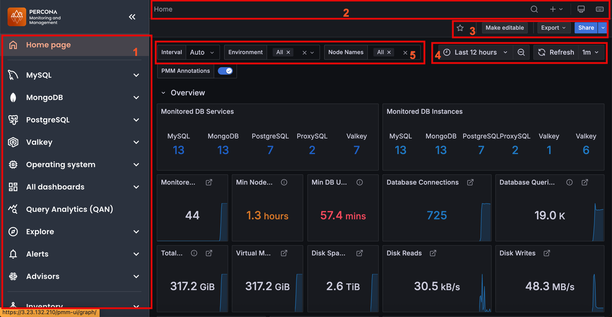
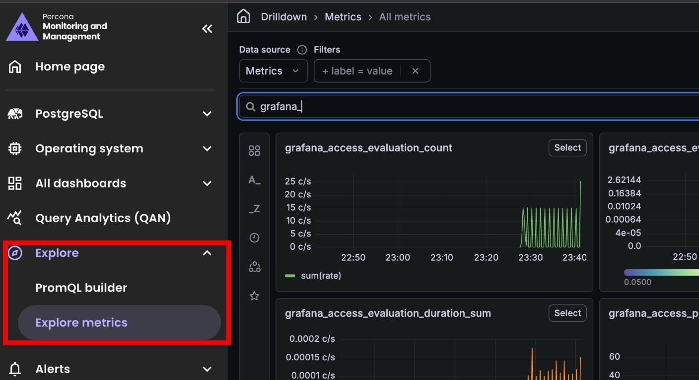

# UI components

This section explains how to access the interface, navigate the layout, and use the various controls within PMM.

Here's how the UI is laid out, and what the controls do:

1. [Main menu](#1-main-menu) (also called the side menu)
2. [Top navigation bar](#2-top-navigation-bar)
3. [Dashboard actions](#3-dashboard-actions)
4. [View controls](#4-view-controls)
5. [View selectors](#5-view-selectors)

## 1. Main menu

You'll find these options in the left-side menu:

| Icon | Name | What you can do |
|:----:|------|-----------------|
| :material-home-outline:  | Home | Access the main dashboard with overview panels for database connections, queries, anomaly detection, and upgrade status. |
| :simple-mysql:                  | MySQL | View specialized dashboards for MySQL database performance monitoring. |
| :simple-postgresql:             | PostgreSQL | Access PostgreSQL-specific monitoring dashboards and metrics. |
| :material-monitor-dashboard:| Operating System  | Monitor server-level metrics including CPU, memory, disk, and network performance. |
| :material-view-grid-outline:| All Dashboards | Create and organize dashboards, create [folders](../../use/dashboards-panels/manage-dashboards/create-folders.md), import dashboards, create playlists, and manage snapshots. |
| :material-chart-timeline-variant: | Query Analytics (QAN) | Analyze database queries over time, identify slow queries, optimize performance, and troubleshoot issues. |
| :material-compass-outline:  | Explore | Investigate metrics without creating dashboards. **PromQL builder** lets you write custom [PromQL](https://prometheus.io/docs/prometheus/latest/querying/basics/) queries. You can also enable **Explore metrics** to visually browse metrics without writing queries. **Explore metrics** requires [enabling the Grafana Metrics Drilldown plugin](#enable-explore-metrics). |
| :material-bell-outline: |  | Alerts | Create and manage [alerts](../../alert/index.md) that notify you when metrics exceed thresholds. |
|:material-earth: | Advisors | Run health assessment checks on your databases and view recommendations for improving performance.|
| :material-flask-outline: | Inventory | View and manage all monitored nodes, services, and agents registered in PMM. Check database and agent status, organize services by clusters, and add or remove monitored instances. |
|:material-backup-restore:  | Backups | Configure and manage your [database backups](../../backup/index.md) and storage locations. |
| :material-cog-outline: | Configuration | Configure PMM-specific settings like metrics resolution, data retention, and advanced options. |
| :material-shield-lock-outline: | Users and Access | Access Grafana-specific settings for users, permissions, plugins, and system maintenance. |
| :material-account-circle-outline:| Account | Manage your user profile settings, change your password, set notification preferences, and configure your personal PMM experience. |
| :material-help-circle-outline:| Help | Access PMM documentation, community forums, and support resources. Export diagnostic logs for troubleshooting and view version information.|

## 2. Top navigation bar

The top bar helps you navigate and understand your current location:

- **Dashboard title and breadcrumbs**: Shows your current location and navigation path
- **Search**: Quickly find any dashboard by name
- **Enable kiosk mode**: Displays the current dashboard in full-screen view, hiding the sidebar and navigation elements. Press Esc to exit.
- **View shortcuts**: Access frequently used commands
- **Quick actions menu** — Provides shortcuts to common tasks without navigating through the sidebar

## 3. Dashboard actions

- **Star**: Mark the dashboard as a favorite for quick access.
- **Make editable**:  Unlock the dashboard for editing. Built-in dashboards are read-only by default.
- **Export**: Download the dashboard as a JSON file for backup or import into another PMM instance. 
- **Share**: Share dashboards or panels via direct or shortened links, or export panels as rendered PNG images.

## 4. View controls

Customize how you view your dashboard data:

- **Time range selector**: Focus on specific time periods (last hour, day, week)
- **Refresh button**: Manually update dashboard data or set automatic refresh intervals

## 5. View selectors

Filter your monitoring data using these contextual options:

- **Interval**: Control the data granularity (Auto, 1m, 5m, etc.)
- **Environment**: Focus on specific deployment environments
- **Node Names**: Filter metrics to specific servers
- **PMM Annotations**: Toggle visibility of important events on your timelines

These selectors change based on the dashboard you're viewing, showing only relevant options.

## Enable **Explore metrics** menu

Explore metrics lets you visually browse and filter available metrics without writing PromQL queries. It is powered by the Grafana Metrics Drilldown plugin, which you can enable from the **Plugins** page:
{.power-number}

1. Go to the **Home** page and type **plugins** in the search bar.
2. On the **Plugins** page, search for **Grafana Metrics Drilldown**.
3. Select the plugin and click **Install**.

This adds the **Explore metrics** option under **Explore** in the left sidebar. For more information, see [Grafana Metrics Drilldown](https://grafana.com/docs/grafana-cloud/visualizations/simplified-exploration/metrics).

