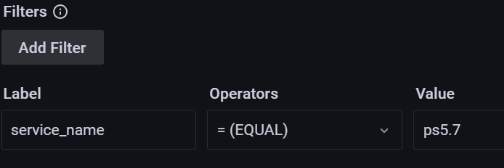

# Percona Monitoring and Management 2.29.0 (2022-07-19)

**Installation**: [Installing Percona Monitoring and Management](https://www.percona.com/software/pmm/quickstart)

Percona Monitoring and Management (PMM) is an open source database monitoring, management, and observability solution for MySQL, PostgreSQL, and MongoDB.

!!! caution alert alert-warning "Important"
    We recommend using the latest version of PMM. This ensures that you have access to the latest PMM features and that your environment runs on the latest version of the underlying components, such as VictoriaMetrics, with all the bug fixes in place.

## Release Highlights

### Guided tour of PMM

PMM now includes a short in-app tutorial that automatically pops up when you first launch the application. 

If you are a new user, this is your virtual unboxing of key PMM features to help you get started easier. 

If you are an Intermediate or Advanced user, use the tour as a checklist of features worth exploring to ensure you're making the most out of your PMM.

### Deploying PMM in various environments

#### K8s

!!! caution alert alert-warning "Disclaimer"
    Deploying PMM on Kubernetes is still [technical preview](../details/glossary.md#technical-preview) and is subject to change. We recommend that early adopters use this feature for testing purposes only.


Starting with PMM 2.29.0, we have introduced the [helm](https://helm.sh/) chart supported by Percona to seamlessly deploy your PMM instances on Kubernetes (k8s), a prominent container orchestration system. With the Helm chart, you can customize your deployment. You can tweak your PMM installation by setting these various [parameters](https://github.com/percona/percona-helm-charts/tree/main/charts/pmm#parameters). For more information, see the [documentation](https://docs.percona.com/percona-monitoring-and-management/setting-up/server/helm.html).


Before introducing the helm chart for PMM, if you wanted to deploy PMM, you would need a separate virtual machine to run PMM, but with the helm chart, that is not required. Helm Charts provide the ability to leverage Kubernetes packages at the click of a button or a single CLI command.

#### Podman

!!! caution alert alert-warning "Disclaimer"
    Podman support is still  [technical preview](../details/glossary.md#technical-preview) and is subject to change. We recommend that early adopters use this feature for testing purposes only.

Starting with PMM 2.29.0, get your PMM instances up and running quickly with the [Podman](https://github.com/containers/podman). Using Podman makes it easy to run, build, and deploy PMM.

Deployment of PMM with the Podman is far more secure as it does not require root privileges to create, run and manage containers. It lets you run containers as a non-root user, so you never have to give a user root permission on the host. Thus it adds a new security layer, which is crucial in the event of a security breach. Podman also allows multiple unprivileged users to run containers on the same machine. For more information on deploying PMM on Podman, see the [documentation](https://docs.percona.com/percona-monitoring-and-management/setting-up/server/podman.html).

#### Local file system

You can start your PMM instances without a data container using your [local file system](https://docs.percona.com/percona-monitoring-and-management/setting-up/server/docker.html#run-docker-with-the-host-directory). 

You can use docker volume or host directory with the `-v` docker-cli option for storing PMM state (databases, configs, etc.)

#### RHEL 9 support (client): 

PMM client now supports RHEL 9.

### Monitoring

#### Meta metrics

We have added some metrics for Mongodb exporters to monitor the time it takes to collect data for different collectors. With these metrics, you can identify the monitoring cost of various collectors by the MongoDB exporters. 

#### PXC Cluster dashboard

!!! caution alert alert-warning "Important"
    This experimental dashboard is subject to change. It is recommended to use this dashboard for testing purposes only.

Created a new experimental PXC/Galera Cluster Summary dashboard to make it simple, intuitive, and provide at-a-glance visibility for better decision making. Critical data for the PXC cluster is put together in this dashboard to obtain feedback from our users. For more information, refer to the [documentation](https://docs.percona.com/percona-monitoring-and-management/details/dashboards/dashboard-pxc-galera-cluster-summary-experimental.html).

Earlier, the PXC Cluster data was distributed over different dashboards. The users had to browse the MySQL compare dashboard to check for the data like slow queries and network overviews that were not in the PXC nodes compare dashboard. This made it time-consuming to identify any possible issues with the database. With the new PXC dashboard, we aim to solve this problem and gain insightful data about the cluster and services. Now the users can have an overview of the PXC clusters from this dashboard. Also, users with beginner to intermediate levels of expertise can effortlessly analyze the data on this dashboard.

### Troubleshooting

#### Managing logs

As a PMM user, you can explicitly set a detailed level of logging so that, by default, you will have meaningful logs to see, thereby enhancing your troubleshooting experience. 

If you want detailed logging, you can set `--log-level` to INFO. By default, INFO is not logged. Thus, you have more control over the logs you want to view with the `--log-level` parameter with the flexibility to choose options such as warning, error, fatal, and info.

For example, to set the log level to `fatal` for a MySQL database:

`pmm-admin add mysql --username=XXX --password=XXX --log-level=fatal`

#### Additional parameters added in commands

- Added the agent (exporter) port to the output of the `pmm-admin` commands, which is crucial during debugging.

    ```sh
    pmm-admin list
    pmm-admin status
    pmm-admin inventory list agents
    ```

- Added new flag `--agent-password` to the following commands to support a custom password via the CLI to make it more secure:

    ```sh
    pmm-admin register --agent-password=AGENT-PASSWORD
    pmm-admin config --agent-password=AGENT-PASSWORD`
    ```

- You can use the `pprof` parameter in the `pmm-admin` summary command.

    ```sh
    pmm-admin summary --pprof
    ```

    `pprof` reads a collection of profiling data from the PMM server, enabling you to generate reports in textual and graphical formats to visualize and analyze data. 
  

    You can analyze CPU, Memory usage, heap size, and thread count for your PMM components with the data obtained.


### Percona Platform Integration

#### Terminate Percona Platform connections as an Admin

When regular users are not able to disconnect a server (for example, when PMM was moved to a network segment without outbound connections to public networks), PMM Admins can now terminate such connections instead.

The **Disconnect** option under **Settings > Percona Platform** now enables PMM Admins to retire PMM instances from Percona Platform even if they are not logged in with a Percona Account.

When disconnecting servers without a Percona Account, the lingering servers are not automatically removed from the list of PMM instances in Percona Platform. As a Percona Platform Admin, you can ensure that your list of PMM instances stays up-to-date by manually removing those unavailable servers via [PMM instances](https://portal.percona.com/pmm-instances).

#### Easier access to your Percona Support Specialist 

If you are a Percona customer, you can now find the contact details of your dedicated Percona Support Specialist on the new  **Environment Overview** tab on the main menu.

The **Percona Contacts** section here shows the name and email of the Customer Success Manager assigned to your organization, who can help with any PMM queries.
This new tab will soon be populated with more useful information about your PMM environment.


### Advisors

#### Extended severities for advisor checks and alerts

We have extended and unified the list of severity levels for the notifications coming from Integrated Alerting and Advisor Checks. 
When you create a new alert rule, you can now choose from a broader range of severity labels: **Emergency**, **Alert**, **Critical**, **Error**, **Warning**, **Notice**, **Info**, **Debug**. 

The same severities are now also available for notifications coming from failed checks under **Advisor Checks > Failed Checks**. We’ve also made a small UX improvement to the way failed checks are grouped by severity in the table.

#### Use filters to explore available advisors checks

As we’re constantly adding more advisors for checking the health of your connected databases, you may find it useful to now be able to drill-down through this constantly growing list.    

Use the filters on the **Advisors Checks > All Checks** page to search advisors by **Name**, **Description**, **Status** or **Interval**. If you need to share the filtered results with your team members, send them the PMM URL, which saves your search criteria and results. 

### DBaaS

Simplified the API such that it requires fewer parameters to run the API. 

With this new implementation, the only mandatory field is the Kubernetes cluster name. All other fields such as resource parameters, image field, params field, and name filed are optional. The API sets these to default values if these fields are not specified. 

Also, the [documentation](https://percona-pmm.readme.io/reference/dbaas) has been enhanced for these APIs.


### Components upgrade

 - Upgraded VictoriaMetrics operator to version 0.24.
 - Upgraded the ClickHouse plugin to 2.4.4, which fixes some of the CVEs.
 - With this release, we are upgrading grpc-gateway to version 2.0, which deprecates the error field in error responses. If you are using the PMM API, ensure to replace this with the new message field from the Google Cloud API Error model. 
 - Upgraded the mysqld exporter to the upstream version 0.14.0.


### Important bug fixes

- [PMM-9981](https://jira.percona.com/browse/PMM-9981): Fixed excessive space usage for Group replication monitoring. Services with enabled group replication and custom queries now take up less disk space and perform faster. To achieve this, we removed the **Transactions Details** table from the **Group Replication** dashboard, as these were based on labels that were generating high-cardinality data.

    If you still have issues with performance in Group Replication dashboard, log into PMM as an admin, and use     *https://pmm_server_url/prometheus/api/v1/admin/tsdb/delete_series?match[]=*  to remove all time series for the following metrics:

    - mysql_perf_schema_replication_group_worker_rep_delay_seconds
    - mysql_perf_schema_replication_group_worker_transport_time_seconds
    - mysql_perf_schema_replication_group_worker_time_RL_seconds
    - mysql_perf_schema_replication_group_worker_apply_time_seconds
    - Mysql_perf_schema_replication_group_worker_lag_in_secondds

    For example, to remove all time series for the *mysql_perf_schema_replication_group_worker* metric use the following URL: *https://PMM_SERVER_URL/prometheus/api/v1/admin/tsdb/delete_series?match[]=mysql_perf_schema_replication_group_worker_rep_delay_seconds*

- [PMM-9510](https://jira.percona.com/browse/PMM-9510): Fixed incorrect and duplicate information displayed on the Dashboard for MongoDB Replica Set.


## New Features

- [PMM-10133](https://jira.percona.com/browse/PMM-10133): New User Onboarding: Added a guided tour that highlights the main PMM components on your first onboarding journey.

- [PMM-10059](https://jira.percona.com/browse/PMM-10059): Advisors: Extended and unified list of severity levels for the notifications coming from Integrated Alerting and Advisor Checks. 

- [PMM-7110](https://jira.percona.com/browse/PMM-7110): You can now obtain profiling data with the pprof tool that helps analyze CPU, Memory usage, heap size, and thread count for your PMM components.

- [PMM-8660](https://jira.percona.com/browse/PMM-8660): Percona customers can now find the contact details of their dedicated Percona Support Specialist on the new **Environment Overview** tab on the main menu. 
  
- [PMM-7925](https://jira.percona.com/browse/PMM-7925): [Technical Preview]: Starting with PMM 2.29.0, you can now deploy your PMM instances using Podman, which is considered far more secure as it does not require root access.

- [PMM-9613](https://jira.percona.com/browse/PMM-9613): [Technical Preview]: You can now scale and deploy your PMM instances faster using the Kubernetes clusters.

- [PMM-9919](https://jira.percona.com/browse/PMM-9919): We have added some additional metrics to Mongodb exporters to monitor the time it takes to collect data for different collectors that would allow us to identify the monitoring cost of various collectors by MongoDB exporters.
 

## Improvements

- [PMM-9766](https://jira.percona.com/browse/PMM-9766): Advisors: Added filters on the **Advisors Checks > All Checks** page to narrow the list of available advisor checks. 
  
- [PMM-7491](https://jira.percona.com/browse/PMM-7491): Alerting: We’ve redefined the Filters option under **Integrated Alerting > Alert Rules > New Rule** to simplify the way you target specific services or nodes for your alert rules. 
  
- Instead of typing an exact filter pattern, you can now intuitively create a filter by choosing from the available operators and filling in the predefined fields. So instead of typing: *service_name=name123*, just fill in the following fields: 
   

- [PMM-9704](https://jira.percona.com/browse/PMM-9704): With the implementation of a simplified API for DBaaS, you only have to specify the Kubernetes cluster name. All the other fields are optional, and the API will set the default values for these fields if not specified.

- [PMM-8222](https://jira.percona.com/browse/PMM-8222): DBaaS: Enhanced the documentation for the API.
 
- [PMM-9611](https://jira.percona.com/browse/PMM-9611): PMM now warns you if your current domain is different than the one specified in the Grafana .INI configuration file. Since this can generate incorrect short URLs when sharing the link to a PMM dashboard, make sure to correct this mismatch if you see a warning on the **Share Panel > Link page**. 
  
- [PMM-7326](https://jira.percona.com/browse/PMM-7326): You now have more control over the logs you want to view with the **--log-level** parameter. With this enhancement, you can experience more pronounced logging with the flexibility to choose options such as warning, error, and fatal.
  
- [PMM-8566](https://jira.percona.com/browse/PMM-8566): For enhanced security, you can now specify the custom Basic Auth password for agents when adding a Node.
  
- [PMM-9362](https://jira.percona.com/browse/PMM-9362): PMM Admins can now disconnect servers from Percona Platform even if they are not logged in with a Percona Account Percona Account. 
    
- [PMM-6592](https://jira.percona.com/browse/PMM-6592): PMM now displays the ports used by the exporters in the output of the pmm- admin list and status commands, which are crucial while debugging.
  
- [PMM-7110](https://jira.percona.com/browse/PMM-7110): You can now use the pprof parameter in the pmm-admin summary command to obtain profiling data from the PMM server, thereby enabling you to generate reports in textual and graphical formats to visualize and analyze data.

- [PMM-7186](https://jira.percona.com/browse/PMM-7186): The pmm-admin summary command now retrieves a list of targets scraped by Victoriametrics on the client-side.

- [PMM-8308](https://jira.percona.com/browse/PMM-8308): To enhance the troubleshooting experience, in addition to the information summary and archive, you can now view the paths for all the exporters managed by the pmm-agent in the diagnostic data.

- [PMM-9650](https://jira.percona.com/browse/PMM-9650): Created a new experimental dashboard for PXC Cluster Summary to make it simple and intuitive.


- [PMM-10039](https://jira.percona.com/browse/PMM-10039): VictoriaMetrics operator has been upgraded to 0.24.

- [PMM-10083](https://jira.percona.com/browse/PMM-10083): Upgraded the ClickHouse plugin to 2.4.4, which fixes some of the CVEs.

- [PMM-10103](https://jira.percona.com/browse/PMM-10103): Added RHEL 9 support for PMM client.

- [PMM-10155](https://jira.percona.com/browse/PMM-10155): Access QAN from the main menu instead of the PMM dashboard for better reach and visibility.

- [PMM-2038](https://jira.percona.com/browse/PMM-2038): Starting with PMM 2.29.0, we have upgraded the mysqld exporter to the upstream version.

- [PMM-9913](https://jira.percona.com/browse/PMM-9913): PMM removes all the unnecessary temporary files created while adding a monitoring service, which might impact your PMM server's performance if not deleted.
- [PMM-10067](https://jira.percona.com/browse/PMM-10067): Updated the version of Percona Toolkit to 3.4.0.


## Bugs Fixed

- [PMM-10127](https://jira.percona.com/browse/PMM-10127): Alerting: Fixed issue where changing the page under **Integrated Alerting > Alerts** would not update the list of results.
 
- [PMM-10110](https://jira.percona.com/browse/PMM-10110): DBaas: Fixed an issue where an incorrect operator version was installed.

- [PMM-9965](https://jira.percona.com/browse/PMM-9965): DBaas: Fixed an issue where re-registering a K8s cluster returned an error.

- [PMM-7143](https://jira.percona.com/browse/PMM-7143): DBaaS: Fixed an issue where proper node metrics were not exposed for database instances created with DBaaS.

- [PMM-8677](https://jira.percona.com/browse/PMM-8677): DBaaS: Fixed the names of the operators used in PMM on the DBaaS UI to reflect their official names rather than short forms.

- [PMM-9998](https://jira.percona.com/browse/PMM-9998): Fixed an issue where 'Unknown column...' errors are thrown when monitoring MariaDB from the Debian package (10.2, 10.3, 10.4, 10.5).

- [PMM-10144](https://jira.percona.com/browse/PMM-10144): Fixed an issue where if an already existing service was added via CLI, incorrect output was being displayed. 

- [PMM-9320](https://jira.percona.com/browse/PMM-9320): Fixed an issue where it was impossible to add MongoDB to PMM when the password contained “+.”

- [PMM-9909](https://jira.percona.com/browse/PMM-9909):  Fixed an issue where the redirection from Home Dashboard Stats Panel to Node Summary did not work.

- [PMM-10049](https://jira.percona.com/browse/PMM-10049): Removed unnecessary error messages from the pmm-agent log.

- [PMM-8819](https://jira.percona.com/browse/PMM-8819): Fixed an issue where the metric data displayed in the table was not appropriately aligned.

- [PMM-10087](https://jira.percona.com/browse/PMM-10087): PMM would show an “Internal server error” for custom alert rules created with a **"ia=1"** label. This issue is now fixed.

- [PMM-7462](https://jira.percona.com/browse/PMM-7462): Fixed an issue where you can update the PMM settings via the UI if they are not provided as an Environment variable.

- [PMM-9510](https://jira.percona.com/browse/PMM-9292): Fixed incorrect and duplicate information displayed on the Dashboard for MongoDB Replica Set.

- [PMM-9910](https://jira.percona.com/browse/PMM-9910): Fixed an issue where upgrading PMM from 2.26.0 to 2.27.0 via the UI failed due to a GRPC error.

- [PMM-9981](https://jira.percona.com/browse/PMM-9981): Enormous space usage and slow queries for Group replication monitoring
  
- [PMM-10069](https://jira.percona.com/browse/PMM-10069): Fixed a typo in the tooltip for InnoDB Random Read Ahead.
  
- [PMM-10161](https://jira.percona.com/browse/PMM-10161): Removed unnecessary breadcrumb navigation panel from all dashboards.
