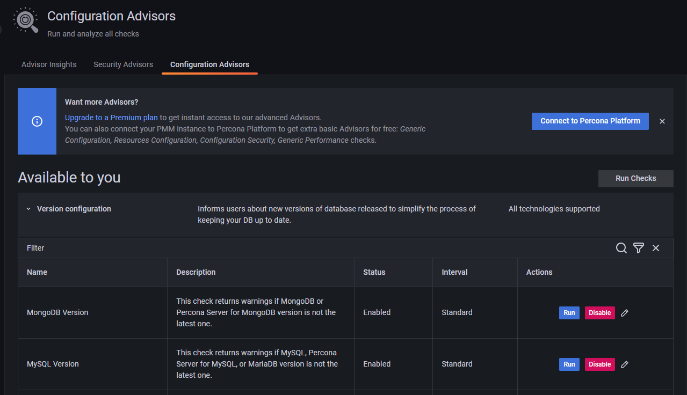

# Percona Monitoring and Management 2.36.0 (2023-03-23)

**Installation**: [Installing Percona Monitoring and Management](https://www.percona.com/software/pmm/quickstart)

Percona Monitoring and Management (PMM) is an open source database monitoring, management, and observability solution for MySQL, PostgreSQL, and MongoDB.

<!---
!!! caution alert alert-warning "Important/Caution"
    Crucial points that need emphasis:

    - Important: A significant point that deserves emphasis.
    - Caution: Used to mean 'Continue with care'.
 --->

## Release Highlights

### pg_stat_monitor 2.0 support in QAN

We are excited to announce PMM 2.36 now supports [pg_stat_monitor](https://docs.percona.com/pg-stat-monitor/index.html) 2.0 (PGSM 2.0) in QAN, a powerful PostgreSQL query performance monitoring tool. By downloading this update, you will have access to the latest improvements and fixes covered by PGSM2, including:

- Improved internal architecture that results in fewer lock acquisitions and increases performance by approximately 20%.
- Support for PostgreSQL 15 
- Enhanced consistency with `pg_stat_statements` so that the `pg_stat_monitor` view has identical column names, columns, and data types as `pg_stat_statements` for every major version of PostgreSQL from versions 11 to 15.
- A bucket status indication (done vs. current) eliminates the need for the tool to evaluate bucket status and facilitates accurate data display.
- The generation of a unique ID for a query makes it easier to monitor query planning, execution, and performance regardless of version, database, user, or schema.

For more information on the enhancements in PGSM2, refer to the [full list](https://github.com/percona/pg_stat_monitor/blob/main/RELEASE_NOTES.md).

!!! Warning "Important"
    PMM 2.36 and PGSM 2.0 now support PG 13, 14, and 15. Support for older versions (PG 11 and 12) will be introduced in PMM 2.37.

### Revamped Advisors page

We’ve improved the structure of the **Advisors** page to group Advisors by categories and clearly show the Advisors available for your current subscription. 

With this change, we have renamed all the tabs on the page, and added an option to easily integrate with Percona Platform for extra Advisors for free:

  

### PostgreSQL Advisors executed against more databases (DBs)
To give you additional insights on your PostgreSQL DBs, PostgreSQL Advisors now try to perform checks on all the databases accessible with the credentials used during pmm-client setup.
In most cases, these are the databases available for the PMM database account user. For more information, see the Create a database account for PMM topic in the PMM online Help."

### Backup Management enabled by default
Since the PMM 2.32 release, we have continuously improved the Backup Management functionality in terms of backup locations, restore options and user experience.

As a mature and generally useful feature, this option is now enabled by default for easier access to your backups and restore artifacts.

!!! note alert alert-primary "Note"
    - Upgrading to PMM will automatically enable this feature for existing PMM instances. You can disable it at any time from your PMM dashboard on the **Advanced Settings** page or using the Docker environment variable `DISABLE_BACKUP_MANAGEMENT=1`.
    - While we have GA'ed Backup Management for MongoDB since PMM 2.32, Backup Management for MySQL still  in [technical preview](../details/glossary.md#technical-preview), and, therefore, subject to change. For more information, see the [Percona Release Lifecycle](https://www.percona.com/services/policies/percona-release-lifecycle-overview).

## Components upgrade

Grafana has been upgraded to version 9.2.13.

## New Features

- [PMM-9474](https://jira.percona.com/browse/PMM-9474) - PostgreSQL Advisors are now executed against all the available databases (DBs), not only the one connected to PMM
- [PMM-11363](https://jira.percona.com/browse/PMM-11363) - Starting with PMM 2.36.0, you no longer need to unassign a role before deleting it. If you try to delete a role assigned to a user, you will see a dropdown with replacement roles. As a result, the selected role will be assigned to the user.

## Improvements

- [PMM-11640](https://jira.percona.com/browse/PMM-11640) - [Backup Management]: The Backup Management feature is now enabled by deault forf easier access to your backups and restore artifacts.

- [PMM-11182](https://jira.percona.com/browse/PMM-11182) - [Platform integration]: Renamed the **Disconnect** button on the confirmation message that pop-ups when you are terminating Percona Platform connections as an Administrator. The button is now called **Force disconnect** to better differentiate between situations where you are disconnecting using a Percona Platform Account.

    Force-disconnecting only clears the connection in PMM without automatically removing the disconnected servers from Percona Platform. We recommend that you always disconnect while logged in with your Percona Account. Otherwise, make sure to manually remove the force-disconnected servers from your [list of PMM instances in Percona Platform](https://portal.percona.com/pmm-instances).

- [PMM-11381](https://jira.percona.com/browse/PMM-11381) - Starting with PMM 2.36.0, you can scrape Kubelet metrics with DBaaS or VictoriaMetrics operator. Using Kubelet metrics, you can gather volume-related information.

- [PMM-11566](https://jira.percona.com/browse/PMM-11566) - You now have Admin Access to PMM Demo instances so that you can experiment with all the features of PMM.

- [PMM-11699](https://jira.percona.com/browse/PMM-11699) - Improved documentation and descriptions for Advisor checks.

- [PMM-10974](https://jira.percona.com/browse/PMM-10974) - Usage of pg_stat_monitor by default.

## Bugs Fixed

- [PMM-11291](https://jira.percona.com/browse/PMM-11291) - [DBaaS]: There was a difference in the shape and color of the DB Cluster Status box compared to the Kubernetes Cluster status box. The issue has been resolved now.
- [PMM-11296](https://jira.percona.com/browse/PMM-11296) - [DBaaS]: Fixed an issue where the DB Cluster creation page did not load when DBaaS was disabled.
- [PMM-11358](https://jira.percona.com/browse/PMM-11358) - [DBaaS]: Connection to the DB cluster displayed a loader when the DB cluster was suspended/paused. The issue has been resolved now.
- [PMM-11613](https://jira.percona.com/browse/PMM-11613) - [DBaaS]: Backups could not be created when uppercase letters were used in the storage name. The issue has been resolved now.
- [PMM-11568](https://jira.percona.com/browse/PMM-11568) - [DBaaS]: Disabled the selection of MySQL versions less than 8.0.27.
- [PMM-11766](https://jira.percona.com/browse/PMM-11766) - [DBaaS]: The status of an unavailable cluster was displayed as Active. When this cluster was unregistered, an error was thrown. The issue has been resolved now.
- [PMM-11428](https://jira.percona.com/browse/PMM-11428) - [DBaaS]: Fixed an issue where editing DB clusters was broken.
- [PMM-10254](https://jira.percona.com/browse/PMM-10254) - [Dashboards]: On the MySQL/Mongo dashboards, the Memory Available graph showed incorrect values. The issue has been resolved now.
- [PMM-11209](https://jira.percona.com/browse/PMM-11209) - [Backup Management]: Improved error handling for partially successful restores. Restore jobs that finished successfully on some nodes and failed on others are no longer locked in a **Pending** state. Instead, PMM now shows a **PartlyDone** error and populates the logs with specific details on the restore status for the replica set and nodesup restores.
- [PMM-10606](https://jira.percona.com/browse/PMM-10606) - Fixed an issue for the incorrect link for node name on the mysql instance summary dashboard.
- [PMM-11001](https://jira.percona.com/browse/PMM-11001) - Fixed an error that occurred in certain scenarios when expanding alert rules nested in folders.
- [PMM-11004](https://jira.percona.com/browse/PMM-11004) - Fixed issue that ignored the database name provided when adding PG server to PMM.
- [PMM-11408](https://jira.percona.com/browse/PMM-11408) - Navigation from the New Home dashboard panel to certain dashboards is broken. The issue has been resolved now.
- [PMM-11421](https://jira.percona.com/browse/PMM-11421) - Improved error message that is displayed when trying to connect PMM to Percona Platform over HTTP Proxies: "PMM Platform connection does not support proxy".
- [PMM-11526](https://jira.percona.com/browse/PMM-11526) - On the Summary dashboard, the error message exit status 1 has been replaced with a more meaningful message.
- [PMM-11588](https://jira.percona.com/browse/PMM-11588) - Fixed an issue where the database instance count on the OS Overview dashboard was incorrect.
- [PMM-11636](https://jira.percona.com/browse/PMM-11636) - The Grafana Admin page crashed when filtering users. The issue has been resolved now.
- [PMM-11654](https://jira.percona.com/browse/PMM-11654) - There was no data displayed on the PXC Galera replication latency dashboard. The issue has been resolved now.
- [PMM-11664](https://jira.percona.com/browse/PMM-11664) - Fixed an issue for the environment filter missing from the OS dashboards.
- [PMM-11717](https://jira.percona.com/browse/PMM-11717) - Mysql exporter agent stopped working after upgrading the server to PMM 2.36.0. The issue has been resolved now.

<!---## Known issues

- ​List of known issues with a  comprehensive description and link to the JIRA ticket.

    Example:

    [PMM-XXXX](https://jira.percona.com/browse/PMM-XXXX) - Comprehensive description.

    **Solution**

    Description of the solution.

## Coming Soon

  Share what are the upcoming features on your roadmap to keep users excited:

- Planned item 1
- Planned item 2
--->
