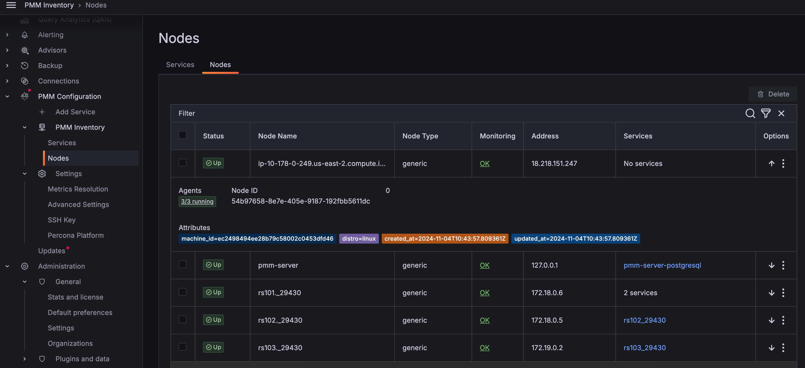
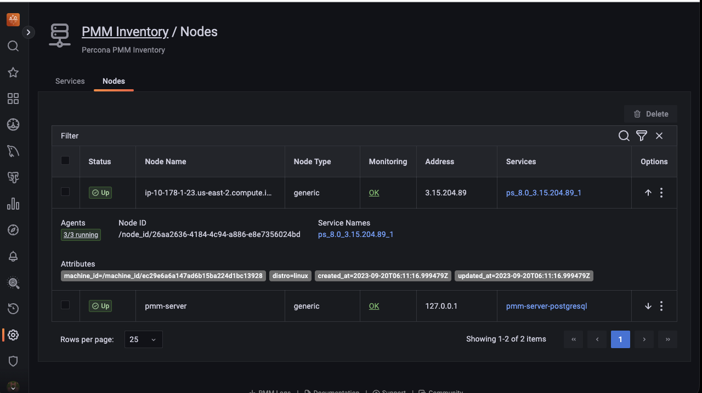
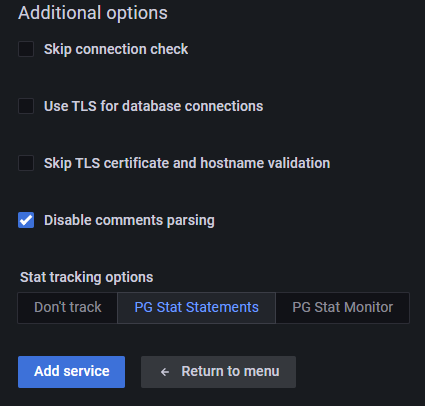
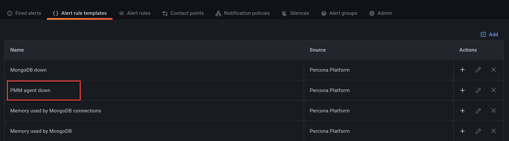

# Percona Monitoring and Management 2.38.0

| **Release date:** | Jul 3, 2023                                                                                    |
| ----------------- | ----------------------------------------------------------------------------------------------- |
| **Installation:** | [Installing Percona Monitoring and Management](https://www.percona.com/software/pmm/quickstart) |

Percona Monitoring and Management (PMM) is an open-source database monitoring, management, and observability solution for MySQL, PostgreSQL, and MongoDB.

<!---
!!! caution alert alert-warning "Important/Caution"
    Crucial points that need emphasis:

    - Important: A significant point that deserves emphasis.
    - Caution: Used to mean 'Continue with care'.
 --->

## Release Highlights

### Important security updates

#### Oracle Linux 9 as new base OS for PMM

As security is paramount to us, PMM 2.38.0 adds a solid and modernized enterprise-grade foundation to PMM. This release migrates our base operating system on which we build our PMM image from CentOS 7 to Oracle Linux 9. 
Thus, starting with PMM 2.38.0, PMM is publicly available on Oracle Linux 9.

This transition brings many benefits:

- a large number of CVEs automatically fixed
- improved upstream response time to security-related issues
- better compatibility with new technologies
- modern libraries for our team to build on

Since not all users will be able to seamlessly make the move, we will be rolling this out in phases:

##### Automated migration paths

The following users will be able to take advantage of this immediately:

- New installations of PMM:
    - Docker containers from our Docker hub: `percona/pmm-server:2`
    - OVF: Download directly from [our website](https://www.percona.com/software/database-tools/percona-monitoring-and-management)
    - AMI: Loaded from [AWS Marketplace](https://aws.amazon.com/marketplace/seller-profile?id=ebb45d8b-14ce-4c17-9aa0-d25e98318ece)

- Docker/Podman users who do full container replacement upgrades to newer versions of PMM.
    Your existing `docker pull` or `docker run` commands will use the new image.

##### Manual upgrade options

For users upgrading AMI, OVF, or Docker-based installations via the UI, the **Upgrade Now** button on the Home dashboard will upgrade your PMM version to the latest PMM 2 release. This upgrade will provide access to all the new features and bug fixes available in this version. However, the PMM base operating system will remain on EL7 (CentOS 7) and will not be upgraded to EL9 (Oracle Linux 9). This means that certain CVEs related to the base operating system will remain unpatched.

While we work on providing automated migration paths for these deployment types, you have the option to manually upgrade your PMM installation to take advantage of the updated Oracle Linux 9 base operating system and associated security enhancements.

To manually upgrade your PMM installation to the new Oracle Linux 9 base, check out the instructions in the [PMM is getting a modernized enterprise-grade foundation blog post](https://www.percona.com/blog/pmm-modernized-enterprise-grade-foundation).

#### Grafana upgrade

PMM now uses Grafana to 9.2.20, which fixes some critical vulnerabilities. For more information, see [Grafana's release blog](https://grafana.com/blog/2023/06/22/grafana-security-release-for-cve-2023-3128/#reporting-security-issues).

#### Exporters

Updated the mysqld_exporter, node_exporter, postgres_exporter, and mongo_exporter to fix the CVEs.

#### ClickHouse plugin

We have migrated from the [Altinity Clickhouse datasource](https://grafana.com/grafana/plugins/vertamedia-clickhouse-datasource/) to the [Grafana Clickhouse datasource](https://grafana.com/grafana/plugins/grafana-clickhouse-datasource/) due to the vulnerabilities discovered. 

Due to this migration, we have also updated our experimental Environment Overview Dashboard.

!!! caution alert alert-warning "Important"
    Though we have removed the datasource from PMM, we are still reusing the same name (ClickHouse) to keep the changes minimal. Thus, if you are using the old datasource in your dashboards, ensure that you upgrade the underlying queries that will pull the data from the new datasource.

##### Example

The following example shows the difference in the query before and after migration.

Before migration:

```sh
// Altinity ClickHouse datasource
SELECT $timeSeries as t, 
    sum(m_query_time_sum)/sum(m_query_time_cnt) as QLatency,
    environment
FROM $table
WHERE $timeFilter and environment != ''
GROUP BY t,environment
ORDER BY t
```

After migration:

```sh
// Grafana ClickHouse datasource
SELECT period_start as t,
    sum(m_query_time_sum)/sum(m_query_time_cnt) as QLatency,
    environment
FROM pmm."metrics" 
WHERE $__timeFilter(period_start) AND environment != ''
GROUP BY t, environment
ORDER BY t
```    

Altinity data sources used macros like `$timeSeries`, `$timeFilter`, and `$table`, which are no longer present in the Grafana datasource. As a result, the query needs to be rewritten to use the new macros instead of the old ones. 
You will notice that in the example above, the macro `$timeFilter` has changed to `$__timeFilter`, and now it requires a parameter, which should be a column of type **datetime**.

Depending on which macros you have used, your migration effort will vary. However, we recommend checking the [plugin documentation](https://grafana.com/grafana/plugins/grafana-clickhouse-datasource/) to apply the new syntax correctly, including macros and template variables.

### Improved nodes view on the Inventory page

In our continuing endeavor to enhance user experience, we further improved the **Inventory** page by improving the **Nodes** tab. With this change, you can get more context on your inventory objects, such as nodes, and more actionable information for exploring and resolving possible issues.

Here is the change as part of PMM 2.38.0:

- Check the number of agents running on any particular node. When you click on any node, the UI navigates to the view of agents, which is filtered to display only agents related to that specific node.

    To see the details of the agents running:

    On the **Nodes** tab, under the **Monitoring** column, click **OK** or **Failed**, depending on the status of the node that you have selected. A page that provides the user with crucial information regarding the total number of agents deployed on that node is displayed.
        

- View comprehensive information about each agent, including key attributes such as node type, IP address, and associated services. This gives you a complete overview of the nodes at a glance.

    

- Check the health status of the agents to see if they are running or have failed.

### Backup enhancements

#### Better folder management for enhanced PBM compatibility 

We’ve added a new **Folder** field to the Create Backup pages. Use this to set a specific target directory within the selected local or S3-compatible location for the backup.  

Organizing backups in folders makes grouping PBM backups for clusters easier, and it improves PMM-PBM (Percona Backup for MongoDB) integration workflows.

The **Folder** field is automatically populated with the value of the cluster label. You can change this default folder from PMM’s Advanced Settings, but make sure you understand how your custom folder will impact PBM integration workflows.


#### Sharded cluster MongoDB backup support

This release introduces support for working with backups for sharded clusters. PMM handles the backup process end-to-end, but restoring such artifacts is currently possible only via the CLI, using Percona Backup for MongoDB.

For information on restoring sharded backups, check the [PBM documentation](https://docs.percona.com/percona-backup-mongodb/usage/restore.html).

### SQL comments support in QAN

!!! caution alert alert-warning "Important/Caution"
    This feature is still in [Technical Preview](https://docs.percona.com/percona-monitoring-and-management/details/glossary.html#technical-preview) and is subject to change. We recommend that early adopters use this feature for testing purposes only.

You can now collect labels from the comments placed in SQL queries. You can tag the query by key value in the query comment. This helps in query management and optimization. This feature is currently supported for MySQL and PostgreSQL.


For example:

```sh
SELECT * /* cluster=’east’ */ FROM city;   
```
You can enable this feature as follows:

- CLI - Pass the parameter `comments-parsing`
- UI - It is enabled by default. To disable, uncheck the **Disable comments parsing** checkbox in the **Additional Options** section. This is supported for PostgreSQL and MySQL.

    


### New PMM Agent Down alert template

We've added a new default alert template to [Percona Alerting](../get-started/alerting.md). 

The new **PMM Agent down** alert template monitors your Node status to notify if the Agent is down. Before using this template:

- ensure the PMM Agent is healthy and present on the Database Node.
- check that PMM Client is on version 2.38 version or later.




### Grafana upgrade

PMM now uses Grafana v9.2.20, which includes fixes for some critical vulnerabilities. For more information, see [Grafana's release blog](https://grafana.com/blog/2023/06/22/grafana-security-release-for-cve-2023-3128/#reporting-security-issues).

## New Features

- [PMM-2852](https://jira.percona.com/browse/PMM-2852) -   [QAN]: Starting with PMM 2.38.0, MySQL and PostgreSQL supports collection of labels from the comments placed in the SQL queries.
- [PMM-11961](https://jira.percona.com/browse/PMM-11961) - [Inventory]: Starting with PMM 2.38.0, we have enhanced the **Inventory** page by improving the **Nodes** tab. With this change, you can get more context on your inventory objects, such as node, and more actionable information for exploring and resolving possible issues.
- [PMM-11962](https://jira.percona.com/browse/PMM-11962) - [Inventory]: Starting with PMM 2.38.0, you can filter the nodes and services on the **Inventory** page using the parameters such as ID, names, status, etc., instead of scrolling through an exhaustive list of nodes or services.
- [PMM-12087](https://jira.percona.com/browse/PMM-12087) - [Inventory]: Added tooltips to explain the meaning of the different service statuses in the Inventory view.   

## Improvements

- [PMM-9367](https://jira.percona.com/browse/PMM-9367) -   [Backups]: Added support for working with backups for sharded clusters.
- [PMM-11250](https://jira.percona.com/browse/PMM-11250) - [Backup]: Added option to specify target directory for the selected backup location to improve PMM-PBM integration workflows.
- [PMM-12038](https://jira.percona.com/browse/PMM-12038) - [Backup]: Extended support for MongoDB backups to cover all authentication mechanisms available for MongoDB (including LDAP, x509 certs).
- [PMM-9544](https://jira.percona.com/browse/PMM-9544) -   [Alerting]: Added new default alert template to Node status and notify if the Agent is down.
- [PMM-12114](https://jira.percona.com/browse/PMM-12114) - Upgraded Grafana to 9.2.18 to fix to CVEs.
- [PMM-12136](https://jira.percona.com/browse/PMM-12136) - We have migrated our base operating system on which we build our base image from CentOS 7 to Oracle Linux 9 to fix the CVEs.

## Bugs Fixed

- [PMM-11578](https://jira.percona.com/browse/PMM-11578) - [Alerting]: The **Last notified** column under **Alerting > Fired Alerts** has been renamed to **Last triggered**. This better illustrates the fact that triggered alerts may not always generate a notification. This can happen when the contact points are not correctly configured.
In addition, the **Suppressed** status in the **State** column has been renamed to **Silenced** to keep consistency with how this status is displayed on other **Alerting** pages.
- [PMM-12067](https://jira.percona.com/browse/PMM-12067) - [QAN]: Fixed vulnerability in Vitess package.
- [PMM-12105](https://jira.percona.com/browse/PMM-12105) - [QAN]: Fixed an issue where QAN was broken due to wrong pgsm_query_ids.
- [PMM-10063](https://jira.percona.com/browse/PMM-10063) - [QAN]: The QAN filter section could display the available list of services/nodes. But the load time was too much, with the UI  being unresponsive. This issue has been resolved now. The entire list is loaded with the count displayed on the upper right side.
- [PMM-11386](https://jira.percona.com/browse/PMM-11386) - [QAN]: MongoDB QAN query time metrics was showing the wrong unit. It should be ms. The issue has been resolved now.
- [PMM-12024](https://jira.percona.com/browse/PMM-12024) - [QAN]: Fixed an issue where a QAN agent couldn't start due to an expected return value type.
- [PMM-12091](https://jira.percona.com/browse/PMM-12091) - [QAN]: The tooltip for QAN > MongoDB > Query Details was displayed in seconds instead of decimals. The issue has been fixed now.
- [PMM-9844](https://jira.percona.com/browse/PMM-9844) -   [QAN]: Data for a large number of partitions or possible indexes was shown in the QAN Details tab in one scrolling column making it practically impossible to read. The issue has been resolved now.
- [PMM-11938](https://jira.percona.com/browse/PMM-11938) - [QAN]: Fixed the problem when PMM tried to create `pg_stat_monitor_settings` view all over again.
- [PMM-11645](https://jira.percona.com/browse/PMM-11645) - Fixed mysql service detection when this is not loaded in systemd.
- [PMM-9541](https://jira.percona.com/browse/PMM-9541) - PostgreSQL exporter now works as expected with `--socket`.
- [PMM-10799](https://jira.percona.com/browse/PMM-10799) - Now in the **EXPLAIN/TABLE** tab you can get results even for queries with table alias.
- [PMM-11692](https://jira.percona.com/browse/PMM-11692) - On the MySQL Instances Overview dashboard, the `Top MySQL Active Client Threads` panel color was misleading. The issue has been resolved now.
- [PMM-11715](https://jira.percona.com/browse/PMM-11715) - CPU Utilization Graph for RDS instances was not matching what Cloudwatch reported. The issue has been resolved now.
- [PMM-11950](https://jira.percona.com/browse/PMM-11950) - Non-admin roles are calling restricted endpoints after login or page refresh.
- [PMM-12085](https://jira.percona.com/browse/PMM-12085) - Fixed an issue where SSH access to AMI and OVF images for Oracle Linux 9-based images did not work. The issue has been resolved now.
- [PMM-12118](https://jira.percona.com/browse/PMM-12118) - Addressed the Grafana ClickHouse DS plugin CVEs.
- [PMM-12119](https://jira.percona.com/browse/PMM-12119) - When a user successfully adds an RDS service to PMM, the RDS exporter's status does not change from "UNKNOWN" (the initial status of all exporters) to "RUNNING."  This issue has been resolved.
- [PMM-9224](https://jira.percona.com/browse/PMM-9224) - Data from Arbiter nodes is now correctly displayed on the **MongoDB ReplSet Summary** dashboard.


<!---


## Known issues

- ​List of known issues with a  comprehensive description and link to the JIRA ticket.

    Example:

    [PMM-XXXX](https://jira.percona.com/browse/PMM-XXXX) - Comprehensive description.


    **Solution**

    Description of the solution.


## Coming Soon

  Share what are the upcoming features on your roadmap to keep users excited:

- Planned item 1
- Planned item 2

--->
