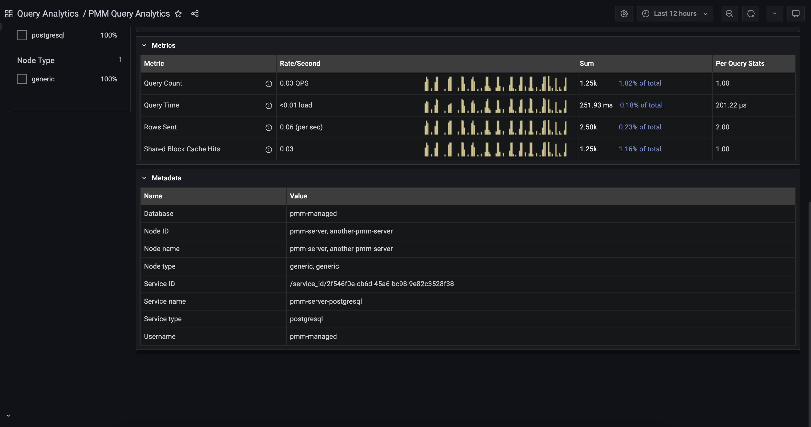

# Percona Monitoring and Management 2.39.0

| **Release date:** | Aug 14, 2023                                                                                    |
| ----------------- | ----------------------------------------------------------------------------------------------- |
| **Installation:** | [Installing Percona Monitoring and Management](https://www.percona.com/software/pmm/quickstart) |

Percona Monitoring and Management (PMM) is an open source database monitoring, management, and observability solution for MySQL, PostgreSQL, and MongoDB.

<!---
!!! caution alert alert-warning "Important/Caution"
    Crucial points that need emphasis:

    - Important: A significant point that deserves emphasis.
    - Caution: Used to mean 'Continue with care'.
 --->

## Release Highlights

### MongoDB backups: UI-based restore on a new replica set cluster

Building on the recent MongoDB backup management enhancements, we have now added the option to restore backups on different clusters with the same configuration. This enables you to test restore data before deploying it on Dev environments. 

Restoring on different clusters is not available for sharded clusters. This is a complicated process that still requires manual intervention. For more information, see [Restoring from a sharded cluster]()

### Query Analytics - Meta information

QAN is an important tool that can help filter data and identify problematic queries. However, it can be challenging to determine which services, nodes, and other labels are linked to these queries. 

PMM 2.39.0 now includes a metadata table for QAN to address this issue. This table contains information such as Node name, Node name, Service name, Service type, and user name for each selected query. With this feature, you can easily identify the services, nodes, and labels associated with your identified queries.

To view the metadata table, navigate to the **Main** menu and click on **Query Analytics (QAN)**. This will bring you to the **Query Analytics** page. Next, select the desired query and expand the **Metadata** tab. The metadata for that specific query will then be displayed.

## Improvements

- [PMM-6279](https://jira.percona.com/browse/PMM-6279) - [QAN]: PMM 2.39.0 now includes a metadata table for each query. This table contains information such as Node name, Node name, Service name, Service type, and user name for each selected query.
- [PMM-10270](https://jira.percona.com/browse/PMM-10270) - [Backup Management]: Enhanced MongoDB Backup Management to support restoring to different replica set clusters with the same configuration.
- [PMM-11999](https://jira.percona.com/browse/PMM-11999), [PMM-12257](https://jira.percona.com/browse/PMM-12257) - [Advisors] - The **Advisors** page now contains a new **Technology** column that shows the database type for each advisor. This helps you distinguish between MongoDB, MySQL, and PostgreSQL advisors.
- [PMM-11206](https://jira.percona.com/browse/PMM-11206) - [Alerting]: You can now easily add multiple **Alert rule templates** at once, whether through the API or UI. When added in bulk, each template will be displayed separately on the **Alert rule templates** page. This makes it quicker and more efficient to manage your alert rules.
- [PMM-11637](https://jira.percona.com/browse/PMM-11637) - PMM UI now reflects the new PMM logo as per the new branding.
- [PMM-12070](https://jira.percona.com/browse/PMM-12070) - We have updated the deprecated [Boomtable plugin](https://github.com/percona/grafana-dashboards/tree/main/panels/yesoreyeram-boomtable-panel) to the Grafana table plugin.
- [PMM-12389](https://jira.percona.com/browse/PMM-12389) - The postgres_exporter now provides more comprehensive logs that display the specific namespace and error message for any issue.
 
## Bugs Fixed

- [PMM-12151](https://jira.percona.com/browse/PMM-12151) - [QAN]: The Explain plan was not displayed in a few scenarios. The issue has been resolved now.
- [PMM-11658](https://jira.percona.com/browse/PMM-11658) - Fixed issue that caused the pmm-agent to crash on AMI and OVF distributions.
- [PMM-11992](https://jira.percona.com/browse/PMM-11992) - Postgres databases with names other than **Postgres** could not be added. The issue has been resolved now.
- [PMM-12263](https://jira.percona.com/browse/PMM-12263) - On the MongoDB Cluster Summary dashboard, the **Replication Lag by Set** graph showed the wrong value if **rs** was in the primary-secondary-arbiter (PSA) configuration. It calculated the arbiter's lag from the beginning of the UNIX time (currently >54 years instead of a few seconds). The issue has been resolved now.
- [PMM-12280](https://jira.percona.com/browse/PMM-12280) - Fixed an issue where the **Service Summary Panel** on Home Dashboard used the incorrect units to display `Available Memory`.
- [PMM-10665](https://jira.percona.com/browse/PMM-10665) - Fixed issue that caused QAN to show incorrect values when setting non-default values for performance schema. Make sure to restart pmm-agent after changing the settings for perfschema in MySQL.
- [PMM-10391](https://jira.percona.com/browse/PMM-10391) - PMM did not work with external Clickhouse versions greater than 22.5.2. The issue has been resolved now.
- [PMM-12231](https://jira.percona.com/browse/PMM-12231) - In the recent versions of PMM, users have encountered issues with installing, updating and removing plugins from PMM. For more information on this issue, see [Troubleshooting Plugin issues](https://docs.percona.com/percona-monitoring-and-management/how-to/troubleshoot.html#plugins-issues).