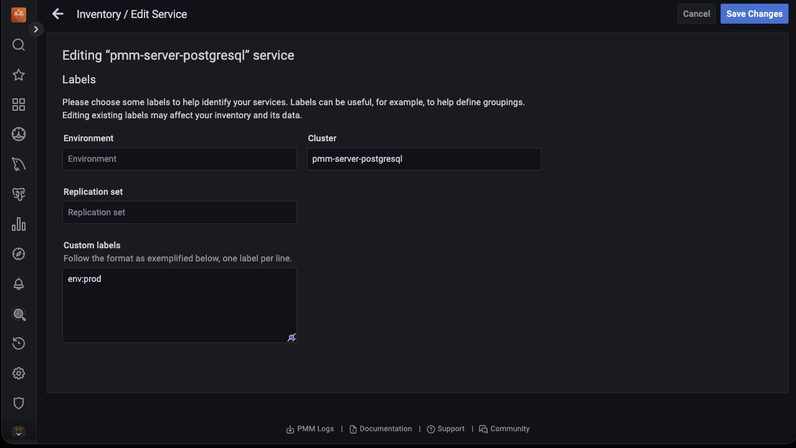

# Percona Monitoring and Management 2.40.0

| **Release date:** | Oct 05, 2023                                                                                    |
| ----------------- | ----------------------------------------------------------------------------------------------- |
| **Installation:** | [Installing Percona Monitoring and Management](https://www.percona.com/software/pmm/quickstart) |

Percona Monitoring and Management (PMM) is an open source database monitoring, management, and observability solution for MySQL, PostgreSQL, and MongoDB.

!!! caution alert alert-warning "Caution"
    **If you are using the Library Panels on the PMM dashboard, avoid upgrading to PMM 2.40.0 due to a known issue. Instead, we recommend waiting for the release of PMM 2.40.1.**

## Release Highlights

### Inventory improvements

#### Ability to update labels for existing services to PMM  

Starting with PMM 2.40.0, editing labels for existing services is easier and much more efficient. You can edit a service label directly from the PMM UI without removing and re-adding it. For more information on editing labels, see [documentation](https://docs.percona.com/percona-monitoring-and-management/details/dashboards/dashboard-inventory.html#editing-labels-for-a-service).

  

Furthermore, in our continued effort  to enhance user experience, we have redesigned the following pages to make them more user-friendly and intuitive:

- Select service type page
- Add service page

#### Connecting Services and Nodes 

Starting with PMM 2.40.0, you can click on the link in the **Node Name** column to view the node on which a specific service is running and analyze how node-level resource utilization impacts the performance of those services.

Before introducing this feature, locating the running services on a node was cumbersome. However, with this new feature, you can effortlessly access a list of services running on a specific node and identify the node name where the service is being utilized. Additionally, the filters implemented make navigation a lot simpler.

  

Furthermore, you can also see the service running on that specific node when you click on the link in the **Services** column.

  

#### Cluster view for Inventory

!!! caution alert alert-warning "Important"
    This feature is still in [Technical Preview](https://docs.percona.com/percona-monitoring-and-management/details/glossary.html#technical-preview) and is subject to change. We recommend that early adopters use this feature for evaluation purposes only.

Understanding the structure of your inventory is crucial. With the release of PMM 2.40.0, we've introduced an experimental feature that categorizes all your Services by Cluster, making it easier for you to understand your inventory. By using the **Organize by Clusters** toggle, you can view a group of services as a single cluster. PMM utilizes the cluster label to display services that belong to the same cluster.

  

For detailed information on this feature, see [documentation](https://docs.percona.com/percona-monitoring-and-management/details/dashboards/dashboard-inventory.html#cluster-view).
 

### MongoDB Backup Monitoring 

With this release, we are shipping the first version of a the **Backup failed** alert template which notifies of any failed MongoDB backups. This uses a new, dedicated metric, `pmm_managed_backups_artifacts`, for checking the state of backup artifacts. 

This new template is currently in Technical Preview and we are keen to get your feedback around this change before we move it to General Availability.

   

For information on working with this new template, see the [Percona Alerting](../get-started/alerting.md) topic.

### Components Upgrade

VictoriaMetrics has been upgraded [v1.93.4](https://docs.victoriametrics.com/CHANGELOG.html#v1934).

## New Features

- [PMM-11963](https://jira.percona.com/browse/PMM-11963) - Starting with PMM 2.40.0, you can click on the link in the **Node Name** column to view the node on which a specific service is running.
- [PMM-11148](https://jira.percona.com/browse/PMM-11148) - [Inventory]: We have redesigned the **Select service type** and **Add service** pages to make them more user-friendly and intuitive.
- [PMM-11423](https://jira.percona.com/browse/PMM-11423) - [Inventory]: Starting with PMM 2.40.0, you can now edit service labels directly from the PMM UI without having to remove and re-add them.
- [PMM-12378](https://jira.percona.com/browse/PMM-12378) - [Inventory]: We have introduced an experimental feature that categorizes all your Services by Cluster, making it easier for you to understand your inventory. By using the **Organize by Clusters** toggle, you can view a group of services as a single cluster. 
- [PMM-12384](https://jira.percona.com/browse/PMM-12384) - [Alerting]: Added a new built-in alert template,  **Backup failed** which you can use to create alert rules that notify of failed MongoDB backups. 
- [PMM-9374](https://jira.percona.com/browse/PMM-9374) - [[Technical Preview](https://docs.percona.com/percona-monitoring-and-management/details/glossary.html#technical-preview)]: Starting with PMM 2.40.0, you can now use an external VictoriaMetrics database for monitoring in PMM. This provides multiple benefits, including scalability, resource isolation, reduced load on the PMM server,  customization, etc.

## Improvements

- [PMM-4466](https://jira.percona.com/browse/PMM-4466) - Grafana now uses PostgreSQL instead of SQLite, resulting in improved performance, stability for user auth requests, data integrity, reliability, security, etc.
- [PMM-12310](https://jira.percona.com/browse/PMM-12310) - Links from PMM to documentation may change, causing "broken links" in older PMM versions due to document structure changes. We have replaced all links with Short.io links specific to each document to address this. This way, we can maintain the PMM-to-doc links using a URL shortener. This ensures that the links remain accessible even if the document structure changes.
- [PMM-12457](https://jira.percona.com/browse/PMM-12457) - We have added a new `node_name` property to the **PMM agent down** alert template in PMM. This allows users to easily identify the node where the failure occurred.
- [PMM-12488](https://jira.percona.com/browse/PMM-12488) - VictoriaMetrics has been updated to v1.93.4.
- [PMM-12500](https://jira.percona.com/browse/PMM-12500) - [[Technical Preview](https://docs.percona.com/percona-monitoring-and-management/details/glossary.html#technical-preview)]: For Percona Operator users, we have introduced a new dashboard for K8s monitoring with PMM 2.40.0.
- [PMM-11770](https://jira.percona.com/browse/PMM-11770) - PMM now automatically sets the server domain value in `grafana.ini` to the public address specified in PMM’s Advanced Settings. This ensures that links generated by Grafana, such as links in alert emails, also carry that address.

## Bugs Fixed

- [PMM-10145](https://jira.percona.com/browse/PMM-10145) - When we installed an AMI image in AWS and added an Amazon RDS instance in the creating state, it caused errors. The issue has been resolved now.
- [PMM-12173](https://jira.percona.com/browse/PMM-12173) - On adding several clients to PMM, unexpected and unauthorized errors caused PMM to stop responding. The issue has since been resolved now.
- [PMM-12344](https://jira.percona.com/browse/PMM-12344) - An error was displayed on the **Explain** tab after selecting a PostgreSQL query. The issue has been resolved now.
- [PMM-12361](https://jira.percona.com/browse/PMM-12361) - The command `pmm-admin inventory` returned GO errors. The issue has been reolved now.
- [PMM-12382](https://jira.percona.com/browse/PMM-12382) - Fixed an issue where the upper-case custom labels were not being accepted.
- [PMM-11371](https://jira.percona.com/browse/PMM-11371) - Usage of `pmm-admin` config subcommand shutdown pmm-agent. The issue has been resolved now.
- [PMM-11603](https://jira.percona.com/browse/PMM-11603) - When running `pmm-agent` outside of systemd, adding an agent causes errors. The issue has been resolved now.
- [PMM-11651](https://jira.percona.com/browse/PMM-11651) - When a user has both full access and limited access roles, only the limited role's metrics are displayed. The issue has been resolved now.
- [PMM-12146](https://jira.percona.com/browse/PMM-12146) - Dead Tuples graph on PostgreSQL Vacuum Monitoring Dashboard displayed invalid percentage. The issue has been resolved now.
- [PMM-12448](https://jira.percona.com/browse/PMM-12448) - Can't start backup if artifact with empty `service_id` exists.

## Known issues

- [PMM-12517](https://jira.percona.com/browse/PMM-12517) - If you have set custom dashboards as your Home dashboard in version 2.26.0, they may be lost after upgrading to version 2.40.0. To prevent this, we recommend that you back up your custom dashboard before upgrading and recover it after the upgrade.

- [PMM-12576](https://jira.percona.com/browse/PMM-12576) - After upgrading PMM from version 2.39.0 to 2.40.0 (not el7) using Docker, the admin user cannot access the PMM UI. Refer to the [documentation](https://docs.percona.com/percona-monitoring-and-management/troubleshoot.html#pmm-cannot-acess-admin-user-after-upgrading) for information on the solution.

- [PMM-12592](https://jira.percona.com/browse/PMM-12592) - If you are using the **Library Panels** on the PMM dashboard, avoid upgrading to PMM 2.40.0 due to a known issue.
