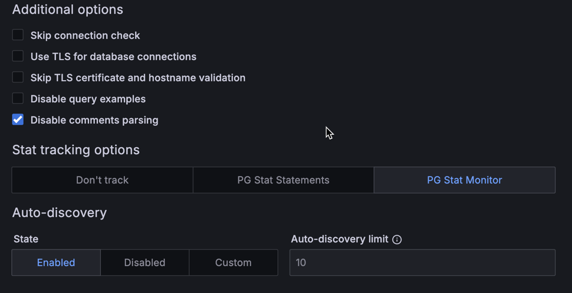

# Percona Monitoring and Management 2.41.0 (2023-12-12)

**Installation**: [Installing Percona Monitoring and Management](https://www.percona.com/software/pmm/quickstart)

Percona Monitoring and Management (PMM) is an open source database monitoring, management, and observability solution for MySQL, PostgreSQL, and MongoDB.

<!---

!!! caution alert alert-warning "Important/Caution"
    Crucial points that need emphasis:

    - Important: A significant point that deserves emphasis.
    - Caution: Used to mean 'Continue with care'.

--->

## Release Highlights

### Streamlined database problem reporting to Percona

To improve the gathering and sharing of PMM metrics and data, we’ve now integrated the [pmm_dump client utility](https://docs.percona.com/pmm-dump-documentation/index.html) into PMM. Initially a standalone client for PMM Server, PMM Dump is now accessible in the PMM user interface.

This integration enables you to collect PMM data to share with our Support team.

To get started, in the main menu, go to **Help** > **PMM Dump** and select either to export a dataset locally or upload it to our SFTP servers using the credentials generated through your Percona Support ticket.

### PostgreSQL monitoring: optimizing performance

PMM 2.41.0 introduces limit for Auto-discovery in PostgreSQL, a feature that dynamically discovers all databases in your PostgreSQL instance. Limiting Auto-discovery reduces connections and prevents high CPU and RAM usage caused by multiple databases, thus optimizing performance.

For details, see [documentation](https://docs.percona.com/percona-monitoring-and-management/setting-up/client/postgresql.html#auto-discovery-limit).

### PMM DBaaS functionality evolution into Percona Everest

We have decided to separate our DBaaS offering into an independent product. Consequently, we are discontinuing the DBaaS functionality in PMM and offering a [migration path to Everest](http://per.co.na/pmm-to-everest-guide).

While the DBaaS functionality will remain available in PMM versions 2.x, all future updates and enhancements will be exclusively accessible through the Percona Everest interface.
For a more streamlined and robust database deployment experience, try [Percona Everest](http://per.co.na/pmm-to-everest).

### Technical Preview of PMM in high availability (HA) mode

!!! caution alert alert-warning "Important"
    Disclaimer: This feature has been added in PMM 2.41.0 and is currently in [Technical Preview](https://docs.percona.com/percona-monitoring-and-management/details/glossary.html#technical-preview). Early adopters are advised to use this feature for testing purposes only as it is subject to change.

  Starting with this release, PMM can now be run in high availability mode with several PMM server applications and independent data sources.

  Currently, PMM servers provide high availability, but users are responsible for maintaining the high availability of the data sources used by PMM.

  These data sources are:

  - ClickHouse: An open-source, fast analytical database.
  - VictoriaMetrics: A scalable, long-term storage solution for time series data.
  - PostgreSQL: A powerful open-source relational database management system used in this setup to store PMM data like inventory, settings, and other feature-related data.

  If you're looking to dive deep into this feature, see our comprehensive [documentation](https://docs.percona.com/percona-monitoring-and-management/how-to/HA.html).  

## New Features

- [PMM-12459](https://jira.percona.com/browse/PMM-12459) - The [pmm_dump client utility](https://docs.percona.com/pmm-dump-documentation/index.html) previously available as a standalone client for PMM Server is now readily accessible within the PMM user interface.

## Improvements

- [PMM-11341](https://jira.percona.com/browse/PMM-11341) - PMM 2.41.0 introduces limit for Auto-discovery in PostgreSQL, a feature that dynamically discovers all databases in your PostgreSQL instance. Limiting Auto-discovery reduces connections and prevents high CPU and RAM usage caused by multiple databases, thus optimizing performance.
- [PMM-12375](https://jira.percona.com/browse/PMM-12375) - Starting with PMM 2.41.0, each instance of a service gets a `version` attribute in the PMM Inventory UI.
- [PMM-12422](https://jira.percona.com/browse/PMM-12422) - PMM 2.41.0 introduces a new flag called `--expose-exporter`. When you enable this flag any IP address, either from a local system or from anywhere on the internet, can access exporter endpoints. If the flag is not enabled, the exporter will be available only locally.
- [PMM-12544](https://jira.percona.com/browse/PMM-12544) - Added deprecation notices to the PMM documentation DBaaS pages. For a more streamlined and robust database deployment experience, try [Percona Everest](http://per.co.na/pmm-to-everest).
- [PMM-12549](https://jira.percona.com/browse/PMM-12549) - Added support for the latest MongoDB version. You can now use PMM to monitor MongoDB 7 databases.

## Components upgrade

- [PMM-12154](https://jira.percona.com/browse/PMM-12154) - Updated `postgres_exporter` to version [0.14.0](https://github.com/prometheus-community/postgres_exporter/releases). With this update, we have resolved several performance issues and eliminated the creation of multiple connections per database.
- [PMM-12223](https://jira.percona.com/browse/PMM-12223) - Clickhouse has been updated to version 23.8.2.7, which optimizes memory and CPU usage to improve system performance.

## Bugs Fixed

- [PMM-4712](https://jira.percona.com/browse/PMM-4712) - We have addressed the issue where the [pprof](https://github.com/google/pprof) heap reports for postgres_exporter were missing. 
- [PMM-12626](https://jira.percona.com/browse/PMM-12626) - Due to the packages being built on an outdated Go version, there was a potential vulnerability. We have updated Go to the latest version to mitigate this risk.
- [PMM-12414](https://jira.percona.com/browse/PMM-12414) - Fixed an issue with an unexpected behavior (502 response) when accessing the `logs.zip` endpoint. This was caused by the `group_by` parameter being included in the Alertmanager configuration. Additionally, we removed AlertManager-related files from `logs.zip` since we stopped using AlertManager.
- [PMM-11714](https://jira.percona.com/browse/PMM-11714) - Registering a node with the Grafana Admin flag enabled but a non-admin role was failing. This issue has now been resolved.
- [PMM-12660](https://jira.percona.com/browse/PMM-12660) - Prior to version 2.41.0 of PMM, the endpoint `/v1/management/Agent/List` could deliver database certificates to the PMM UI, allowing an authenticated admin user to view the output of TLS certificates. This posed a security issue since certificates should be consumed by the backend only. We have resolved this issue now.
- [PMM-12630](https://jira.percona.com/browse/PMM-12630) - When users attempted to upgrade PMM versions lower than or equal to 2.37.1, the upgrade process got stuck in a loop and failed. The issue has been resolved now.
- [PMM-12725](https://jira.percona.com/browse/PMM-12725) - Fixed the pagination for QAN.
- [PMM-12658](https://jira.percona.com/browse/PMM-12658) - Corrected a typo in the MongoDB cluster summary dashboard.
