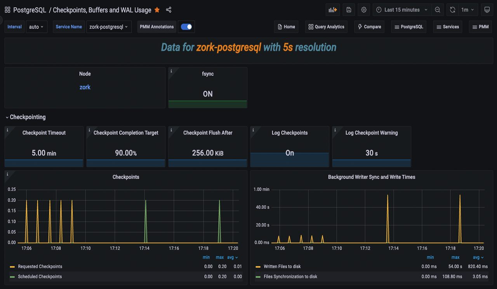

# Percona Monitoring and Management 2.41.2

| **Release date** | March 20th, 2024                                                                                   |
| ----------------- | ----------------------------------------------------------------------------------------------- |
| **Installation** | [Installing Percona Monitoring and Management](https://www.percona.com/software/pmm/quickstart) |

Percona Monitoring and Management (PMM) is an open source database monitoring, management, and observability solution for MySQL, PostgreSQL, and MongoDB.

It enables you to observe the health of your database systems, explore new patterns in their behavior, troubleshoot them and execute database management operations—regardless of whether your databases are located on-premises or in the cloud.

## Release highlights

### Debian 12(Bookworm) pmm-client packages

Starting with PMM 2.41.2, we now offer pmm-client packages for the latest version of Debian. You can install these packages by following the instructions in our [documentation](https://docs.percona.com/percona-monitoring-and-management/setting-up/client/index.html#package-manager).

### Experimental dashboards

!!! warning "warning"
    These **experimental** dashboards are subject to change. It is recommended to use these dashboards for testing purposes only. 

As part of PMM 2.41.2, we have added the following experimental dashboards.

- [Reworked Kubernetes dashboards](#reworked-kubernetes-dashboards)
- [Databases overview dashboard](#databases-overview-dashboard)
- [PostgreSQL Instance Summary dashboard](#postgresql-instance-summary-dashboard)
- [PostgreSQL Checkpoints, Buffers and WAL Usage dashboard](#postgresql-checkpoints-buffers-and-wal-usage-dashboard)
- [PostgreSQL Patroni dashboard](#postgresql-patroni-dashboard)

To access the experimental dashboards, go to the PMM home page and then navigate to **Dashboards > Experimental** from the side menu.

Alternatively, go to the PMM home page, navigate to **Dashboards** from the side menu, and enter the dashboard name in the **Search for dashboards**  field.

#### Reworked Kubernetes dashboards

PMM 2.41.2 now features redesigned Kubernetes dashboards that offer improved clarity and usability.

- The redundant information has been removed from some of these dashboards.
- The **Overview** dashboard, which has now been renamed as **Kubernetes Cluster Overview**, has been reorganized and improved for better functionality.
- The **DB Cluster** dashboard has been renamed as **Databases on Kubernetes** and now displays dynamic information. Furthermore, it separates database/proxy details and shows resource limits. 

These changes aim to improve user experience while adhering to PMM standards, particularly for managing multiple clusters.

#### Databases overview dashboard

The latest release introduces a new dashboard that offers a simplified overview of the databases being monitored by PMM. This dashboard aims to provide a centralized and unified place where the crucial parameters for database performance can be easily accessed. 

If you're looking for more information on this dashboard, see the [blog post](https://www.percona.com/blog/percona-monitoring-and-management-database-overview-dashboard-simplified/).

#### PostgreSQL Instance Summary dashboard

The PostgreSQL Instance Summary dashboard is a newly designed feature that displays the critical PostgreSQL metrics. This dashboard aims to assist DBAs and developers in identifying PostgreSQL issues quickly.

#### PostgreSQL Checkpoints, Buffers and WAL Usage dashboard

In our continuous effort to enhance our dashboards, we have introduced this new experimental dashboard that provides more data about your PostgreSQL instances.

By leveraging this data, administrators can gain insights into their PostgreSQL servers and fine-tune their performance. Understanding and managing checkpoints, buffers, and WAL usage contribute to a well-performing and reliable PostgreSQL environment.

If you’re looking for in-depth insights into this dashboard, refer to our [blog post](https://www.percona.com/blog/postgresql-checkpoints-buffers-and-wal-usage-with-percona-monitoring-and-management/).

#### PostgreSQL Patroni dashboard

Starting with PMM 2.41.2, we have included a new dashboard designed to monitor [Patroni](https://patroni.readthedocs.io/en/latest/) as an external service. For more information, see our documentation on [external services](https://docs.percona.com/percona-monitoring-and-management/setting-up/client/external.html).

This dashboard facilitates gathering more data for your PostgreSQL cluster inside PMM. 

Read our [blog post](https://www.percona.com/blog/monitoring-a-postgresql-patroni-cluster/) to learn more about this dashboard and how to add Patroni monitoring.

!!! caution alert alert-warning "Important"
    We would appreciate your feedback on these experimental dashboards to help us enhance it further.

## Improvements

- [PMM-10974](https://perconadev.atlassian.net/browse/PMM-10974) - Starting from PMM version 2.41.2, PMM has improved its stat tracking feature. In case `pg_stat_monitor` is not available, PMM will now use `pg_stat_statements` as a fallback option.

- [PMM-12884](https://perconadev.atlassian.net/browse/PMM-12884) - In PMM dump, the **Address** field on the **Send to Support** screen now comes with the address and port pre-filled, making it easier to send logs to support.

- [PMM-12887](https://perconadev.atlassian.net/browse/PMM-12887) - [Tech Preview] This new experimental dashboard has been added in PMM 2.41.2 for monitoring PostgreSQL checkpoints, buffers and WAL usage.

- [PMM-12888](https://perconadev.atlassian.net/browse/PMM-12888) - [Tech Preview] This new experimental dashboard has been added in PMM 2.41.2 to monitor [Patroni](https://patroni.readthedocs.io/en/latest/) as an external service.

- [PMM-12960](https://perconadev.atlassian.net/browse/PMM-12960) - [Tech Preview] The latest PMM release includes redesigned Kubernetes dashboards with improved clarity and usability.

- [PMM-12981](https://perconadev.atlassian.net/browse/PMM-12981) - Starting with PMM 2.41.2, PMM can now collect wraparound metrics for PostgreSQL. By monitoring these wraparound-related metrics, PostgreSQL administrators can proactively manage wraparound risks and prevent potential data corruption and downtime.

- [PMM-12894](https://perconadev.atlassian.net/browse/PMM-12894) - We have limited the number of connections used by postgres_exporter. Additionally, we have fixed an issue where connections are closed as soon as they are no longer needed, thereby preventing any hanging or idle connections.

- [PMM-12897](https://perconadev.atlassian.net/browse/PMM-12897) - Previously, two heavy queries were running for each database in the PostgreSQL server at medium resolution, which impacted the performance. These queries have now been moved to low resolution to improve performance.

## Fixed issues

- [PMM-12806](https://perconadev.atlassian.net/browse/PMM-12806) - In previous versions, PMM Server used certain non-configurable Victoria Metrics settings with default values. With this release, we are updating this behavior to enable you to modify default values for Victoria Metrics settings using environment variables. Previously, environment variables were overlooked as Victoria metrics prioritized specific command line flags passed by PMM over environment variables.

- [PMM-12348](https://perconadev.atlassian.net/browse/PMM-12348) - The ClickHouse engine was updated from the ordinary engine to the Atomic engine, which is the most robust engine, after upgrading PMM to version 2.41.0.

- [PMM-12785](https://perconadev.atlassian.net/browse/PMM-12785) - Fixed an issue where VictoriaMetrics scrape configuration contained unsupported parameters. 

- [PMM-12805](https://perconadev.atlassian.net/browse/PMM-12805) - While monitoring MongoDB servers, the disk space was being consumed due to the `CommandNotSupportedOnView` message in the logs. This issue has now been resolved.

- [PMM-12809](https://perconadev.atlassian.net/browse/PMM-12809) - Fixed several CVEs in PMM versions v2.40.1 and above.

- [PMM-12852](https://perconadev.atlassian.net/browse/PMM-12852) - An internal server error was thrown while attempting to modify any setting in PMM. This issue has been resolved now.

- [PMM-12986](https://perconadev.atlassian.net/browse/PMM-12986) - The `PostgreSQL connections in use` alert was triggering false positive notifications, but the issue has been resolved now.

- [PMM-12948](https://perconadev.atlassian.net/browse/PMM-12948) - Fixed an issue where the wrong information was being displayed regarding the uptime of the PostgreSQL instance.

- [PMM-12997](https://perconadev.atlassian.net/browse/PMM-12997) - The `pmm-agent` output was changed from `stdout` to `stderr`, which caused the automation to break. The issue has been resolved now.
