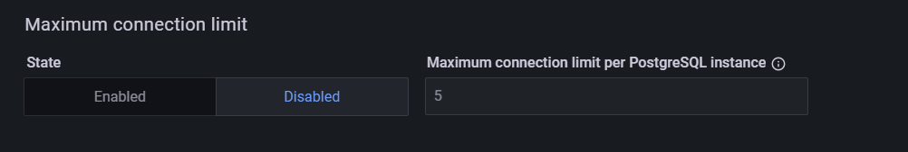
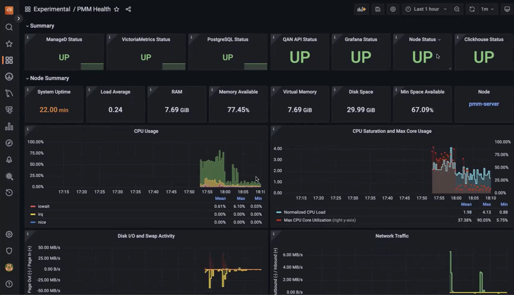
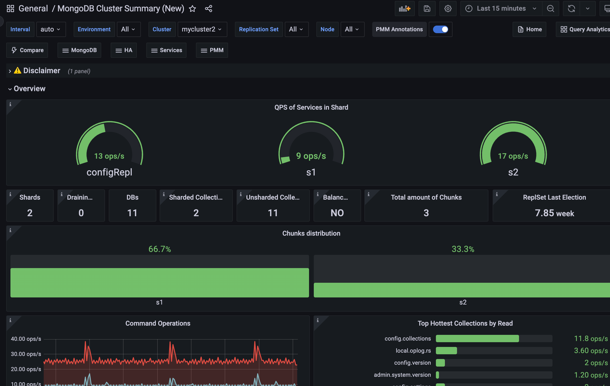

# Percona Monitoring and Management 2.42.0 (2024-06-11)

**Installation**: [Installing Percona Monitoring and Management](../quickstart/index.md)

Percona Monitoring and Management (PMM) is an open source database monitoring, management, and observability solution for MySQL, PostgreSQL, and MongoDB.

It enables you to observe the health of your database systems, explore new patterns in their behavior, troubleshoot them and execute database management operations regardless of whether your databases are located on-premises or in the cloud.

## What's new in this release

This release introduces support for Ubuntu 24.04, configurable metrics resolutions per service, improved connection management for PostgreSQL and PMM Agent, and experimental dashboards for PMM self-monitoring and MongoDB.

The release also brings enhancements to MySQL Query Response Time Details, adds new metrics and labels for PostgreSQL, and addresses several issues related to MongoDB monitoring, upgrades, and Query Analytics and High Availability documentation.

Experimental dashboards in PMM are new or redesigned dashboards that are released as a preview feature for you to test and provide feedback, as we hope to include them as defaults in a future release.

Keep in mind that these dashboards are not considered fully stable or complete, and their design, functionality, and metrics may change in future releases based on user feedback and further development.

## Release highlights

## Ubuntu 24.04 Noble Numbat support

PMM now officially supports monitoring of databases running on the recently released Ubuntu 24.04 Noble Numbat operating system.

With this addition, PMM continues to provide comprehensive coverage across a wide range of Linux distributions commonly used in database deployments.

Check the full list of supported platforms on the [Percona Software Support Lifecycle webpage](https://www.percona.com/services/policies/percona-software-support-lifecycle#:~:text=older%20minor%20versions..-,Percona%20Tools,-Software%3A%20Percona).

For information on installing the PMM Client on Linux, see [Set up PMM Client](https://docs.percona.com/percona-monitoring-and-management/setting-up/client/index.html#package-manager).

## Configurable metrics resolutions per service

You can now configure metrics resolutions on a per-service basis by setting Low-Resolution (LR), Medium-Resolution (MR), and High-Resolution (HR) settings for each exporter individually.

Customizing the resolution settings for individual services means that you can fine-tune your PMM setup to balance data granularity and resource consumption. This will enable you to:

- Allocate resources efficiently by focusing on high-resolution data for key services
- Reduce storage requirements by lowering resolution for less important components
- Align your monitoring setup with the specific needs of your environment

This feature is currently accessible via the PMM API and will be integrated into the user interface in a future release.

For more information on configuring per-service metrics resolution, see [Configure metrics resolution per-service](../how-to/configure.md#metrics-resolution).

## Improved connection management for PostgreSQL Services and pmm-agent

PMM now offers enhanced connection management capabilities for PostgreSQL services and the PMM Agent, to optimize resource utilization and prevent potential performance issues caused by excessive connections.

### PostgreSQL services

When adding a new PostgreSQL services, you can now set a maximum limit on the number of connections that the PostgreSQL exporter can open to the same PostgreSQL instance.

This feature, previously available only through the CLI, is now also accessible through the PMM web interface as well:

- PostgreSQL service: **PMM Configuration > Add Service > PostgreSQL > Configuring PostgreSQL Service**
- RDS PostgreSQL service: **PMM Configuration > Add Service > Amazon RDS > Discover with Amazon Credentials > RDS PostgreSQL**

By setting a maximum connection limit, you can prevent excessive connections during concurrent operations, and ensure that connections are closed promptly to avoid idle connections.

When adjusting the maximum number of connections, consider the following:

- higher values might be needed for larger or busier instances.
- setting the limit too high can impact performance.
- if no limit is specified or the option is disabled, the server will manage the connection limits automatically.

### PMM Agent

Similarly, you can now limit the number of connections that the PMM Agent opens to monitored databases for QAN, Advisors, and other systems.

Starting with this release, pmm-agent tracks all required resources (primarily connections), and opens no more than two connections per database instance simultaneously.

You can change this default value by setting a parameter or environment variable when starting the pmm-agennt.

For more information on configuring the PMM Agent and available parameters, see the PMM Agent help documentation by running `pmm-agent --help`.

## Experimental PMM self-monitoring dashboard

We've added a new experimental **PMM Health** dashboard to provide detailed insights into the health and performance of PMM itself.

The dashboard reflects the PMM architecture and covers key components such as overall component status, node health, Query Analytics, PMM-managed, Grafana, VictoriaMetrics, ClickHouse, and PostgreSQL metrics.

This initial version is available in the **Experimental** folder after updating PMM and contains a starter set of key metrics to help identify potential issues and ensure optimal operation.

For more information about this new dashboard, see the [Keeping an eye on the eye blog post](https://www.percona.com/blog/self-monitoring-for-percona-monitoring-and-management/).

## Experimental MongoDB dashboards: Sharded Cluster and Replica Set

Along with the PMM Health Dashboard, we're also introducing experimental updates to two key MongoDB dashboards: the **Cluster Summary** and **ReplicaSet** dashboards. These new versions, accessible from the MongoDB section within PMM, have been redesigned to address feedback regarding readability and data density.

The design and navigation are simplified here, to focus on the essential parameters and metrics most relevant to MongoDB performance monitoring.

We encourage you to explore these experimental dashboards and provide feedback in the PMM forum to help us refine them.

## Improvements

- [PMM-3303](https://perconadev.atlassian.net/browse/PMM-3303) - We've introduced an experimental PMM Health dashboard in the Experimental folder, offering detailed insights into PMM's health and performance by covering key components such as node health, Query Analytics, Grafana, VictoriaMetrics, ClickHouse, and PostgreSQL metrics.

- [PMM-13123](https://perconadev.atlassian.net/browse/PMM-13123) - Enhanced the **Query Response Time Distribution** graphs in the **MySQL Query Response Time Details** dashboard to provide more granular insights into query performance. Previously, the graphs did not include buckets for queries with response times less than 100 milliseconds, the range which many queries typically fall into. This limitation made it difficult to analyze the performance of sub-100ms queries, especially those in the sub-1ms range.

- [PMM-13075](https://perconadev.atlassian.net/browse/PMM-13075) - Added support for Ubuntu 24.04 support.

- [PMM-12896](https://perconadev.atlassian.net/browse/PMM-PMM-12896), [PMM-12895](https://perconadev.atlassian.net/browse/PMM-12895), [PMM-12971](https://perconadev.atlassian.net/browse/PMM-12971) - Added per-database metrics collection and control of parameters, enabling more granular data gathering without overusing connections.

- [PMM-12994](https://perconadev.atlassian.net/browse/PMM-12994) - Added labels to the `pg_replication_slot_slot_is_active` and `slot_current_wal_lsn` metrics in the postgres_exporter to identify the replication type (logical or physical) and the plugin used for the slot.

- [PMM-12753](https://perconadev.atlassian.net/browse/PMM-12753) - Added experimental versions of the MongoDB Cluster Summary and ReplicaSet dashboards with a streamlined design and simplified navigation, focusing on essential metrics for monitoring MongoDB performance.

- [PMM-11583](https://perconadev.atlassian.net/browse/PMM-11583) - Added support for the `innodb_redo_log_capacity` variable introduced in MySQL 8.0, ensuring accurate and consistent data representation in the InnoDB Logging graphs.

- [PMM-11278](https://perconadev.atlassian.net/browse/PMM-11278) - Improved the Query Analytics documentation to explain how QAN collects data. For more information, see the **Query Analytics under the hood** section in the [Query Analytics topic](https://docs.percona.com/percona-monitoring-and-management/get-started/query-analytics.html).

- [PMM-13119](https://perconadev.atlassian.net/browse/PMM-13119) - Improved the High Availability documentation Improved the High Availability documentation to clearly outline the available options for HA in PMM. For more information, see the [Set up PMM for HA topic](https://docs.percona.com/percona-monitoring-and-management/how-to/HA.html).

## Fixed issues

- [PMM-12349](https://perconadev.atlassian.net/browse/PMM-12349) - Fixed an issue in the MongoDB RepSet Summary dashboard where incorrect data was displayed when a node in the replica set was down, ensuring that the dashboard accurately reflects the status and version information of the nodes even when they are unavailable.

- [PMM-12522](https://perconadev.atlassian.net/browse/PMM-12522) - Resolved an issue where high resolution collection of MongoDB sharding information caused timeouts.

- [PMM-12880](https://perconadev.atlassian.net/browse/PMM-12880) - Fixed an issue where the `pmm-admin --tls-skip-verify` flag did not work correctly when using x509 authentication for MySQL, ensuring that the flag now properly skips certificate verification when connecting to MySQL instances with self-signed or untrusted certificates.

- [PMM-12962](https://perconadev.atlassian.net/browse/PMM-12962) -  Updated the balancer metrics in MongoDB exporter to accurately calculate and report the `mongodb_mongos_sharding_balancer_enabled` metric, providing a correct indication of whether the balancer is currently enabled or disabled in the sharded cluster.
Additionally, the `mongodb_mongos_sharding_chunks_is_balanced` metric has been renamed to `mongodb_mongos_sharding_chunks_is_balancer_running`. Update any alerts or dashboards using the old metric name to ensure they continue working correctly.

- [PMM-12989](https://perconadev.atlassian.net/browse/PMM-12989) - Fixed an issue where incorrect log entries persisted when monitoring Arbiter nodes in a MongoDB replica set.

- [PMM-12998](https://perconadev.atlassian.net/browse/PMM-12998) - Fixed an issue where upgrading PMM Server from versions older than 2.41.0 using Amazon Machine Image (AMI) or Open Virtualization Format (OVF) was unstable, causing the upgrade process to fail.

- [PMM-9403](https://perconadev.atlassian.net/browse/PMM-9403) - Fixed an issue where the MongoDB Replication Lag graph displayed incorrect and identical values for all nodes, by updating the metric to differentiate between instances and accurately represent the replication lag of each node in the cluster.
