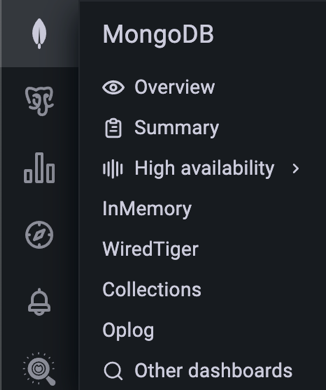

# Percona Monitoring and Management 2.43.0 (2024-09-19)

**Installation**: [Installing Percona Monitoring and Management](../quickstart/index.md)

Percona Monitoring and Management (PMM) is an open source database monitoring, management, and observability solution for MySQL, PostgreSQL, and MongoDB.

It enables you to observe the health of your database systems, explore new patterns in their behavior, troubleshoot them and execute database management operations regardless of whether your databases are located on-premises or in the cloud.

## What's new in this release

PMM 2.43 brings a host of updates, including new and redesigned dashboards, new collectors and metrics, enhanced troubleshooting capabilities, strengthened security, and initial steps towards expanded platform support with experimental ARM compatibility for PMM Client.

Additionally, this release features many bug fixes and performance enhancements to improve your user experience.

### MongoDB dashboard improvements and GA of recent experimental dashboard

We've made some significant enhancements to MongoDB monitoring, focusing on redesigned dashboards, streamlined navigation, and general availability (GA) of previously experimental dashboards.

#### Redesigned dashboards

We've overhauled two critical MongoDB dashboards to provide more value, especially for complex, multi-environment setups:

- **Replica Set Summary**
- **Sharded Cluster Summary** (formerly Cluster Summary)

These dashboards now offer enhanced usability, improved insights, and optimized visualizations for complex environments.

They focus on highlighting potential database issues for faster resolution and provide centralized, actionable insights without clutter.

#### General availability of Experimental dashboards

The redesigned dashboards, along with the following previously experimental dashboards, are now generally available:

- **MongoDB Oplog Details**
- **MongoDB Collection Overview**
- **Replica Set Summary**
- **Sharded Cluster Summary** (formerly Cluster Summary)

!!! note alert alert-primary "Experimental vs. GA"
    Experimental dashboards are newly developed or redesigned dashboards that are initially released as preview features. Once these dashboards have proven their value and stability, they are transitioned to GA status, which indicates that they are fully stable and ready for general use.

#### New experimental MongoDB Router Summary dashboard

We've created a new experimental [MongoDB Router Summary](../details/dashboards/dashboard-mongodb-router-summary.md) dashboard to enhance your experience when monitoring MongoS (routers) of MongoDB sharded clusters.

This dashboard provides:

- MongoS availability (UP or DOWN) with a chart showing the state of all MongoS instances, similar to the **Replica Set Summary** dashboard
- MongoS version
- CPU, Memory, Disk metrics, and much more

To access the new dashboard, go to **MongoDB> High availability > Router summary**.

#### Accessing the new dashboards

You can find the updated dashboards in the **MongoDB** and **Dashboards** sections of the main menu. They replace the previous versions as the default dashboards for MongoDB monitoring.

The old dashboards have been moved to the **Experimental** folder and renamed with **(Old)** appended to their names. Future releases will remove these older versions.

#### Updated MongoDB menu structure

To complement the dashboard improvements, we've also restructured the MongoDB section on the main menu for better navigation and accessibility:

- reorganized menu for a more intuitive navigation, prioritizing the two updated GA dashboards above.
- decluttered view by moving older dashboards to the **Experimental** folder or removing them from the menu.
- added **MongoDB Instance Summary**, **Collection Overview** and **MongoDB Oplog Details** the main menu:

    

We encourage you to start using the new dashboards to benefit from their enhanced monitoring capabilities. We also invite you to share your feedback in the [PMM forum](https://forums.percona.com/c/percona-monitoring-and-management-pmm/percona-monitoring-and-management-pmm-v2/31) so we can continue to improve them.

### New MongoDB collector: CurrentOp

The MongoDB exporter now includes the **CurrentOp** collector, offering visibility into active operations, including the new `mongodb_currentop_query_uptime` metric.

To start the MongoDB exporter with the CurrentOp collector enabled, use the `--enable-all-collectors` flag when adding MongoDB services to your PMM instance:

```sh
pmm-admin add mongodb --enable-all-collectors ...
```

Specifying a limit with `--max-collections` for this collector is not necessary.

For more information on MongoDB collectors and metrics, see the [pmm-admin commands documentation](../details/commands/pmm-admin.md).

!!! note "Operation collection limitation"
    To minimize impact on disk usage, the CurrentOp collector is designed to collect only operations that have been running for longer than 1 minute. This limitation helps focus on potentially problematic long-running operations while keeping data volume manageable.

### Monitoring Percona Backup for MongoDB (PBM)

PMM now supports monitoring Percona Backup for MongoDB (PBM) setups through a dedicated collector in the MongoDB exporter, providing key insights into `pbm-agent` statuses, PITR configuration, and backup statuses.

New metrics for this include:

- **`mongodb_pbm_cluster_backup_configured`**: indicates if PBM is configured for the cluster (1 = configured, 0 = not configured).

- **`mongodb_pbm_agent_status`**: shows the status of each PBM agent connected to the cluster nodes (0 = functioning, ≥1 = down, e.g., 2 for unreachable agents).

- **`mongodb_pbm_cluster_pitr_backup_enabled`**: specifies whether PITR is enabled in the current PBM configuration (1 = enabled, 0 = not enabled).

- **`mongodb_pbm_backup_size_bytes`**: displays the size of each backup in PBM's history, with labels for operation ID (`opid`), status (`status`), and backup name (`name`).

- **`mongodb_pbm_backup_duration_seconds`**: shows the duration of each PBM backup operation, using the same labels as `mongodb_pbm_backup_size`.

These metrics are enabled by default, so if you’re already using PBM, you’ll automatically start receiving them. To access them, go to **Explore > Metrics**, search for *mongodb_pbm*, and run your query.

This is just the beginning! While you can create custom dashboards with these metrics, we’re developing dedicated PBM dashboards for a quick overview of your backup status, along with alert templates to help you proactively monitor your PBM setup.

### Improved troubleshooting

We've enhanced PMM's troubleshooting capabilities to provide you with better insights and more efficient problem-solving tools:

#### Enhanced PMM Server logs

The default number of log lines for each log file returned by `https://<pmm-server>/logs.zip` endpoint has been increased from 1,000 to 50,000.

Additionally, the endpoint now includes a customizable line-count parameter in the download URL, allowing you to specify a custom number of log lines or opt for unlimited log size. For more information, see the [API documentation](https://percona-pmm.readme.io/reference/logs).

#### Streamlined Kubernetes diagnostics

New PMM Client Docker images now include essential troubleshooting tools:

- `tar` enables easier file transfer in and out of containers using the `kubectl cp` command.
- `curl` allows direct checking of exporters to verify their proper functioning.

### Improved security

This update addresses several security issues related to the GNU C Library (Glibc), specifically affecting the Name Service Cache Daemon (nscd). Additionally, it resolves multiple security vulnerabilities by upgrading various third-party packages.

### Important changes to PMM Update process

To ensure you can access the most up-to-date and secure versions, we've implemented two key changes to the update process:

#### Transition to a dedicated repository

Since July 1st 2024, PMM updates are distributed exclusively through the dedicated `repo.percona.com/pmm2-client` repository.

To smoothly transition to this repository and verify that your system is correctly configured, download and run our automated script from GitHub: [check_percona_packages.py](https://raw.githubusercontent.com/Percona-Lab/release-aux/main/scripts/check_percona_packages.py).

For detailed instructions and more information about this change, read our recent blog post [Ensure the Correct Repositories are Enabled for Percona Packages](https://www.percona.com/blog/ensure-the-correct-repositories-are-enabled-for-percona-packages/) and [updated installation instructions](../setting-up/index.md).

#### Update process for older PMM versions

If you’re using PMM version 2.38 or earlier, you might encounter issues when updating to the latest version via the UI **Update** button. These issues arise due to Red Hat's discontinuation of CentOS 7 repositories, which impacts PMM installations based on CentOS 7.

To ensure your PMM installation continues to receive updates and transitions smoothly away from the discontinued CentOS 7 base:

- **for Docker instances**: perform a one-time [Docker update](../setting-up/server/docker.md#upgrade) to migrate your installation to the Oracle Linux 9-based image.
- **for Non-Docker Instances (OVF/AMI)**: follow the upgrade instructions outlined in our [PMM Modernization blog post](https://www.percona.com/blog/pmm-modernized-enterprise-grade-foundation).

### Experimental ARM support for PMM Client

PMM 2.43 introduces experimental support for ARM architecture in PMM Clients, responding to the growing adoption of ARM in data centers and cloud environments.

For this, PMM now includes pre-built ARM binaries for key features like `node_exporter` and `mysqld_exporter`, enabling monitoring of ARM-based infrastructure while maintaining compatibility with existing PMM Server installations.

You can install PMM Client on ARM systems using the same process as for non-ARM platforms.

As an experimental feature, ARM support is suitable for testing purposes but not recommended for production environments yet. We wil refine and stabilize it in future releases.

Test this feature and share your experience on the [PMM forum](https://forums.percona.com/c/percona-monitoring-and-management-pmm/percona-monitoring-and-management-pmm-v2/31) to help accelerate its path to GA.

## End of support for CentOS 7

As of PMM 2.43.0, support for CentOS 7 has officially ended, continuing the transition to Oracle Linux 9 that began with PMM 2.38.0. With this change, we will no longer provide CentOS 7-based native packages (RPMs and DEBs) or EL7-based Docker images.

This decision allows us to focus on modern operating systems that offer better security, enhanced compatibility, and access to the latest libraries, streamlining both development and support.

If your infrastructure still relies on CentOS 7, we recommend planning a migration to a supported OS before upgrading to PMM 2.43.0 or any later versions. Be sure to review our blog post [Update Process for Percona Monitoring and Management 2.38 and Earlier](https://www.percona.com/blog/important-notice-update-process-for-percona-monitoring-and-management-2-38-and-earlier/) for key details about the update process, including potential issues and steps for a successful upgrade.

For assistance with migrating to Oracle Linux 9, our expert team is available to support you. For more information, [contact Percona Support](https://www.percona.com/services/support).

## Maintenance: QAN Update and PostgreSQL 9.x support changes

As part of our ongoing maintenance efforts, we have upgraded the `pg_query_go` package to version 5. This latest version helps parse PostgreSQL queries in QAN, provides improved functionality, and enables subsequent upgrades of important dependencies.

However, with this change, QAN will no longer be able to list PostgreSQL database tables for versions 9.4, 9.5, and 9.6. Since all PostgreSQL 9.x versions have already reached their end-of-life status, we recommend upgrading to a supported version of PostgreSQL.

If you're looking to upgrade, you can easily [install the latest version of Percona Distribution for PostgreSQL](https://docs.percona.com/postgresql/16/installing.html).

Need help with the upgrade process? Our team of PostgreSQL experts can guide you through a smooth and efficient upgrade. [Contact Percona Support](https://www.percona.com/services/support) or [our Sales team](https://www.percona.com/about/contact) to learn more about our professional upgrade services and ensure a seamless transition to a supported PostgreSQL version.

## Improvements

- [PMM-13257](https://perconadev.atlassian.net/browse/PMM-13257): [Dashboards] - PMM 2.43 delivers refined MongoDB dashboards with standardized layouts, improved visual consistency, and enhanced usability across Replica Set, Cluster, Collections, and Oplog views, ensuring a more intuitive and efficient monitoring experience.

- [PMM-13003](https://perconadev.atlassian.net/browse/PMM-13003): [Dashboards] - The **MongoDB ReplSet Summary** dashboard now features a clearer, more organized layout with separate rows for CPU usage, CPU saturation, disk I/O, and network traffic for each node in replica sets with more than three nodes, improving visibility and analysis of multi-node deployments.

- [PMM-12982](https://perconadev.atlassian.net/browse/PMM-12982): [Dashboards] - The **MongoDB ReplSet Summary** dashboard now displays replica set roles (Primary, Secondary, Arbiter) for each node, enhancing visibility and simplifying identification of node functions within the replica set topology.

- [PMM-13258](https://perconadev.atlassian.net/browse/PMM-13258): [Dashboards] - Revamped **MongoDB** dashboard structure, featuring new and updated dashboards for improved monitoring of various MongoDB aspects including replicas, sharded clusters, collections, and oplogs, while moving older dashboards to the **Experimental** folder.

- [PMM-13227](https://perconadev.atlassian.net/browse/PMM-13227): [Dashboards] - Renamed the **MongoDB Cluster Summary** dashboard to **MongoDB Sharded Cluster Summary** to more accurately reflect its focus on sharded cluster environments, reducing potential confusion for users monitoring different MongoDB topologies.

- [PMM-13217](https://perconadev.atlassian.net/browse/PMM-13217): [Dashboards] - The **MongoDB Sharded Cluster Summary** dashboard now displays the versions of mongoS routers alongside shard and config server versions, providing a more comprehensive view of the entire sharded cluster infrastructure.

- [PMM-13183](https://perconadev.atlassian.net/browse/PMM-13183): [Dashboards] - The **Node States** chart in the **MongoDB ReplSet Summary** dashboard now auto-adjusts its size to display all nodes without scrolling, enhancing visibility and ease of monitoring for larger replica sets.

- [PMM-13029](https://perconadev.atlassian.net/browse/PMM-13029): [Dashboards] - Improved filtering consistency across all charts on the **MongoDB Oplog Details** dashboard, including the **Oplog GB/Hour** view, ensuring accurate data representation for selected MongoDB nodes.

- [PMM-13159](https://perconadev.atlassian.net/browse/PMM-13159): [Dashboards] - We have removed the experimental MongoDB **Collection Details** dashboard from PMM. You can now find up-to-date collection information on the new Mongo **Cluster Summary** dashboard, which provides a more comprehensive and accurate view of MongoDB collection metrics. If you have been using the **Collection Details** dashboard, make sure to now check the new **MongoDB Cluster Summary** dashboard for similar information.

- [PMM-13030](https://perconadev.atlassian.net/browse/PMM-13030): [Dashboards] - The **MongoDB Collections Overview** dashboard has been refined to ensure consistent data filtering across all charts, including **Top 5 Hottest Collections** views, aligning with user-selected database contexts for improved clarity and more accurate per-database analysis.

- [PMM-13243](https://perconadev.atlassian.net/browse/PMM-13243): We've added a new `cluster_role` label to the `mongodb_up` metric, which identifies the type of node: `mongos` for query routers, `mongod` for database instances and `arbiter` for arbiter nodes.

    This label makes it easier to understand and monitor your MongoDB cluster by allowing you to filter and group metrics based on node roles. When querying the `mongodb_up` metric, the `cluster_role` label provides immediate insight into each instance's role, improving the visibility and management of your MongoDB infrastructure.

- [PMM-13141](https://perconadev.atlassian.net/browse/PMM-13141) - Introduced new MongoDB metrics for Feature Compatibility Version (FCV),  enhancing monitoring capabilities for multi-version deployments.

    This metric, collected automatically via the MongoDB exporter, provides insights into individual node compatibility and supports upcoming PMM advisors. 
  
- [PMM-12333](https://perconadev.atlassian.net/browse/PMM-12333): [Installation] - The PMM Client tarball installation process has been improved with more user-friendly features, including clearer error messages for permission issues, a helpful usage guide, and better overall guidance, making the setup process more intuitive and less error-prone for users.

- [PMM-13243](https://perconadev.atlassian.net/browse/PMM-13258): Improved identification and monitoring of MongoDB cluster member roles, particularly for mongos instances, enabling clearer topology visualization and laying the groundwork for more precise alerting in sharded cluster environments.

- [PMM-12957](https://perconadev.atlassian.net/browse/PMM-12957): Introduced alerting capabilities for Percona Backup for MongoDB (PBM), leveraging newly added PBM-specific metrics to enable proactive monitoring of backup statuses, configurations, and performance across MongoDB deployments.

- [PMM-13054](https://perconadev.atlassian.net/browse/PMM-13054): The default number of log lines returned by the `/logs.zip` endpoint has been increased from 1,000 to 50,000, with an added option to customize the line count or allow unlimited log size via a parameter in the download URL.

- [PMM-13292](https://perconadev.atlassian.net/browse/PMM-13292): Introduced an improved mechanism to resolve port conflicts when starting multiple PMM agents on the same machine, enhancing reliability and reducing manual intervention in complex monitoring setups.

- [PMM-13133](https://perconadev.atlassian.net/browse/PMM-13133): Improved QAN functionality through pg_query_go upgrade, encouraging transition to supported PostgreSQL versions for enhanced performance and security.

### Fixed issues

- [PMM-13002](https://perconadev.atlassian.net/browse/PMM-13246): [Dashboards] - Fixed a bug in the **MongoDB ReplSet Summary** dashboard where the **Node Summary** section only displayed information for one node. It now correctly shows data for all nodes in a replica set when **All** is selected, providing a comprehensive view of multi-node deployments.

- [PMM-13277](https://perconadev.atlassian.net/browse/PMM-13277): PMM 2.43 is now available on the AWS Marketplace, resolving the previous temporary unavailability issue of PMM 2.42.0. Users can directly install or upgrade to PMM 2.43.0 through AWS Marketplace or the PMM UI for access to the latest features and improvements.

- [PMM-13246](https://perconadev.atlassian.net/browse/PMM-13246): Addressed four security vulnerabilities (CVEs) related to the GNU C Library (Glibc), specifically affecting the Name Service Cache Daemon (nscd): [CVE-2024-33599](https://nvd.nist.gov/vuln/detail/CVE-2024-33599), [CVE-2024-33600](https://nvd.nist.gov/vuln/detail/CVE-2024-33600), [CVE-2024-33601](https://nvd.nist.gov/vuln/detail/CVE-2024-33601), [CVE-2024-33602](https://nvd.nist.gov/vuln/detail/CVE-2024-33602).

- [PMM-13255](https://perconadev.atlassian.net/browse/PMM-13255): Resolved two issues with the MongoDB Replication Lag Alert: one where an error occurred during the import of the alert rule template, and another where the alert description displayed an incorrect current value for the replication lag.

- [PMM-13288](https://perconadev.atlassian.net/browse/PMM-13288): Fixed an issue where queries longer than 2048 characters in PostgreSQL were not properly parsed for table extraction, now allowing accurate monitoring and analysis of long queries without generating error messages in logs.

- [PMM-12965](https://perconadev.atlassian.net/browse/PMM-12965): We've improved the **MongoDB replication lag is high** alert template to make sure it:

    - now triggers only for `SECONDARY` nodes that are up and exceed the lag threshold, eliminating false alarms during maintenance.
    - excludes `PRIMARY` nodes from alerts, as they cannot lag behind themselves.

      To ensure you're using the updated alert logic, make sure to recreate any alerts based on this alert rule template.

- [PMM-12451](https://perconadev.atlassian.net/browse/PMM-12451) and [PMM-13017](https://perconadev.atlassian.net/browse/PMM-13017) - Resolved an issue with parsing JSON objects into the correct data types and aligned the explain functionality with the official MongoDB client. These updates enhance consistency with MongoDB's native tools and provide improved performance insights.

- [PMM-13071](https://perconadev.atlassian.net/browse/PMM-13071): The **Explain** tab on the Query Analytics (QAN) page now properly handles unsupported MongoDB query types. For operations like `INSERT`, which don’t support explain functionality, you will now see a clear message saying that the operation is not explainable.

    This replaces the previous, confusing error message about duplicate BSON fields, offering more accurate feedback in QAN.

