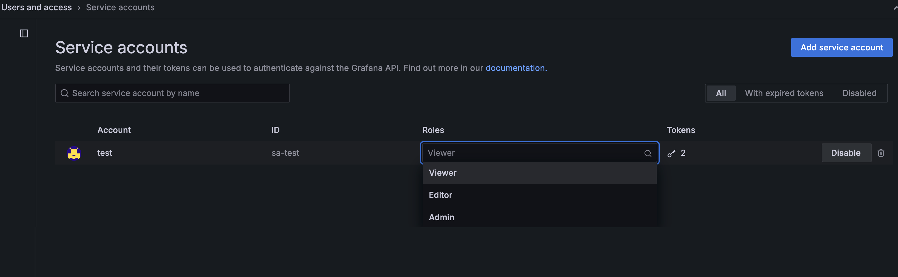
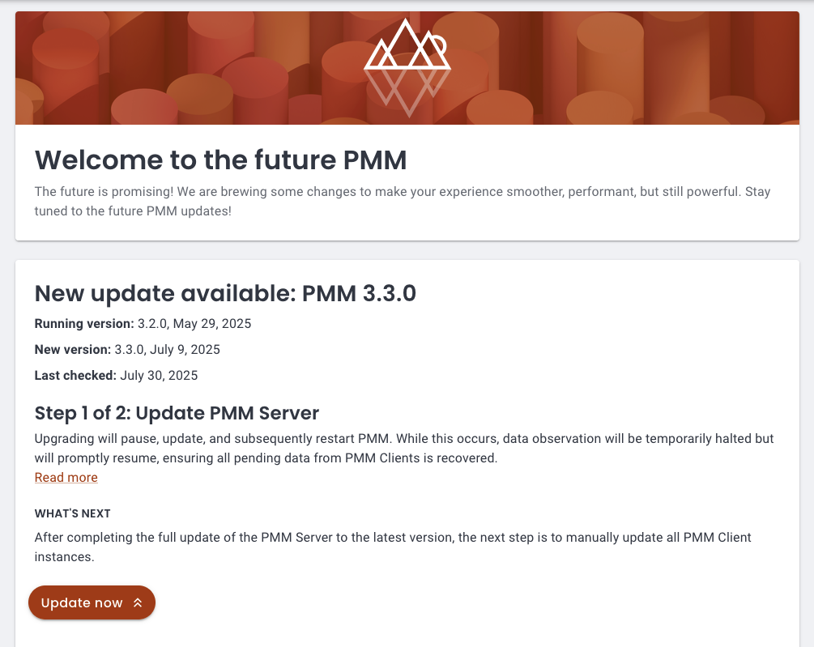

# Percona Monitoring and Management 3.0.0 

| **Release date** | January, 2025                                                                                  |
| ----------------- | :---------------------------------------------------------------------------------------------- |
| **Installation** | [Installing Percona Monitoring and Management](../quickstart/index.md) |
| **Upgrade**| [Migrate PMM 2 to PMM 3](../pmm-upgrade/migrating_from_pmm_2.md)

Percona Monitoring and Management (PMM) is an open source database monitoring, management, and observability solution for MySQL, PostgreSQL, and MongoDB.

PMM empowers you to: 

- Monitor the health and performance of your database systems
- Identify patterns and trends in database behavior
- Troubleshoot issues effectively
- Execute database management tasks seamlessly, whether your databases are on-premises or in the cloud

## General availability of PMM 3.0.0

We’re excited to announce the General Availability of PMM 3.0.0, a new major version that introduces a complete architectural overhaul of PMM. 

This milestone delivers major security improvements with rootless deployments, encryption of sensitive data, enhanced stability through containerized architecture, and improved user experience with flexible monitoring configurations. Key changes include official ARM support, MongoDB 8.0 monitoring, and a streamlined upgrade process.

## Security enhancements

### Support for rootless deployments

Using the root user in applications poses a significant security risk, particularly when outdated software is installed or resides in the environment.

PMM Server now supports rootless deployment through multiple methods, including the latest versions of Podman, Helm, Docker, Virtual Appliance, and Amazon AWS.

This rootless setup enhances security by eliminating the need for root privileges to create, run, and manage containers. By running PMM Server as a non-root user, you avoid granting root permissions on the host system, providing an additional layer of protection against potential vulnerabilities and security breaches.

For instructions on deploying rootless PMM, check the [Setting up PMM Server](https://docs.percona.com/percona-monitoring-and-management/setting-up/index.html#set-up-pmm-server) topic.

### UI-based upgrades for Podman installations

You can now upgrade PMM Server installations running under Podman directly through the **PMM Configuration > Updates** panel in the UI. 

This functionality integrates Watchtower for automated container updates and requires configuration of new environment variables (`PMM_WATCHTOWER_HOST`, `PMM_WATCHTOWER_TOKEN`) as well as relevant systemd service settings.

For detailed configuration instructions, see [Installation with UI updates](../install-pmm/install-pmm-server/baremetal/podman/index.md).

### Encryption of sensitive data

Plaintext passwords and credentials are among the top ten security risks identified by OWASP (Open Web Application Security Project).

To address this risk, PMM now encrypts all sensitive information stored in its database. This includes usernames, passwords, AWS keys, Azure credentials, and TLS/SSL certificates, significantly enhancing the security of your monitoring environment.  Even though we recommend minimal privileges for monitoring user accounts, you can rest assured that the sensitive data is protected! 

By default, PMM generates an encryption key and stores it at `/srv/pmm-encryption.key`. Alternatively, you can define a custom path for the encryption key using the new environment variable `PMM_ENCRYPTION_KEY_PATH`.

When upgrading to PMM 3, any existing unencrypted PMM 2 data will be encrypted automatically.

For more information, see [PMM data encryption](../pmm-admin/security/data_encryption.md).

### Enhanced API authentication with Grafana service accounts

We've made a significant enhancement to the way API authentication is handled. PMM no longer relies on API keys as the primary method for controlling access to the PMM Server components and resources. Instead, PMM now leverages Grafana service accounts, which provide a more secure and manageable authentication mechanism compared to API keys.

This transition to service accounts brings fine-grained access control and logging of all actions performed, providing more security, better visibility and auditing capabilities. 

#### Migration from API keys
With this change, API keys are now deprecated. When upgrading from PMM 2 to PMM 3, your existing API keys will be automatically converted to service accounts when you first log in as an Admin user or via CLI.
For more information see [Migrate to PMM 2 to PMM 3](../pmm-upgrade/migrating_from_pmm_2.md#step-3-migrate-pmm-2-clients-to-pmm-3) and [Service account authentication](../api/authentication.md).

#### CVEs eliminated through architectural changes

The removal of legacy components like Integrated Alerting and DBaaS, combined with the security enhancements above, eliminates multiple potential vulnerabilities and CVEs. This makes PMM 3 our most secure release yet.

## Enhanced stability

### Containerized PMM architecture for AMI and OVF deployments

Previously, AMI and OVF instances of PMM were created as standalone images rather than being containerized like the primary Docker-based PMM version.

This difference in architecture led to challenges in maintenance as fixes and updates for AMI and OVF instances required additional effort and were sometimes delayed due to their lower adoption rates.

With this update, PMM now uses a unified containerized architecture across all deployment methods. In AMI and OVF environments, PMM components run as Podman-managed containers in rootless mode, eliminating the need for elevated system privileges.

This transition not only aligns AMI and OVF deployments with PMM's core containerized model but also improves security, enables faster troubleshooting, and streamlines updates and patch management.

### More stable and quicker upgrades

PMM 3 introduces a significant upgrade system overhaul, replacing the earlier method based on internal package updates. While the previous approach offered the convenience of upgrading directly via the Update button on the Home dashboard, it was prone to connection issues and package corruption, often resulting in complex recovery challenges.

The new upgrade method moves away from RPM updates to exclusive container updates, eliminating RPM-related complications. This streamlined approach provides consistent upgrade experiences across all deployment types—Docker, Podman, and OVF/AMI.

At the same time, we're maintaining the UI upgrade option by integrating [Watchtower](https://containrrr.dev/watchtower/), an external upgrading tool. When you click the **Upgrade Now** button on the Home Dashboard, Watchtower seamlessly replaces the PMM Server container and links the new one to the existing volume, preserving all data and settings intact.

For easy adoption, Watchtower comes pre-configured in our [Easy-Install script](../quickstart.md), enabling one-step PMM setup.

### Reduced PMM container image size

We've optimized the PMM 3 container image from 3.1GB to 2.6GB, reducing its size by 0.5GB. This reduction improves download speeds and enhances deployment reliability, particularly in environments with limited storage capacity.

## Improved user experience

### New upgrade UI

We’ve introduced a new **Updates** page under **PMM Configuration** to support the new container-based upgrade system. This centralized interface offers clear visibility into the versions and configurations of both your PMM Server and Clients, simplifying the update process.

With this update, you’ll receive proactive notifications whenever new versions are released to help you make informed decisions before proceeding with available upgrades.

### Flexible monitoring configurations  

PMM extends its database monitoring setup process by adding an intuitive UI-driven approach alongside CLI-based configuration. After installing PMM Client on your database server, all further monitoring configurations can be managed directly through the PMM interface, eliminating the need for complex command-line operations.

This simplified workflow combines with PMM's new ability to run database exporters on any PMM Client node rather than solely on PMM Server. By distributing the monitoring load across multiple PMM Clients, this approach enables more efficient monitoring of a larger number of remote and cloud-hosted databases, such as RDS instances.

When adding new services through the PMM UI, you can now specify which PMM Client node will run the monitoring exporter. While PMM Server remains the default option, you can choose any node with PMM Client installed, including selecting specific clients on nodes with multiple installations.

This distributed monitoring capability is currently available for new service additions, with support for existing service modification planned for a future release.

For more details, see [Connect services](../install-pmm/install-pmm-client/index.md##connect-services).

### Simplified AWS installation process

We've simplified AWS installations to match our standard Docker/Podman workflow. After installation, you'll immediately see the PMM login screen.

Use **admin** as the username and your EC2 Instance ID as the password (the default PMM password cannot be used for security reasons).

You can find your Instance ID in the AWS Console. For detailed instructions, see [Install PMM Server on AWS Marketplace](../install-pmm/install-pmm-server/aws/aws.md).

### Official ARM support for PMM Client

PMM 3 now officially supports ARM architecture, upgrading from its experimental status in PMM 2.43. This means you can reliably monitor databases on ARM platforms, taking advantage of their cost-effective infrastructure and energy efficiency in data centers and cloud environments.

Installation follows the standard PMM Client process, with no special requirements for ARM systems.  

Try out this feature and share your experience on the [PMM forum](https://forums.percona.com/c/percona-monitoring-and-management-pmm/percona-monitoring-and-management-pmm-v2/31)!

### Improved UX with Grafana's latest release

PMM now integrates Grafana 11.1.8, which delivers the following important enhancements alongside all the advancements introduced since the previous Grafana 9.2.20 integration in PMM 2.

For the full list of  Grafana changes included with this update, see [Grafana’s 11.1.8 changelog](https://community.grafana.com/t/changelog-updates-in-grafana-11-1-8/134843) and [Grafana release highlights](https://grafana.com/docs/grafana/latest/whatsnew/).

#### Improved navigation

PMM now includes a revamped header with search, breadcrumbs, and a reorganized menu that groups related tools together, making it easier to navigate PMM's features and find what you need:

#### Improved Alerting workflow

Leveraging the new Grafana user interface updates, we've taken the opportunity to refine the workflow for creating alerts from the **Alert Rules** and **Alert Rule Templates** pages.

You'll notice separate, more visible options for creating different types of alert rules, cutting down on unnecessary steps and making it easier to manage various alert rules, templates, and configurations:

#### Simplified administration settings with dedicated menus

Administration settings are now easier to manage with the new **Administration** menu. This menu brings together all Grafana-related configurations and account management options that were previously scattered across the general **Configuration** section. This change helps administrators locate and manage Grafana-specific settings more efficiently.

Additionally, all PMM settings and inventory options are now grouped under a new **PMM Configuration** menu. This centralizes access to all PMM-related configurations, making it simpler for users to handle their PMM setup.

These improvements make navigating easier and more organized, so you can quickly find and adjust settings for Grafana and PMM.

## Monitoring improvements

### Added monitoring support for default PostgreSQL database

PMM now provides full monitoring support for the default `postgres` database on PostgreSQL instances, with metrics displayed across Query Analytics (QAN).

This enhancement resolves a previous visibility gap where database activity was hidden when applications used the default database. 

While using the default database for applications is not recommended, PMM 3 ensures comprehensive visibility, empowering teams to identify and address this practice proactively and maintain better database management.

### Added Oplog generation rate panel to MongoDB dashboards

The **MongoDB Sharded Cluster Summary** and **MongoDB ReplSet Summary** dashboards now include an **Oplog GB/Hour** panel showing the oplog generation rate per hour in a column format.

The panel is located in the **Replication** section, helping you monitor oplog generation alongside other replication metrics for better visibility into your database replication patterns:

### General availability of MongoDB Router Summary dashboard

The [MongoDB Router Summary](../reference/dashboards/dashboard-mongodb-router-summary.md), initially introduced as an experimental dashboard in PMM 2, is now generally available in PMM 3. This dashboard provides comprehensive monitoring for MongoS routers in sharded MongoDB clusters, offering insights into MongoS availability, version details and resource utilization. 

You can access this dashboard at **MongoDB > High availability > Router summary**.

### [Tech Preview] Support for PSMDB  and Community MongoDB 8.0

The latest version of MongoDB, along with [Percona Server for MongoDB 8.0](https://www.percona.com/software/mongodb/percona-server-for-mongodb), brings [numerous improvements and significant performance enhancements](https://www.mongodb.com/docs/manual/release-notes/8.0/).
In this version of PMM, we are also adding support for MongoDB 8, allowing MongoDB users to monitor their new version and observe its performance impact.

This includes updates to `mongodb_exporter` to accommodate PSMDB 8.0’s revised metrics structure and renamed metrics (e.g., `wiredTiger.concurrentTransactions` is now `queues.execution`).

This enhances monitoring, particularly for sharded cluster deployments, and requires PMM Agent version 2.43.1 or later.

Keep in mind that some dashboard metrics may need further updates to fully support MongoDB 8.0's new format.

### QAN improvements

#### Increased query length limit for MongoDB in QAN

For MongoDB queries, the default maximum query length in Query Analytics (QAN) is now 4096 characters (up from 2048).
This better supports long queries and aggregation pipelines while reducing truncation errors. Other databases retain the 2048-character limit.

#### Enhanced MySQL SlowLog query identification

Improved MySQL Slow Log query identification by extending the query ID length from 16 to 32 characters. This reduces the likelihood of ID collisions and ensures more accurate and reliable QAN results.

## Breaking changes and deprecations

### Oracle Enterprise Linux 9 images only

With Enterprise Linux 7 (EL7) approaching its end-of-life date, we've made sure that PMM 3 exclusively uses Oracle Enterprise Linux 9 (EL9) as the base system for all PMM images.

We began this transition from CentOS 7 to EL9 with the latest PMM 2 releases, and now with PMM 3, we are no longer building Docker containers, AMIs, or OVFs based on EL7.

By moving to EL9, we ensure that PMM is built on most recent library versions and stays compatible with new technologies. Moreover, EL9 grants access to faster upstream responses to issues, particularly those concerning security, so that your PMM setup remains up-to-date and secure.

Due to this change, PMM 3 cannot be started on host servers running EL7.

### Finalized DBaaS migration to Percona Everest

In previous PMM releases, the Database as a Service (DBaaS) functionality has been gradually transferred to Percona Everest, an open source cloud-native database platform that solves the challenge of public cloud DBaaS vendor lock-in.

With Percona Everest, you gain the ability to provision and oversee highly performant database clusters on the infrastructure you manage, whether it's your preferred cloud environment or on-premises. This empowerment extends to regaining control over critical aspects such as data access, database configuration, and the costs associated with cloud-based database operations.

While PMM 2.x versions continue to support existing DBaaS functionality, PMM 3 marks the complete deprecation of this feature, removing all references to DBaaS.

If you are an existing PMM user who relies on DBaaS functionality, we encourage you to explore [Percona Everest](https://www.percona.com/resources/percona-everest) and leverage its advanced features for database deployment. Percona Everest also integrates with PMM to provide monitoring capabilities for your database infrastructure.

To learn more about integrating Percona Everest with PMM and adding monitoring endpoints, see [Add monitoring endpoints in the Everest documentation](https://docs.percona.com/everest/use/monitor_endpoints.html).

### Finalized Integrated Alerting deprecation and API removal

This release completes the deprecation of Integrated Alerting started in PMM 2.31.0 by removing its remaining components and APIs:

- Removed all Integrated Alerting API endpoints, including `/v1/Settings/TestEmailAlertingSettings`
- Removed Integrated Alerting-related fields from the PMM Settings API (`email_alerting_settings` and `slack_alerting_settings`)

If you still have alert rules that haven't been migrated to Percona Alerting, use the [Integrated Alerting Migration Script](https://github.com/percona/pmm/blob/main/ia_migration.py) to migrate them. [Percona Alerting](../alert/index.md) provides enhanced capabilities through Grafana's alerting infrastructure and pre-configured Alert Rule Templates.

### Breaking API changes

This release introduces major breaking API changes:

- Database record identifiers no longer use prefixes (e.g., `/agent_id/`) and are now represented as plain UUIDs.
- Feature toggles have been simplified from dual booleans to a single boolean control with an `enable_feature` property.  
- API responses now consistently emit all fields including those with default or zero values.
- Service, node, and agent management has been streamlined through consolidated endpoints where the resource type is specified as a top-level property in the request payload.
- Low-level Inventory API sections have been removed from documentation in favor of the Management API for inventory-related tasks.

For detailed information about all these API changes and new endpoints, see the [PMM API documentation](https://percona-pmm.readme.io/v3/reference/release-notes-3-0-0). 

### New upgrade environment variables

When migrating from PMM 2 to PMM 3, you’ll need to update your environment variables to match the new naming convention. This is because PMM 3 introduces several important changes to improve consistency and clarity:

- environment variables now use PMM_ prefix
- some boolean flags reversed (e.g., `DISABLE_` > `ENABLE_`)
- removed deprecated variables

To check the Migration reference table, see [Environment variables in PMM](../install-pmm/install-pmm-server/baremetal/docker/env_var.md##variables-for-migrating-from-pmm-v2-to-pmm-v3).

### Grafana Angular support discontinuation

Grafana will discontinue support for Angular starting with version 12, expected in 2025. This affects numerous panels and plugins, including but not limited to Graph and Table panels.

We have already migrated many plugins to newer technologies and are actively working on the remaining components to ensure continued functionality. We recommend that you review all plugins in your dashboards and begin planning transitions to newer panel types where necessary.

For the full list of affected plugins and guidance on migration, see [Grafana's official documentation](https://grafana.com/docs/grafana/latest/developers/angular_deprecation/angular-plugins/) on Angular deprecation and plugin migration.

We will provide regular updates on our migration progress in future releases to help you prepare for this change and modernize your dashboards.

## Component upgrades

We've upgraded following PMM components to their latest stable versions to enhance functionality, security, and performance:

- **Grafana 11.1.8**: Includes significant improvements over the previous version 9.2.20 integration in PMM 2.
- **Node Exporter 1.8.2**: The latest stable release enhances system metrics collection with improved security, additional metrics for custom dashboards, and critical bug fixes. This version strengthens our ability to monitor crucial system-level metrics through upstream improvements.
- **ClickHouse Datasource plugin**: Updated to address security vulnerabilities and maintain system integrity. This update ensures continued reliable operation of ClickHouse-related dashboards.
- **ClickHouse-go driver**: Upgraded QAN to use version 2 of the driver, improving database connectivity and performance.

## Improvements

- [PMM-13399](https://perconadev.atlassian.net/browse/PMM-13399) - PMM Client packages (DEB, RPM, and tarball) now include the Nomad binary, laying the foundation for expanded functionality in future PMM releases.  
While the Nomad binary is now included and properly configured within the PMM Client ecosystem, Nomad agent configuration and execution capabilities will be implemented in future releases, which will unlock more capabilities for PMM.

- [PMM-13315](https://perconadev.atlassian.net/browse/PMM-13315) - To prevent node registration failures, PMM now automatically shortens service account names longer than 200 characters. For this, PMM creates a truncated name in the format `{prefix}_{hash}`, where:

    - **prefix** is a portion of the original name, providing context
    - **hash** is a unique identifier to avoid naming conflicts

    For example, a long node name such as:

    - `Copyvery_long_mysql_database_server_in_production_environment_with_specific_location_details_and_multiple_configuration_settings_for_east_coast_datacenter_primary_backup_replica_instance_2024`

    would now be shortened to:

    - `Copyvery_long_mysql_database_server_in_prod_4a7b3f9d`.
  
- [PMM-12940](https://perconadev.atlassian.net/browse/PMM-12940) - We've added automated update support for AMI/OVF deployments. The new **Updates** page also enables AMI and OVF deployments to update PMM Server directly from the UI, following the integration of the Watchtower container.

- [PMM-11216](https://perconadev.atlassian.net/browse/PMM-11216) - Added ability to upgrade PMM Server between different version tags, enabling more flexible version management for Docker-based deployments.

- [PMM-xxxx](https://perconadev.atlassian.net/browse/PMM-xxxx) - Building on the OpenShift compatibility introduced for PMM Client in PMM 2.44, PMM 3.0 extends this support to include PMM Server as well. All PMM Docker images now comply with Red Hat certification requirements, ensuring seamless deployment of both PMM Client and PMM Server in OpenShift environments.

## Fixed issues

- [PMM-13122](https://perconadev.atlassian.net/browse/PMM-13122) - Fixed navigation between pages to properly maintain selected service names and timeframes when switching between different dashboards and metrics views.

- [PMM-12013](https://perconadev.atlassian.net/browse/PMM-12013) - Fixed reliability and memory usage issues with RDS monitoring in large deployments by running separate RDS exporters per AWS access key. This improves metric collection stability and reduces memory consumption when monitoring multiple RDS instances.

- [PMM-13360](https://perconadev.atlassian.net/browse/PMM-13360) - Fixed an issue in the MongoDB ReplSet Summary dashboard where nodes in `down` state would sometimes disappear from the **States** panel and their version information would be removed from the MongoDB Versions panel. Nodes in `down` state now remain visible with their last known version information preserved.

!!! seealso alert alert-info "Ready to install or migrate to PMM 3?"
    
    We provide two installation scripts to help you get started with this new version:

    - For new installations, the [Easy-Install script](../quickstart/index.md) comes with Watchtower pre-configured, enabling one-step PMM setup with automatic updates.
    - For existing PMM 2 users, we provide a dedicated [Upgrade script]((../pmm-upgrade/migrating_from_pmm_2.md)) that safely migrates your installation to PMM 3 and ensures data is backed up before the upgrade.
