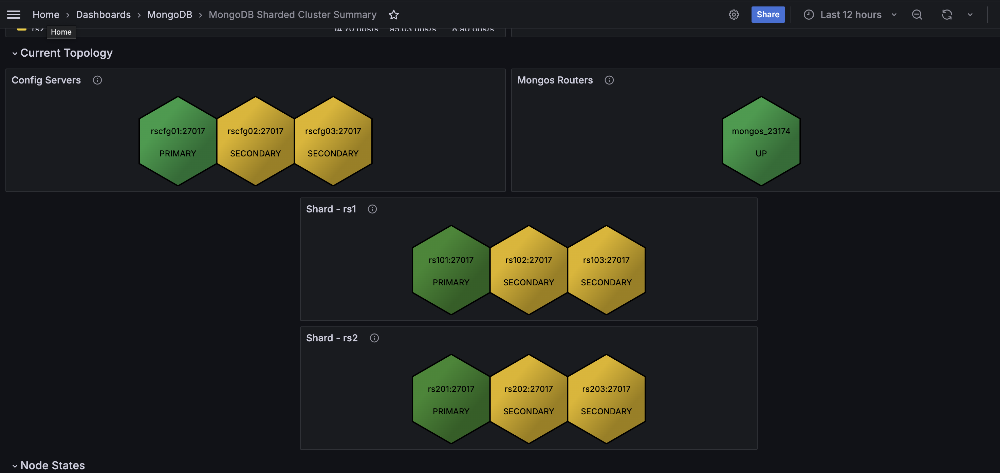

# Percona Monitoring and Management 3.0.0 

| **Release date** | January 30th, 2025                                                                                  |
| ----------------- | :---------------------------------------------------------------------------------------------- |
| **Installation** | [Installing Percona Monitoring and Management](../quickstart/quickstart.md) |
| **Upgrade**| [Migrate PMM 2 to PMM 3](../pmm-upgrade/migrating_from_pmm_2.md)

Percona Monitoring and Management (PMM) is an open source database monitoring, management, and observability solution for MySQL, PostgreSQL, and MongoDB.

PMM empowers you to: 

- monitor the health and performance of your database systems
- identify patterns and trends in database behavior
- troubleshoot issues effectively
- execute database management tasks seamlessly, whether your databases are on-premises or in the cloud

## Improved MongoDB cluster topology visualization

We have enhanced the MongoDB Cluster Summary dashboard to restore and improve the Current Topology section, which had been available in older PMM 2 versions.

The enhanced topology view now properly groups and displays MongoDB cluster components—shards, config servers, and mongos routers—in their respective dedicated sections with clear hierarchical organization. Previously, all components were incorrectly displayed under the Config Services section, causing confusion. 

This update provides a more accurate and intuitive representation of your MongoDB cluster architecture, making it easier to understand, monitor, and manage the relationships between different components:

## Highlight 2

## Improvements

- [PMM-12161](https://perconadev.atlassian.net/browse/PMM-12161) - Improved MongoDB cluster topology visualization on the **MongoDB Cluster Summary** dashboard.

- [PMM-13315](https://perconadev.atlassian.net/browse/PMM-13315) - 

## Fixed issues
