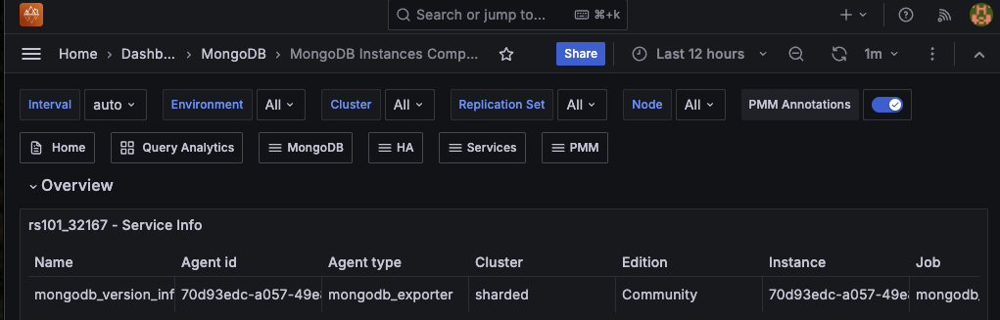

# Percona Monitoring and Management 3.1.0 

| **Release date** | March 27th, 2025                                                                                  |
| ----------------- | :---------------------------------------------------------------------------------------------- |
| **Installation** | [Installing Percona Monitoring and Management](../quickstart/quickstart.md) |
| **Upgrade**| [Migrate PMM 2 to PMM 3](../pmm-upgrade/migrating_from_pmm_2.md)

Percona Monitoring and Management (PMM) is an open source database monitoring, management, and observability solution for MySQL, PostgreSQL, and MongoDB.

PMM empowers you to: 

- monitor the health and performance of your database systems
- identify patterns and trends in database behavior
- troubleshoot issues effectively
- execute database management tasks seamlessly, whether your databases are on-premises or in the cloud

## Release summary

PMM 3.1.0 enhances MongoDB monitoring with improved query analytics, better visualization, and streamlined troubleshooting. This release also refines role-based access for advisors and alerts, along with various usability improvements and bug fixes.

## Release highlights

### Enhanced MongoDB monitoring
We've improved MongoDB monitoring with detailed query metrics, better dashboard visualization, and new capabilities to quickly identify performance bottlenecks.

#### Extended metrics and labels for MongoDB Query Analytics (QAN)

The [QAN dashboard](../use/qan/index.md) includes new metrics and filters that highlight inefficient execution paths and offer detailed lock and storage metrics. With the improved filters, you can quickly pinpoint problematic queries based on application, client, user, or plan summary:

##### New metrics
In the **Query Details** section of the QAN dashboard you'll now find these additional metrics:

=== "Query execution metrics"
    New metrics for identifying inefficient query patterns:

    - **Docs Examined**: the number of documents scanned. High values may indicate missing or inefficient indexes.
    - **Keys Examined**: the number of index keys scanned. Compare this with **Docs Examined** to assess index efficiency.
    - **Docs Returned**: the number of documents returned. A high **Docs Examined** to **Docs Returned** ratio may indicate inefficiencies that need optimization. 

=== "Response metric"
    New metric for evaluating query response efficiency:

    **Response Length**: measures the size of the response payload in bytes, helping identify large result sets that may impact performance.

=== "Lock statistics metrics"
    New metrics for detecting lock contention issues:

    - **Locks Global Acquire Count Read/Write Shared**: tracks how often global locks are used, helping to spot delays caused by multiple processes accessing the same data.
    - **Locks Database Acquire Count Read Shared**: tracks how often read locks are used in the database.
    - **Locks Database Acquire Wait Count Read Shared**: counts the times a database read lock request had to wait. High values may signal delays due to contention.
    - **Locks Database Time Acquiring Micros Read Shared**: captures the time spent waiting for database read locks, critical for performance analysis.
    - **Locks Collection Acquire Count Read Shared**: tracks how often read locks are used at the collection level.
    - **Full Scan (COLLSCAN)**: tracks instances where the entire dataset is scanned, meaning every document in the collection is read. This results in high I/O operations, long execution times, and scalability challenges. High  COLLSCAN should be addressed to enhance performance.

=== "Storage metrics"
    New metrics for analyzing I/O performance:

    - **Storage Bytes Read**: measures the volume of data read from storage during operations, helping identify I/O-intensive queries.
    - **Storage Time Reading in Microseconds (µs)**: tracks the time spent on storage read operations, which is useful for detecting potential storage bottlenecks.

##### New filters

The QAN dashboard now includes several additional MongoDB-specific filter options:

- **Plan Summary**: filters queries by execution plan type (COLLSCAN, IXSCAN, etc.) to easily identify inefficient full collection scans. 
- **Application Name**: filters queries by the application that executed them. 
- **User**: isolates queries by specific database users. 
- **Database**: focuses on particular database instances. 

     

#### Improved query fingerprint visualization
MongoDB query fingerprints in QAN now display the actual query structure, including operators and field names, similar to the format used in a MongoDB shell. 

The previous display only showed operation type and collection name, which provided limited context for troubleshooting. 

The new fingerprint format makes query patterns immediately recognizable while still anonymizing sensitive data. 

#### Enhanced query examples visualization
We've refined the query examples interface in Mongo QAN by removing unnecessary enumeration labels ("1 item", "2 item", etc.) and upgrading the JSON viewer component. 

This creates a cleaner display that emphasizes the actual query content rather than distracting metadata.

#### Improved MongoDB cluster topology visualization

We have enhanced the [MongoDB Cluster Summary dashboard](../reference/dashboards/dashboard-mongodb-cluster-summary.md) with a redesigned **Current Topology** section. 

This section now properly categorizes MongoDB cluster components—shards, config servers, and mongos routers—within their appropriate hierarchical sections. This replaces the previous implementation that incorrectly grouped all components under the **Config Servers** section.

#### Enhanced MongoDB dashboard visualizations
Based on community feedback, we've made several improvements to the [MongoDB ReplicaSet Summary](../reference/dashboards/dashboard-mongodb-replset-summary.md) and [MongoDB Sharded Cluster Summary](../reference/dashboards/dashboard-mongodb-cluster-summary.md) dashboards:

- improved detection of node states to better identify down nodes
- optimized **Top Hottest Collections** panel showing only the most critical data
- improved readability with rounded numbers in **Overview** panels
- increased precision with decimal values (tenths) in **Top Hottest Collections** panels
- resolved visualization issues in **Disk I/O** and **Network traffic** panels for more reliable performance monitoring

#### Enhanced filtering capabilities 
We've improved the filtering experience on the [MongoDB Instances Compare](../reference/dashboards/dashboard-mongodb-instances-compare.md) dashboard with four new selection boxes in addition to the existing **Service Name** filter. These filters allow you to narrow down instances by:

- **Replication Set**
- **Environment**
- **Cluster**
- **Node** 

These additional filters make it easier to navigate and compare MongoDB instances in larger environments, enabling you to quickly narrow down the specific instances you want to monitor.

### Enhanced role-based access control

We've refined role-based access for Advisors and Alerts, making it easier for teams to collaborate while maintaining security boundaries:

#### Advisors access for Editors

Users with the Editor role can now access Advisors insights without requiring Admin privileges. This is especially beneficial in managed service environments where Admin access is typically restricted to database administrators.

While Editors can view Advisors insights, only Admins can run, disable, or edit Advisors and execute checks.

#### Expanded access to fired alerts

The **Fired Alerts** page under **Alerting** is now accessible to both Viewer and Editor roles, allowing teams to monitor triggered alerts without needing elevated permissions:

- Editors can now view and silence alerts directly from the **Fired alerts** page. Previously, silencing alerts was only possible via the **Alert rules** page.
- Editors also gain full access to alert templates including the ability to view, create, edit, and delete templates.
- Viewers cannot access or modify alert templates, protecting critical alert configurations.

For more details, see [PMM roles and permissions](../admin/roles/index.md).

## Improvements

- [PMM-12161](https://perconadev.atlassian.net/browse/PMM-12161) - MongoDB components are now properly organized in the **Cluster Summary** dashboard, replacing the confusing layout where all appeared under **Config Servers**.

- [PMM-13545](https://perconadev.atlassian.net/browse/PMM-13545) - Enhanced MongoDB dashboard visualizations with improved node state detection, optimized **Top Hottest Collections** panels, better number formatting, and fixed visualization issues in the **Disk I/O** and **Network traffic** panels.

- [PMM-12468](https://perconadev.atlassian.net/browse/PMM-12468), [PMM-9288](https://perconadev.atlassian.net/browse/PMM-9288) - Enhanced MongoDB QAN with additional metrics, new filter categories, and the ability to identify inefficient full collection scans (COLLSCAN).

- [PMM-12242](https://perconadev.atlassian.net/browse/PMM-12242) - Expanded alert visibility allowing Viewers to see fired alerts and Editors to manage alerts from the **Fired Alerts** page.

- [PMM-12356](https://perconadev.atlassian.net/browse/PMM-12356) - Enabled Editor role users to view Advisors insights while maintaining Admin-only control over running and modifying them.

- [PMM-13575](https://perconadev.atlassian.net/browse/PMM-13575) - The `mongodb_pbm_agent_status` metric in MongoDB exporter now includes a `self` label to differentiate between a PMM Client reporting its own status versus reporting status of other Clients in the cluster. 

    The `self` label is set to `1` when the agent is reporting about itself, and to `0` when reporting about other Clients. This helps identify more precisely which specific Client is experiencing problems without false positives on functioning nodes. 

- [PMM-13718](https://perconadev.atlassian.net/browse/PMM-13718) - Improved user access control to PMM logs. The PMM logs link in the Help menu is now hidden for users without administrative privileges instead of displaying an _Access denied_ error when accessed.

- [PMM-13676](https://perconadev.atlassian.net/browse/PMM-13676) - Redesigned all PMM email templates with PMM branding, replacing Grafana logos and styling. Alert emails now also include options for professional support services when needed.

- [PMM-13374](https://perconadev.atlassian.net/browse/PMM-13374) - Improved MongoDB query fingerprint presentation in QAN to display a more detailed query structure, similar to OpsManager format. This makes query patterns easier to recognizable and improves troubleshooting for users migrating from other MongoDB monitoring tools.

- [PMM-13372](https://perconadev.atlassian.net/browse/PMM-13372) - Improved MongoDB **Query Examples** presentation in QAN by removing enumeration labels.

## Fixed issues

- [PMM-13770](https://perconadev.atlassian.net/browse/PMM-13770) - Corrected metric calculations to accurately capture service counts after updates to job name formatting in PMM3. The **Monitored DB services** panel on the **Home** dashboard now displays the correct number of monitored instances.
- [PMM-13769](https://perconadev.atlassian.net/browse/PMM-13769) - Resolved an issue where non-Admin users encountered an _Access denied_ error when trying to download PMM logs. The PMM logs link is now properly hidden for users without administrative privileges.
- [PMM-13715](https://perconadev.atlassian.net/browse/PMM-13715) - Fixed an issue where non-Admin users would encounter access error messages after a PMM upgrade. PMM now correctly verifies user roles before initiating configuration tasks, preventing unnecessary error messages for regular users.
- [PMM-13706](https://perconadev.atlassian.net/browse/PMM-13706) - Fixed an issue where the **Grafana status** panel on the **PMM Health** dashboard incorrectly displayed a **Down** state even when the service was running normally. 
- [PMM-13698](https://perconadev.atlassian.net/browse/PMM-13698) - Fixed an issue where expanded service details under **Inventory > Services** would collapse automatically due to page reloads. Service details now remain expanded for uninterrupted review.
- [PMM-13750](https://perconadev.atlassian.net/browse/PMM-13750) - Reduced excessive error logging in PostgreSQL monitoring by skipping table extraction from truncated queries, significantly lowering log volume in busy environments.
- [PMM-13546](https://perconadev.atlassian.net/browse/PMM-13546) - Added Grafana fix for incorrect **Data source** link on the **Alerting** section.
- [PMM-13333](https://perconadev.atlassian.net/browse/PMM-13333) - Removed unnecessary **PMM Server Logs** section from the **VictoriaMetrics** dashboard as it only contained a non-functional diagnostics link.
- [PMM-12881](https://perconadev.atlassian.net/browse/PMM-12881) - PMM would display both an error notification and a misleading success notification when changing PMM settings to an invalid value. This issue has been resolved, and PMM now only shows the appropriate error message when a setting change fails.

