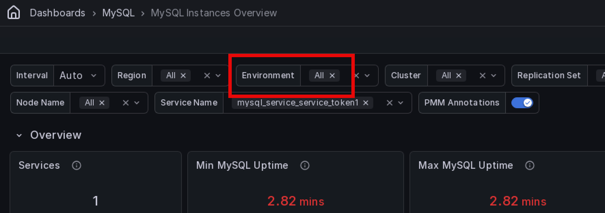

# Percona Monitoring and Management 3.10.0

**Release date**: TBD
**Release date**: 30 August 2026

Percona Monitoring and Management (PMM) is an open source database monitoring, management, and observability solution for MySQL, PostgreSQL, MongoDB, Valkey and Redis. PMM empowers you to:

- monitor the health and performance of your database systems
- identify patterns and trends in database behavior
- diagnose and resolve issues faster with actionable insights
- manage databases across on-premises, cloud, and hybrid environments

## Release summary

### MongoDB Unused Indexes dashboard

You can now spot unused MongoDB indexes directly in PMM, without running manual queries against each node. Go to **Dashboards > MongoDB > MongoDB Unused Indexes** to see indexes with zero accesses since the last `mongod` restart, along with access trends and a least-used index ranking to help you prioritize cleanup.

Built on the existing [MongoDB Unused Indexes advisor check](../advisors/checks/mongodb-unused-indexes.md), the dashboard adds a filterable view across clusters, replica sets, nodes, and databases, so you safely identify and remove indexes that add write overhead and consume memory without benefiting reads.

### Environment filter for MySQL Replication Summary

The [MySQL Replication Summary](../reference/dashboards/dashboard-mysql-replication-summary.md) dashboard now includes an **Environment** filter, consistent with other PMM dashboards. Use it to quickly narrow replication data to a specific environment when working with a large number of replication sets across multiple environments.

Requires the `indexstats` collector on the MongoDB exporter. See [MongoDB Unused Indexes](../reference/dashboards/dashboard-mongodb-unused-indexes.md).

## 📈 Improvements

- [PMM-15071](https://perconadev.atlassian.net/browse/PMM-15071): Added the [MongoDB Unused Indexes](../reference/dashboards/dashboard-mongodb-unused-indexes.md) dashboard for identifying indexes with zero accesses since the last `mongod` restart. Requires the `indexstats` collector.

- [PMM-15189](https://perconadev.atlassian.net/browse/PMM-15189): Added documentation for starting and stopping Real-Time Analytics (RTA) on MongoDB services from the command line. See [pmm-admin inventory add agent rta-mongodb-agent](../use/commands/pmm-admin/inventory.md#pmm-admin-inventory-add-agent-rta-mongodb-agent) and [pmm-admin inventory remove agent](../use/commands/pmm-admin/inventory.md#pmm-admin-inventory-remove-agent).

- [PMM-13932](https://perconadev.atlassian.net/browse/PMM-13932): Added an **Environment** filter to the [MySQL Replication Summary](../reference/dashboards/dashboard-mysql-replication-summary.md) dashboard to quickly narrow replication data to a specific environment.
- [PMM-14848](https://perconadev.atlassian.net/browse/PMM-14848): Your query text filter and page size in **Query Analytics > Real-Time** now survive page refreshes, so you no longer lose your view when the page reloads. When sharing a link with a teammate, they now also land on the same query text filter and page size you had set, not just the same cluster or service.
## ✅ Fixed issues

- [PMM-15067](https://perconadev.atlassian.net/browse/PMM-15067): Fixed an issue where the **Alerts** entry was missing from the left navigation for anonymous users when Grafana anonymous access was enabled, although you could still access the page via direct URL.
- [PMM-15092](https://perconadev.atlassian.net/browse/PMM-15092): Fixed the **InnoDB Row Reads** panel in the [MySQL InnoDB Details](../reference/dashboards/dashboard-mysql-innodb-details.md) dashboard where the series name in the legend appeared blank. The series now correctly shows as **Rows**.
- [PMM-15204](https://perconadev.atlassian.net/browse/PMM-15204): The CSV export in **Query Analytics > Real-Time** now includes all available query data fields instead of a fixed set of columns, including two new ones in this release: `service_id` and `query_text`. Your exports will always reflect the latest query fields available in your PMM version.

- [PMM-14908](https://perconadev.atlassian.net/browse/PMM-14908): Fixed the **Replication Delay Details** section of the [MySQL Group Replication Summary](../reference/dashboards/dashboard-mysql-group-replication-summary.md) dashboard incorrectly including asynchronous replication nodes in mixed replication environments, making it harder to identify actual Group Replication lag. The section now shows only Group Replication nodes, giving you a clean view of replication delay without noise from unrelated nodes.

- [PMM-15091](https://perconadev.atlassian.net/browse/PMM-15091): Fixed the **Total Performance** panels in the [Disk Details](../reference/dashboards/dashboard-disk-details.md) dashboard showing approximately twice the actual IOPS and throughput on hosts using Linux software RAID. If your dashboards showed inflated disk performance figures on RAID hosts, they will now report accurate values.         

## Known issues

## 🚀 Ready to upgrade to PMM 3.9.0?

- [New installation](../quickstart/quickstart.md)
- [Upgrading from PMM 3](../pmm-upgrade/index.md)
- [Upgrading from PMM 2](../pmm-upgrade/migrating_from_pmm_2.md)
