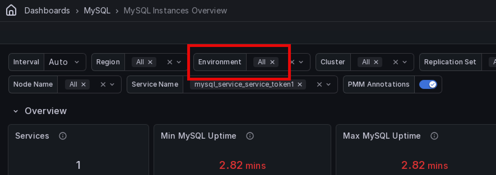

# Percona Monitoring and Management 3.10.0

**Release date**: 30 August 2026

Percona Monitoring and Management (PMM) is an open source database monitoring, management, and observability solution for MySQL, PostgreSQL, MongoDB, Valkey and Redis. PMM empowers you to:

- monitor the health and performance of your database systems
- identify patterns and trends in database behavior
- diagnose and resolve issues faster with actionable insights
- manage databases across on-premises, cloud, and hybrid environments

## Release summary

### PMM HA Cluster is now generally available

PMM 3.10.0 completes the HA Tech Preview introduced in PMM 3.6.0 with the features and improvements needed to run HA reliably in production:

- OpenShift support for versions 4.18 to 4.21, including ROSA with hosted control planes, alongside Amazon EKS 1.33 to 1.35.
- In-place [upgrades to new PMM releases](../pmm-upgrade/upgrade_helm_ha.md) with a single `helm upgrade` command. PMM Server replicas restart one at a time, so monitoring is only briefly interrupted while a new leader takes over.
- [Backup and restore](../install-pmm/backup-restore-HA-clustered.md) for your entire HA installation to S3-compatible storage or a shared volume, on demand or on a schedule. Restore into the same cluster or a new namespace for disaster recovery.
- [Built-in alert rules](../alert/templates_list.md#pmm_ha_alerts) for no active leader, split-brain, leader flapping, unreachable nodes, and quorum at risk, created automatically. Configure a [contact point](../alert/contact_points.md) to receive notifications.
- Improved [PMM HA Health Overview](../reference/dashboards/dashboard-ha-health-overview.md) dashboard with an overall health score, per-component status tables showing leader and primary roles, and resource usage panels, accessible from **PMM HA > Overview** in the side menu.
- [Flexible scaling](../install-pmm/install-HA-clustered.md#scale-pmm-server-replicas) to 1, 3, or 5 PMM Server replicas, with Helm validation that rejects even counts.
- [Multi-namespace deployments](../install-pmm/install-HA-clustered.md#install-pmm-ha-into-multiple-namespaces) on the same cluster.

- Multiple [fixes](#fixed-issues-ha) and [improvements](#improvements-ha) for HA Cluster, including an HA status badge that now reflects the actual cluster state.

For help with lost Raft quorum, leader election problems, and component logs, see [Troubleshoot PMM HA Cluster issues](../troubleshoot/ha_issues.md).

### MongoDB Unused Indexes dashboard

You can now spot unused MongoDB indexes directly in PMM, without running manual queries against each node. Go to **Dashboards > MongoDB > MongoDB Unused Indexes** to see indexes with zero accesses since the last `mongod` restart, along with access trends and a least-used index ranking to help you prioritize cleanup.

Built on the existing [MongoDB Unused Indexes advisor check](../advisors/checks/mongodb-unused-indexes.md), the dashboard adds a filterable view across clusters, replica sets, nodes, and databases, so you safely identify and remove indexes that add write overhead and consume memory without benefiting reads.

Requires the `indexstats` collector on the MongoDB exporter. See [MongoDB Unused Indexes](../reference/dashboards/dashboard-mongodb-unused-indexes.md).

### MySQL 9.7 support and monitoring improvements

PMM 3.10 adds support for Oracle MySQL 9.7 and Percona Server 9.7 with changes that also improve MySQL 8.0 and newer monitoring:

- **Service Summary reports** now work on MySQL 9.x hosts where `mysqldump` is not installed.
- **InnoDB redo log panels** in [MySQL InnoDB Details](../reference/dashboards/dashboard-mysql-innodb-details.md) now render correctly across all supported MySQL versions. **Total Log Space**, **InnoDB Logging Performance**, **InnoDB Log File Usage Hourly**, **InnoDB Log File Size** and **InnoDB Log Files** were previously always empty on MySQL 5.7, Percona Server 5.7 and MariaDB, and now show data there.
- The [InnoDB redo log sizing advisor](../advisors/checks/innodb_redo_logs_not_sized_correctly.md) now correctly evaluates redo log capacity on MySQL 8.0.30 and newer.
- **Backups of MySQL 9.7** are no longer rejected with an incompatible-XtraBackup error. Use a Percona XtraBackup release from the same series as your server, for example PXB 9.7.x for MySQL 9.7.x.
- **Top Tables by Rows Read** and **Top Tables by Rows Changed** in [MySQL Table Details](../reference/dashboards/dashboard-mysql-table-details.md) now show data on Community MySQL, which does not provide the user statistics these panels previously required. Both still need per-table statistics collection, which PMM disables for services with more tables than the configured limit.
- **AHI Miss Ratio** in [MySQL InnoDB Details](../reference/dashboards/dashboard-mysql-innodb-details.md) showed the hit ratio instead of the miss ratio on short time ranges. It now matches **InnoDB AHI Miss Ratio**.
- **Query Cache panels** across [MySQL Instances Overview](../reference/dashboards/dashboard-mysql-instances-overview.md) and [MySQL Instance Summary](../reference/dashboards/dashboard-mysql-instance-summary.md) now show a notice on MySQL 8.0 and newer instead of silently showing no data.

#### Changes to be aware of

- The Checkpoint Age limit series is now labelled **Redo Log Capacity / Max Checkpoint Age**. On MySQL 8.0.30 and newer the checkpoint age is measured against the total redo log capacity, while older servers expose only the smaller synchronous flush threshold. The same workload therefore reports a lower percentage on 8.0.30 and newer, so compare a server against itself over time rather than against a server on a different version.
- On MySQL 5.7 and Percona Server 5.7, `mysql_info_schema_innodb_metrics_recovery_log_lsn_checkpoint_age` is no longer exported while the server reports the `-1` placeholder for that row. Previously the placeholder was exported as a gauge with the value `-1`. Panels and alerts that treated `-1` as a reading now see a gap instead.

### Environment filter for MySQL Replication Summary

The [MySQL Replication Summary](../reference/dashboards/dashboard-mysql-replication-summary.md) dashboard now includes an **Environment** filter, consistent with other PMM dashboards. Use it to quickly narrow replication data to a specific environment when working with a large number of replication sets across multiple environments.

## 📈 Improvements

### All deployments

- [PMM-15071](https://perconadev.atlassian.net/browse/PMM-15071): Added the [MongoDB Unused Indexes](../reference/dashboards/dashboard-mongodb-unused-indexes.md) dashboard for identifying indexes with zero accesses since the last `mongod` restart. Requires the `indexstats` collector.

- [PMM-15195](https://perconadev.atlassian.net/browse/PMM-15195): Added support for Oracle MySQL 9.7 and Percona Server 9.7, with dashboard updates and [InnoDB redo log sizing advisor](../advisors/checks/innodb_redo_logs_not_sized_correctly.md) fixes that also benefit MySQL 8.0 and newer deployments.
- [PMM-15104](https://perconadev.atlassian.net/browse/PMM-15104): The **Queries** panel on the **PostgreSQL Instance Overview** dashboard now surfaces the worst-performing queries immediately, without paging through thousands of timestamp-sorted rows. Queries are aggregated over the selected time range, capped at 500, and sorted by average execution time. The panel has been renamed to **Top slow queries** to reflect this, and includes new columns for when a query peaked, how many times it ran, and its average execution time per call.

- [PMM-15189](https://perconadev.atlassian.net/browse/PMM-15189): Added documentation for starting and stopping Real-Time Analytics (RTA) on MongoDB services from the command line. See [pmm-admin inventory add agent rta-mongodb-agent](../use/commands/pmm-admin/inventory.md#pmm-admin-inventory-add-agent-rta-mongodb-agent) and [pmm-admin inventory remove agent](../use/commands/pmm-admin/inventory.md#pmm-admin-inventory-remove-agent).

- [PMM-13932](https://perconadev.atlassian.net/browse/PMM-13932): Added an **Environment** filter to the [MySQL Replication Summary](../reference/dashboards/dashboard-mysql-replication-summary.md) dashboard to quickly narrow replication data to a specific environment.

- [PMM-14848](https://perconadev.atlassian.net/browse/PMM-14848): Your query text filter and page size in **Query Analytics > Real-Time** now survive page refreshes, so you no longer lose your view when the page reloads. When sharing a link with a teammate, they now also land on the same query text filter and page size you had set, not just the same cluster or service.

- [PMM-14956](https://perconadev.atlassian.net/browse/PMM-14956): PMM Server now creates four [built-in alert rules](../alert/templates_list.md#pmm_component_alerts) that fire when ClickHouse, Grafana, VictoriaMetrics, or the Query Analytics API goes down. They're turned on automatically when you upgrade to PMM 3.10.0. To turn them off, see [Disable the built-in alert rules](../alert/disable_alerts.md#disable-the-built-in-alert-rules).

### PMM HA Cluster deployments

- [PMM-14735](https://perconadev.atlassian.net/browse/PMM-14735): PMM HA Cluster deployments can now be upgraded to new PMM releases using `helm upgrade`. See [Upgrade PMM HA Cluster using Helm](../pmm-upgrade/upgrade_helm_ha.md).

- [PMM-13858](https://perconadev.atlassian.net/browse/PMM-13858): Added optional [backup and restore](../install-pmm/backup-restore-HA-clustered.md) for PMM HA Cluster. Back up PostgreSQL, ClickHouse, VictoriaMetrics, PMM Server data, and the encryption key to S3-compatible storage or a shared volume, on demand or on a schedule. You can restore in place or into another namespace for disaster recovery.

- [PMM-14956](https://perconadev.atlassian.net/browse/PMM-14956): PMM HA Cluster now creates five [built-in alert rules](../alert/templates_list.md#pmm_ha_alerts) for no active leader, split-brain, leader flapping, unreachable nodes, and quorum at risk.

- [PMM-14731](https://perconadev.atlassian.net/browse/PMM-14731): Raft consensus metrics are now exposed for PMM HA Cluster, so you can track leader elections and quorum state over time. The built-in HA alert rules use these metrics.

- [PMM-13860](https://perconadev.atlassian.net/browse/PMM-13860): Improved the [PMM HA Health Overview](../reference/dashboards/dashboard-ha-health-overview.md) dashboard with an overall health score, per-component status tables showing leader and primary roles, restart counts that follow the selected time range, and working resource and storage usage panels. You can now open it from **PMM HA > Overview** in the side menu.

- [PMM-15149](https://perconadev.atlassian.net/browse/PMM-15149): You can now [run several PMM HA Cluster instances](../install-pmm/install-HA-clustered.md#install-pmm-ha-into-multiple-namespaces) on the same Kubernetes cluster, each in its own namespace, for example a disaster recovery target next to production.

- [PMM-14738](https://perconadev.atlassian.net/browse/PMM-14738): PMM HA Cluster now supports scaling to 1, 3, or 5 PMM Server replicas. The Helm chart now validates that replica counts are odd (required for Raft quorum) and rejects even values at install and upgrade time.

- [PMM-14754](https://perconadev.atlassian.net/browse/PMM-14754): PMM Server nodes in an HA cluster are now protected from accidental deletion in **Inventory**.

- [PMM-15462](https://perconadev.atlassian.net/browse/PMM-15462): The VictoriaMetrics, ClickHouse, and PostgreSQL operators used by PMM HA Cluster have been upgraded to their latest versions, including Percona Operator for PostgreSQL 3.0.0.

## ✅ Fixed issues

### All deployments
- [PMM-15060](https://perconadev.atlassian.net/browse/PMM-15060): Fixed the **Uptime** panel in the [VictoriaMetrics Agents Overview](../reference/dashboards/dashboard-victoriametrics-agents-overview.md) dashboard showing overlapping, unreadable node labels when monitoring many nodes. The panel now uses a timeline visualization with one row per node.
- [PMM-15260](https://perconadev.atlassian.net/browse/PMM-15260): PMM Client deployed in Docker or Kubernetes now keeps its monitored services across container restarts and image upgrades. Update your deployment using the revised [Docker](../install-pmm/install-pmm-client/docker.md) and [Kubernetes](../install-pmm/install-pmm-client/kubernetes.md) setup guides.
- [PMM-15067](https://perconadev.atlassian.net/browse/PMM-15067): Fixed an issue where the **Alerts** entry was missing from the left navigation for anonymous users when Grafana anonymous access was enabled, although you could still access the page via direct URL.

- [PMM-15092](https://perconadev.atlassian.net/browse/PMM-15092): Fixed the **InnoDB Row Reads** panel in the [MySQL InnoDB Details](../reference/dashboards/dashboard-mysql-innodb-details.md) dashboard where the series name in the legend appeared blank. The series now correctly shows as **Rows**.

- [PMM-15204](https://perconadev.atlassian.net/browse/PMM-15204): The CSV export in **Query Analytics > Real-Time** now includes all available query data fields instead of a fixed set of columns, including two new ones in this release: `service_id` and `query_text`. Your exports will always reflect the latest query fields available in your PMM version.

- [PMM-14908](https://perconadev.atlassian.net/browse/PMM-14908): Fixed the **Replication Delay Details** section of the [MySQL Group Replication Summary](../reference/dashboards/dashboard-mysql-group-replication-summary.md) dashboard incorrectly including asynchronous replication nodes in mixed replication environments, making it harder to identify actual Group Replication lag. The section now shows only Group Replication nodes, giving you a clean view of replication delay without noise from unrelated nodes.

- [PMM-15091](https://perconadev.atlassian.net/browse/PMM-15091): Fixed the **Total Performance** panels in the [Disk Details](../reference/dashboards/dashboard-disk-details.md) dashboard showing approximately twice the actual IOPS and throughput on hosts using Linux software RAID. If your dashboards showed inflated disk performance figures on RAID hosts, they will now report accurate values.

- [PMM-15302](https://perconadev.atlassian.net/browse/PMM-15302): Fixed the **SSH key** tab incorrectly showing in **Configuration > Settings** on non-AMI deployments. The tab now appears only on AWS AMI. On other deployment types, configure SSH access directly on the host or container. See [SSH key](../install-pmm/install-pmm-server/deployment-options/virtual/ssh.md).

### PMM HA Cluster deployments

- [PMM-15487](https://perconadev.atlassian.net/browse/PMM-15487): Fixed an issue where the PMM UI returned 502 errors when Grafana stopped on the leader replica, even though other replicas were healthy.

- [PMM-15617](https://perconadev.atlassian.net/browse/PMM-15617): Fixed an issue where PostgreSQL ran out of connections with many monitored services, causing dashboards to fail after a leader switch.

- [PMM-14787](https://perconadev.atlassian.net/browse/PMM-14787): Fixed data retention settings having no effect. Changing the retention period under **Configuration > Settings > Advanced Settings** now applies correctly. This resolves the HA part of [PMM-14670](https://perconadev.atlassian.net/browse/PMM-14670), reported in [PMM 3.6.0](3.6.0.md#fixed-issues).

- [PMM-14979](https://perconadev.atlassian.net/browse/PMM-14979): Fixed an issue where PMM nodes didn't share the encryption key, which made PMM unusable.

- [PMM-15400](https://perconadev.atlassian.net/browse/PMM-15400): Fixed Grafana's admin password not being set on fresh installations using the default `secret.create: false` path. Previously, Grafana kept the default `admin/admin` credentials and the `pmm-token-init` job failed with 401.

- [PMM-15501](https://perconadev.atlassian.net/browse/PMM-15501): Fixed fresh installations failing when `secret.create: true` is set.

- [PMM-15395](https://perconadev.atlassian.net/browse/PMM-15395): Fixed an issue where the cluster never formed a quorum if the Helm release wasn't named `pmm-ha`.

- [PMM-14262](https://perconadev.atlassian.net/browse/PMM-14262): Fixed an issue where the **Total Redo Log Space** and **Total Log Space** panels on the [MySQL InnoDB Details](../reference/dashboards/dashboard-mysql-innodb-details.md) dashboard showed incorrect or inconsistent redo log capacity values. Both panels now show the actual redo log capacity configured on the monitored MySQL instance. This fix also updates the redo log size advisor to prevent false alerts on instances where the redo log is already correctly sized.

- [PMM-15394](https://perconadev.atlassian.net/browse/PMM-15394): Fixed an issue where HAProxy didn't start unless every PMM replica was healthy.

- [PMM-15393](https://perconadev.atlassian.net/browse/PMM-15393): Fixed an issue where HAProxy replicas above the number of worker nodes stayed `Pending`, while Helm still reported the upgrade as successful.

- [PMM-14734](https://perconadev.atlassian.net/browse/PMM-14734)/[PMM-15420](https://perconadev.atlassian.net/browse/PMM-15420): Fixed the HA status badge always showing **Healthy** even when follower or leader pods were deleted or not ready. The badge now reflects the actual cluster state.

- [PMM-15227](https://perconadev.atlassian.net/browse/PMM-15227): Fixed an issue where PMM Server pods removed by scaling down still appeared in the PMM UI.

- [PMM-14678](https://perconadev.atlassian.net/browse/PMM-14678): Fixed database dashboards not showing metrics for services added via `pmm-admin`. Dashboards now work regardless of how the service was registered.

- [PMM-14665](https://perconadev.atlassian.net/browse/PMM-14665): Fixed the node list when adding a service incorrectly including PostgreSQL database instance nodes. The list now shows only PMM HA nodes.

- [PMM-14680](https://perconadev.atlassian.net/browse/PMM-14680): Fixed PostgreSQL database instance nodes and services displaying with an incorrect `pmm-` prefix in their names.

- [PMM-15304](https://perconadev.atlassian.net/browse/PMM-15304): PMM Server nodes are now registered as **Container** type in Inventory instead of

## 🔶 Known issues

### Special characters in database passwords prevent PMM Server from starting

- [PMM-15446](https://perconadev.atlassian.net/browse/PMM-15446): PMM Server doesn't start if the password for its ClickHouse, PostgreSQL, or VictoriaMetrics database contains `%`. The VictoriaMetrics password also can't contain `!`, `*`, or `'`. This mainly affects PMM HA Cluster and deployments with external databases, where you set these passwords yourself.

**Workaround**: Use only letters and numbers in these passwords. The PMM admin password is not affected.

## 🚀 Ready to upgrade to PMM 3.10.0?

- [New installation](../quickstart/quickstart.md)
- [Upgrading from PMM 3](../pmm-upgrade/index.md)
- [Upgrading from PMM 2](../pmm-upgrade/migrating_from_pmm_2.md)
