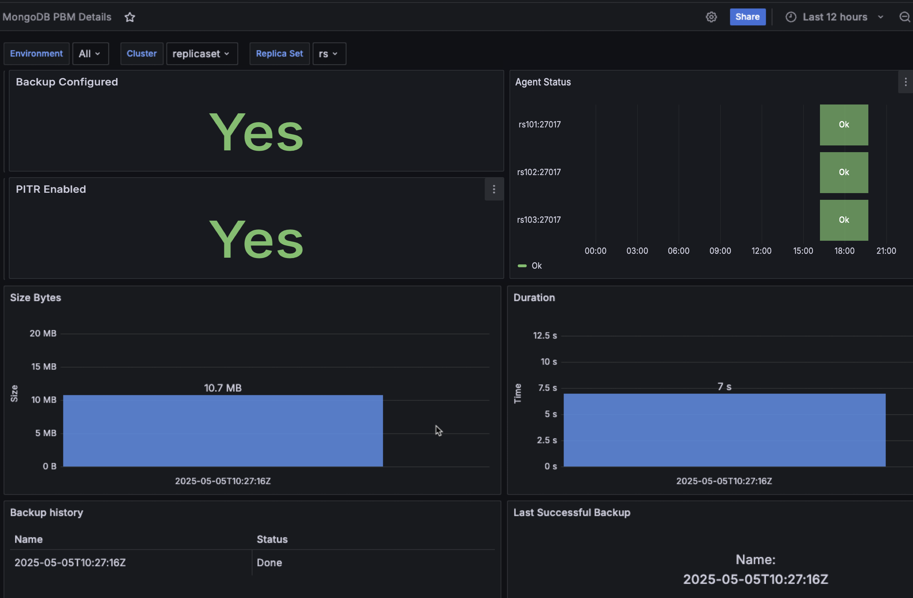

# Percona Monitoring and Management 3.2.0 

| **Release date** | May 15th, 2025                                                                                  |
| ----------------- | :---------------------------------------------------------------------------------------------- |
| **Installation** | [Installing Percona Monitoring and Management](../quickstart/quickstart.md) |
| **Upgrade**| [Migrate PMM 2 to PMM 3](../pmm-upgrade/migrating_from_pmm_2.md)

Percona Monitoring and Management (PMM) is an open source database monitoring, management, and observability solution for MySQL, PostgreSQL, and MongoDB.

PMM empowers you to: 

- monitor the health and performance of your database systems
- identify patterns and trends in database behavior
- troubleshoot issues effectively
- execute database management tasks seamlessly, whether your databases are on-premises or in the cloud

## Release summary

## Release highlights

### Native PMM Client support for Amazon Linux 2023
PMM 3.2.0 introduces official RPM package support for installing the PMM Client on Amazon Linux 2023. If you’ve been deploying PMM Client on AL2023 and relying on tarball-based installation workarounds, you no longer need to — you can now install the Client through native RPM packages.

This streamlines the setup process and integrates more seamlessly with your AL2023 environment, making it quicker and easier to get started with monitoring databases.

### New dashboard for Percona Backup for MongoDB (PBM)
PMM now includes MongoDB PBM Details dedicated dashboard for monitoring PBM activity. If you're using PBM alongside PMM, this dashboard gives you clear visibility into backup status and metrics collected by the PBM collector.

It allows you to monitor backup execution, track activity across sharded clusters and replica sets, and correlate backup data with existing alerts.

### Enhanced MySQL 8.4 support

PMM 3.2.0 completes our support for MySQL 8.4. While PMM 3.0.0 provided partial support with Query Analytics (QAN) and basic dashboard features, it couldn't monitor replication metrics due to MySQL 8.4's shift in exposing replication status from traditional status variables to `performance_schema` tables.

With this release, we've upgraded the MySQL Exporter to version 0.17.2, enabling it to collect replication metrics from both legacy status variables and the new `performance_schema` tables. We've also reconfigured the **MySQL Replication Summary** dashboard to display these metrics properly regardless of their source.

This means that PMM can now provide complete replication monitoring across all supported MySQL versions (5.7, 8.0, and 8.4), including critical metrics like IO Thread status, SQL Thread status, and Replication Lag.

### GSSAPI authentication support for MongoDB
You can now connect to MongoDB (and Percona Server for MongoDB) using the [GSSAPI authentication mechanism](https://www.mongodb.com/docs/manual/tutorial/control-access-to-mongodb-with-kerberos-authentication/), commonly used in Kerberos environments.

If you previously encountered errors when attempting to monitor MongoDB with GSSAPI (e.g., GSSAPI support not enabled during build), this update resolves the issue. You can now pass the appropriate GSSAPI credentials and connection parameters using pmm-admin, improving compatibility with secure enterprise environments that rely on Kerberos. For setup instructions, see the [PSMDB documentation](https://docs.percona.com/percona-server-for-mongodb/8.0/).

### Secure external ClickHouse connections 
PMM now supports connecting to external ClickHouse servers using authenticated credentials. You can now set the `PMM_CLICKHOUSE_USER` and `PMM_CLICKHOUSE_PASSWORD` environment variables when deploying PMM Server to enable access to password-protected ClickHouse instances, such as those managed by Altinity’s operator. This resolves previous authentication errors and removes the need to embed credentials in the address string.

### Improved Query Analytics filter performance
We've significantly improved Query Analytics (QAN) filter loading performance by optimizing the database queries that power the filter sidebar. The optimization reduced the number of processed rows by up to 95% in large environments, resulting in faster filter population and more responsive QAN interface.

### New PBM Details dashboard for MongoDB backups

The new PBM Details dashboard makes it easier to monitor your MongoDB backups directly from PMM. Powered by the PBM collector, the dashboard offers a unified, real-time view of all your backup activity across replica sets and sharded clusters. It displays key information such as backup status, configuration, size, duration, PITR status, and details of the most recent successful backup—all in one place.

If you're already using Percona Backup for MongoDB (PBM) with PMM, this integration lets you track backup operations without switching between tools.

To get started, open the [PBM Details dashboard](../reference/dashboards/dashboard-mongodb-mmapv1-details.md) and see how it works with your MongoDB environments.

Future releases will improve the **Backup history** panel to better display certain error states and special conditions (like "stuck" or "incompatible" backups) that are currently only visible when using `PBM's pbm status` command directly.

## Improvements

- [PMM-13406](https://perconadev.atlassian.net/browse/PMM-13869)- We've integrated HashiCorp Nomad into PMM — a powerful workload orchestrator designed to improve resource allocation and enable future extensibility.
Nomad is disabled by default, and although the Docker image size has slightly increased, this additional footprint has no impact on performance when Nomad remains disabled.

    Initially, Nomad will assist with managing monitoring agents, enhancing service delivery for Percona customers, and providing a foundation for future feature development. For more information, see [Nomad configuration for Percona teams](../reference/nomad.md). 

- [PMM-13869](https://perconadev.atlassian.net/browse/PMM-13869) - PMM now outputs Nginx access logs in LOGFMT format, ensuring consistency across all PMM components. This also improves compatibility with log analysis tools like Loki and VictoriaLogs, which means that you can analyze logs directly without reformatting or manual parsing.

- [PMM-13939](https://perconadev.atlassian.net/browse/PMM-13939) - Improved the performance of a frequently used query in Query Analytics (QAN) by optimizing the number of rows fetched from the database. This change reduces the time it takes to display QAN filters, resulting in a smoother user experience.

- [PMM-13873](https://perconadev.atlassian.net/browse/PMM-13873) - Upgraded MySQL Exporter to the upstream version 0.17.2, which support MySQL version 8.4. “MySQL Replication Summary” and "MySQL Group Replication Summary" dashboards have been updated to support this version.

- [PMM-13824](https://perconadev.atlassian.net/browse/PMM-13824) - Updated **MongoDB Replicaset summary dashboard** and **MongoDB Sharded cluster summary** dashboard with a new panel to show current Feature Compatibility Version. We've also added panels to show Nodes, Databases count and Last election time.

## Fixed issues

- [PMM-13770](https://perconadev.atlassian.net/browse/PMM-13770) - 
- [PMM-13780](https://perconadev.atlassian.net/browse/PMM-13780) - Fixed an issue in the SQL query parser that prevented group replication metrics from being collected. The **MySQL Group Replication Summary** dashboard now properly displays transaction and conflict metrics for MySQL 8.0 and 8.4 environments.

- [PMM-13635](https://perconadev.atlassian.net/browse/PMM-13635) - Fixed an issue in the **MongoDB collections overview dashboard** where computation of the values for a few panels were incorrect. Fixed the Top 5 Databases By Size panel to show correct data based on the MongoDB node and Replication set filters.
