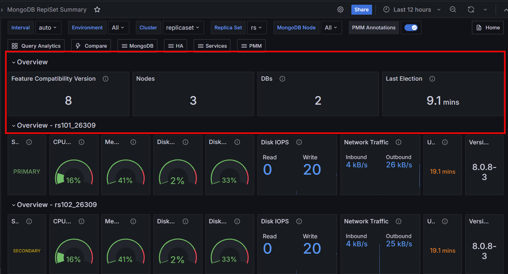

# Percona Monitoring and Management 3.2.0 

| **Release date** | May 29th, 2025                                                                                  |
| ----------------- | :---------------------------------------------------------------------------------------------- |
| **Installation** | [Installing Percona Monitoring and Management](../quickstart/quickstart.md) |
| **Upgrade**| [Migrate PMM 2 to PMM 3](../pmm-upgrade/migrating_from_pmm_2.md)

Percona Monitoring and Management (PMM) is an open source database monitoring, management, and observability solution for MySQL, PostgreSQL, and MongoDB.

PMM empowers you to: 

- monitor the health and performance of your database systems
- identify patterns and trends in database behavior
- troubleshoot issues effectively
- execute database management tasks seamlessly, whether your databases are on-premises or in the cloud

## Release summary

## Release highlights

### Native PMM Client support for Amazon Linux 2023
PMM 3.2.0 introduces official RPM package support for installing the PMM Client on Amazon Linux 2023. If you’ve been deploying PMM Client on AL2023 and relying on tarball-based installation workarounds, you no longer need to — you can now install the Client through native RPM packages.

This streamlines the setup process and integrates more seamlessly with your AL2023 environment, making it quicker and easier to get started with monitoring databases.

### Enhanced MySQL 8.4 support
PMM 3.2.0 completes our support for MySQL 8.4. While PMM 3.0.0 provided partial support with Query Analytics (QAN) and basic dashboard features, it couldn't monitor replication metrics due to MySQL 8.4's shift in exposing replication status from traditional status variables to `performance_schema` tables.

With this release, we've upgraded the MySQL Exporter to version 0.17.2, enabling it to collect replication metrics from both legacy status variables and the new `performance_schema` tables. We've also reconfigured the **MySQL Replication Summary** dashboard to display these metrics properly regardless of their source.

This means that PMM can now provide complete replication monitoring across all supported MySQL versions (5.7, 8.0, and 8.4), including critical metrics like IO Thread status, SQL Thread status, and Replication Lag.

### Grafana 11.6 update

PMM now ships with [Grafana 11.6](https://grafana.com/docs/grafana/latest/whatsnew/whats-new-in-v11-6/), which delivers enhanced visualization capabilities, a streamlined alerting experience, and a wide range of performance and UI improvements:

- [Alert state history](https://grafana.com/docs/grafana/latest/alerting/monitor-status/view-alert-state-history/) allows you to review historical changes in alert statuses over time. Full functionality requires [Grafana Loki](https://grafana.com/oss/loki/) for log aggregation and [specific Grafana configuration](https://grafana.com/docs/grafana/latest/alerting/monitor-status/view-alert-state-history/) to enable centralized tracking and storage.
- Improved panel features and [actions visualization](https://grafana.com/docs/grafana/latest/whatsnew/whats-new-in-v11-3/#actions-for-visualizations) for better dashboard interactivity
- [Simplified alert creation](https://grafana.com/docs/grafana/latest/whatsnew/whats-new-in-v11-3/#simplified-query-section-for-alert-rule-creation) with improved UI workflows
- [Recording rules](https://grafana.com/docs/grafana/latest/whatsnew/whats-new-in-v11-3/#recording-rules-for-grafana-managed-alerts) for creating pre-computed metrics to optimize dashboard performance

Dashboard improvements:
- [Navigation bookmarks](https://grafana.com/docs/grafana/latest/whatsnew/whats-new-in-v11-2/#navigation-bookmarks) for quick access to frequently used dashboards
- [State timeline supports pagination](https://grafana.com/docs/grafana/latest/whatsnew/whats-new-in-v11-2/#state-timeline-supports-pagination) for better performance with large datasets
- [Centralized alert history page](https://grafana.com/docs/grafana/latest/whatsnew/whats-new-in-v11-2/#centralized-alert-history-page) for managing all alert rules
- Improved [Grafana Scenes](https://grafana.com/docs/grafana/latest/whatsnew/whats-new-in-v11-3/#scenes-powered-dashboards-are-generally-available) support for modern dashboard architecture

### Secure external ClickHouse connections 
PMM now supports connecting to external ClickHouse servers using authenticated credentials. You can now set the `PMM_CLICKHOUSE_USER` and `PMM_CLICKHOUSE_PASSWORD` environment variables when deploying PMM Server to enable access to password-protected ClickHouse instances, such as those managed by Altinity’s operator. This resolves previous authentication errors and removes the need to embed credentials in the address string.

### Feature Compatibility Version (FCV) panel in MongoDB dashboards
PMM now shows the current MongoDB Feature Compatibility Version (FCV) in the  **MongoDB Replica Set** and **MongoDB Sharded Cluster Summary** dashboards. 

This panel helps you quickly see if your cluster is running the expected FCV—especially after upgrades, when the FCV might not match the MongoDB version yet.

### Label-based access control for Query Analytics
Query Analytics (QAN)| now supports label-based access control (LBAC), enabling fine-grained, role-based visibility into query data. Users only see the databases and services permitted by their roles—filter options are automatically restricted based on labels.

This makes it easy to limit access by technology (e.g., MySQL-only), environment (e.g., production), or region, enhancing both security and clarity.
To test it, set up a PMM Server, connect MySQL and PostgreSQL databases, enable access control, and define roles using [LBAC selectors](../admin/roles/access-control/intro.md).

### Improved Query Analytics filter performance
We've significantly improved Query Analytics (QAN) filter loading performance by optimizing the database queries that power the filter sidebar. The optimization reduced the number of processed rows by up to 95% in large environments, resulting in faster filter population and more responsive QAN interface.

### New PBM Details dashboard for MongoDB backups

The new PBM Details dashboard makes it easier to monitor your MongoDB backups directly from PMM. Powered by the PBM collector, the dashboard offers a unified, real-time view of all your backup activity across replica sets and sharded clusters. It displays key information such as backup status, configuration, size, duration, PITR status, and details of the most recent successful backup—all in one place.

If you're already using Percona Backup for MongoDB (PBM) with PMM, this integration lets you track backup operations without switching between tools.

To get started, open the [PBM Details dashboard](../reference/dashboards/dashboard-mongodb-PBM-details.md) and see how it works with your MongoDB environments.

Future releases will improve the **Backup history** panel to better display certain error states and special conditions (like "stuck" or "incompatible" backups) that are currently only visible when using `PBM's pbm status` command directly.

## Improvements

- [PMM-13406](https://perconadev.atlassian.net/browse/PMM-13406), [PMM-13458](https://perconadev.atlassian.net/browse/PMM-13406) - We've integrated HashiCorp Nomad into PMM — a workload orchestrator that improves resource allocation and enable future extensibility. Nomad is disabled by default, and although the Docker image size has slightly increased, this additional footprint has no impact on performance when Nomad remains disabled.

Initially, Nomad will assist with managing monitoring agents, enhancing service delivery for Percona customers, and providing a foundation for future feature development.

As part of this integration, the Nomad API (running on port 4646 internally) is now accessible via the standard PMM HTTPS port with the `/nomad` prefix for users with administrator privileges. For more information, see [Nomad configuration for Percona teams](../reference/nomad.md). 

- [PMM-13644](https://perconadev.atlassian.net/browse/PMM-13644) - Added a default 30-day retention policy for ClickHouse system log tables (`trace_log`, `metric_log`, `query_log`). This ensures that recent logs remain available for troubleshooting while older entries are automatically deleted, to avoid ClickHouse issues that could prevent PMM from collecting metrics and display dashboard data. You can customize the retention by updating the Time-To-Live (TTL) expression (`event_date + INTERVAL X DAY DELETE`) in the ClickHouse configuration.

- [PMM-13752](https://perconadev.atlassian.net/browse/PMM-13752) - Introduced a new **PBM Details** dashboard for MongoDB backups that provides comprehensive monitoring of backup operations directly within PMM. 

- [PMM-13463](https://perconadev.atlassian.net/browse/PMM-13463) - PMM now ships with Grafana 11.6, bringing a suite of enhancements to visualization, alerting, and dashboard interactivity. 

[PMM-13453](https://perconadev.atlassian.net/browse/PMM-13453) - Improved how PMM checks for updates. Automatic checks now use cached information to reduce system load, while clicking **Check for updates** on the **Updates** page performs a thorough check for the latest versions. This ensures you get the most accurate information when explicitly checking for updates, while improving overall system performance.

- [PMM-13869](https://perconadev.atlassian.net/browse/PMM-13869) - PMM now outputs Nginx access logs in LOGFMT format, ensuring consistency across all PMM components. This also improves compatibility with log analysis tools like Loki and VictoriaLogs, which means that you can analyze logs directly without reformatting or manual parsing.

- [PMM-13939](https://perconadev.atlassian.net/browse/PMM-13939) - Improved the performance of a frequently used query in Query Analytics (QAN) by optimizing the number of rows fetched from the database. This change reduces the time it takes to display QAN filters, resulting in a smoother user experience.

- [PMM-13873](https://perconadev.atlassian.net/browse/PMM-13873) - Upgraded MySQL Exporter to the upstream version 0.17.2, which support MySQL version 8.4. “MySQL Replication Summary” and "MySQL Group Replication Summary" dashboards have been updated to support this version.

- [PMM-13824](https://perconadev.atlassian.net/browse/PMM-13824) - Updated **MongoDB Replicaset summary dashboard** and **MongoDB Sharded cluster summary** dashboard with a new panel to show current Feature Compatibility Version. We've also added panels to show Nodes, Databases count and Last election time.

- [PMM-13210](https://perconadev.atlassian.net/browse/PMM-13210) - Upgraded VictoriaMetrics to version 1.114.0. This version includes key upstream improvements and fixes, ensuring more reliable metric collection, storage, and faster data access in PMM.

- [PMM-13937](https://perconadev.atlassian.net/browse/PMM-13770) - Improved the output of the `pmm-admin list` command to exclude the `nomad_agent` from the output when it's stopped or not running. This helps you get a cleaner representation of active PMM services.

- [PMM-13785](https://perconadev.atlassian.net/browse/PMM-13785) - Introduced official RPM package support for installing PMM Client on AL2023 environments, eliminating the need for tarball-based installation workarounds. 

- [PMM-13937](https://perconadev.atlassian.net/browse/PMM-13770) - We've revised the [PMM installation documentation](https://docs.percona.com/percona-monitoring-and-management/3/install-pmm/index.html) to enhance technical accuracy, clarity, and usability. As we continue to refine the topics in this chapter, we welcome your feedback to help us make the documentation even better.

- [PMM-13171](https://perconadev.atlassian.net/browse/PMM-13171) - Added support for connecting to external ClickHouse databases with custom user credentials using the `PMM_CLICKHOUSE_USER` and `PMM_CLICKHOUSE_PASSWORD` environment variables. 

- [PMM-13139](https://perconadev.atlassian.net/browse/PMM-13139) - Fixed an issue in the [ProxySQL Instance Summary dashboard](../reference/dashboards/dashboard-proxysql-instance-summary.md) where panels were not correctly filtered by the selected ProxySQL instance. Panels like **Executed queries**, **Queries execution time**, and **Queries Latency** now accurately display data specific to the chosen ProxySQL instance. For a more granular analysis, we've also added a **Hostgroup** filter.

- [PMM-12153](https://perconadev.atlassian.net/browse/PMM-12153)Updated `mysqld_exporter` to the latest stable version (v0.17.2), ensuring alignment with upstream developments and providing the latest features and fixes for collecting MySQL metrics.

## Fixed issues

- [PMM-13766](https://perconadev.atlassian.net/browse/PMM-13766) - Fixed a security issue where TLS certificates and private keys were not being deleted from PMM Client's temporary directories after removing the service. PMM now properly cleans up security-sensitive file when you remove services.

- [PMM-13958](https://perconadev.atlassian.net/browse/PMM-13958) - PMM Server would fail to recognize `PMM_POSTGRES_*` environment variables for configuring external PostgreSQL connections. Since PMM requires a database to function, it would start its internal PostgreSQL instance as a fallback, even when `PMM_DISABLE_BUILTIN_POSTGRES=1` was explicitly set. This is now fixed and PMM Server correctly processes these environment variables, so that external PostgreSQL databases can be correctly configured and accessed.

- [PMM-13780](https://perconadev.atlassian.net/browse/PMM-13780) - Fixed an issue in the SQL query parser that prevented group replication metrics from being collected. The **MySQL Group Replication Summary** dashboard now properly displays transaction and conflict metrics for MySQL 8.0 and 8.4 environments.

- [PMM-13635](https://perconadev.atlassian.net/browse/PMM-13635) - Fixed calculation issues in the **MongoDB Collections Overview** dashboard that previously resulted in empty or incorrect data displays. The dashboard now properly handles filter selections and displays accurate metrics. The **Top 5 Databases By Size** panel particularly benefits from these improvements, correctly showing database sizes when filtering data by specific MongoDB nodes or by MongoDB replica sets. 

- [PMM-13694](https://perconadev.atlassian.net/browse/PMM-13694) - Fixed an issue where PostgreSQL QPS calculations were incorrect in Query Analytics (QAN) when using non-default `pg_stat_statements.max` values greater than `5000`.

- [PMM-13941](https://perconadev.atlassian.net/browse/PMM-13941) - The ProxySQL exporter would incorrectly transition to a `Done` status instead of `Running` after being added for monitoring. This prevented the exporter from collecting metrics from ProxySQL instances, resulting in PMM being unable to accurately track ProxySQL performance. This issue is now fixed.

- [PMM-13916](https://perconadev.atlassian.net/browse/PMM-13916) - Fixed an issue  caused `pmm-admin list` to crash due to an "unhandled Agent type nomad-client" error. PMM can now properly handle this type of agent when listing services.

- [PMM-13909](https://perconadev.atlassian.net/browse/PMM-13909) - Fixed an issue where the Services list under **PMM Inventory** would automatically reset to page 1 while browsing other pages. You can now navigate through multiple pages of services without unexpected page resets.

- [PMM-13897](https://perconadev.atlassian.net/browse/PMM-13897) - Fixed an issue in Query Analytics (QAN) where selecting MongoDB Plan Summary filters containing bracketed expressions (such as "EXPRESS_IXSCAN { id: 1 }") would trigger internal server errors. PMM can now handle  special characters in filter values, regardless of their syntax complexity.

- [PMM-13807](https://perconadev.atlassian.net/browse/PMM-13807) - `pmm-agent` would crash when processing MySQL slow-log entries containing queries with a column named *Value*. This is now fixed and PMM properly monitors all SQL queries, regardless of column naming.

- [PMM-13794](https://perconadev.atlassian.net/browse/PMM-13794) - Fixed an API issue in PMM High Availability (HA) setup where the` /v1/server/leaderHealthCheck` endpoint was returning an internal server error when used as a health check target in HAProxy configurations.

- [PMM-13757](https://perconadev.atlassian.net/browse/PMM-13757) - Fixed an issue where MySQL query fingerprints sometimes incorrectly showed the execution time limit number (from `/*+ MAX_EXECUTION_TIME(<number>) */`) instead of a `?`. These numbers are now always replaced with `?` for consistent query analysis. 

- [PMM-13966](https://perconadev.atlassian.net/browse/PMM-13966) - Checking the **Explain** plan in QAN for queries that themselves contained the `EXPLAIN` keyword would result in an error: `invalid GetActionRequest.ActionId: value length must be at least 1 runes`. This issue is now fixed and PMM now correctly handles such queries in QAN, indicating that running EXPLAIN on queries that already contain the EXPLAIN keyword is not supported.

- [PMM-12784](https://perconadev.atlassian.net/browse/PMM-12784) - Fixed *invalid GetActionRequest.ActionId: value length must be at least 1 runes* error that occurred when switching rapidly between queries and tabs. This error was particularly noticeable when moving between the **Explain** and **Table** tabs for different queries. 

- [PMM-13968](https://perconadev.atlassian.net/browse/PMM-13968) - Fixed a bug in QAN with MySQL Performance Schema where the same query run on different databases was only counted in one. Now, QAN correctly tracks these queries separately for each database.

