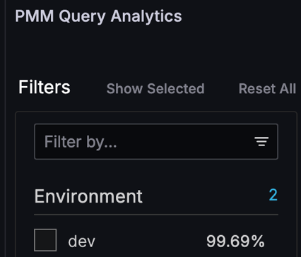

# Percona Monitoring and Management 3.2.0 

| **Release date** | May 15th, 2025                                                                                  |
| ----------------- | :---------------------------------------------------------------------------------------------- |
| **Installation** | [Installing Percona Monitoring and Management](../quickstart/quickstart.md) |
| **Upgrade**| [Migrate PMM 2 to PMM 3](../pmm-upgrade/migrating_from_pmm_2.md)

Percona Monitoring and Management (PMM) is an open source database monitoring, management, and observability solution for MySQL, PostgreSQL, and MongoDB.

PMM empowers you to: 

- monitor the health and performance of your database systems
- identify patterns and trends in database behavior
- troubleshoot issues effectively
- execute database management tasks seamlessly, whether your databases are on-premises or in the cloud

## Release summary

## Release highlights

### Enhanced MySQL 8.4 support

PMM 3.2.0 completes our support for MySQL 8.4. While PMM 3.0.0 provided partial support with Query Analytics (QAN) and basic dashboard features, it couldn't monitor replication metrics due to MySQL 8.4's shift in exposing replication status from traditional status variables to `performance_schema` tables.

With this release, we've upgraded the MySQL Exporter to version 0.17.2, enabling it to collect replication metrics from both legacy status variables and the new `performance_schema` tables. We've also reconfigured the **MySQL Replication Summary** dashboard to display these metrics properly regardless of their source.

This means that PMM can now provide complete replication monitoring across all supported MySQL versions (5.7, 8.0, and 8.4), including critical metrics like IO Thread status, SQL Thread status, and Replication Lag.

### Improved Query Analytics filter performance
We've significantly improved Query Analytics (QAN) filter loading performance by optimizing the database queries that power the filter sidebar. The optimization reduced the number of processed rows by up to 95% in large environments, resulting in faster filter population and more responsive QAN interface.

## Improvements

- [PMM-13406](https://perconadev.atlassian.net/browse/PMM-13869)- We've integrated HashiCorp Nomad into PMM — a powerful workload orchestrator designed to improve resource allocation and enable future extensibility.
Nomad is disabled by default, and although the Docker image size has increased slightly, this additional footprint has no impact on performance when Nomad remains disabled.

    Initially, Nomad will assist with managing monitoring agents, enhancing service delivery for Percona customers, and providing a foundation for future feature development. For more information, see [Nomad configuration for Percona teams](../reference/nomad.md). 

- [PMM-13869](https://perconadev.atlassian.net/browse/PMM-13869) - PMM now outputs Nginx access logs in LOGFMT format, ensuring consistency across all PMM components. This also improves compatibility with log analysis tools like Loki and VictoriaLogs, which means that you can analyze logs directly without reformatting or manual parsing.

- [PMM-13939](https://perconadev.atlassian.net/browse/PMM-13939) - Improved the performance of a frequently used query in Query Analytics (QAN) by optimizing the number of rows fetched from the database. This change reduces the time it takes to display QAN filters, resulting in a smoother user experience.

- [PMM-13873](https://perconadev.atlassian.net/browse/PMM-13873) - Upgraded MySQL Exporter to the upstream version 0.17.2, which support MySQL version 8.4. “MySQL Replication Summary” and "MySQL Group Replication Summary" dashboards have been updated to support this version.

## Fixed issues

- [PMM-13770](https://perconadev.atlassian.net/browse/PMM-13770) - 
- [PMM-13780](https://perconadev.atlassian.net/browse/PMM-13780) - Fixed an issue in the SQL query parser that prevented group replication metrics from being collected. The **MySQL Group Replication Summary** dashboard now properly displays transaction and conflict metrics for MySQL 8.0 and 8.4 environments.
