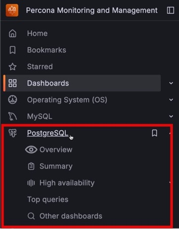

# Percona Monitoring and Management 3.3.0 

| **Release date** | June 30th, 2025                                                                                  |
| ----------------- | :---------------------------------------------------------------------------------------------- |
| **Installation** | [Installing Percona Monitoring and Management](../quickstart/quickstart.md) |
| **Upgrade**| [Migrate PMM 2 to PMM 3](../pmm-upgrade/migrating_from_pmm_2.md) |

Percona Monitoring and Management (PMM) is an open source database monitoring, management, and observability solution for MySQL, PostgreSQL, and MongoDB. PMM empowers you to: 

- monitor the health and performance of your database systems
- identify patterns and trends in database behavior
- diagnose and resolve issues faster with actionable insights
- manage databases across on-premises, cloud, and hybrid environments

## Release summary
## Release highlights

### Enhanced PostgreSQL monitoring with replication support

PMM 3.3.0 transforms PostgreSQL monitoring with enhanced existing dashboards, five new production-ready dashboards, replication monitoring and a redesigned menu structure for easier navigation.

New PostgreSQL dashboards:

-  [Replication Overview](../reference/dashboards/dashboard-postgresql-replication.md): Track replication lag and primary-replica relationships
-  [Top Queries](../reference/dashboards/dashboard-postgresql-topqueries.md): Find and optimize your slowest queries with time-based filtering
-  [Checkpoints, Buffers and WAL Usage](../reference/dashboards/dashboard-postgresql-checkpoints-buffers-wal-usage.md): Monitor checkpoint performance with I/O usage correlation
-  [Instances Overview Extended](../reference/dashboards/dashboard-postgresql-instances-overview-extended.md): Advanced metrics for detailed performance analysis
-  [Patroni Details](../reference/dashboards/dashboard-postgresql-patroni-details.md): High availability cluster monitoring (graduated from experimental)

Enhanced PostgreSQL dashboards:

- [Instance Summary](../reference/dashboards/dashboard-postgresql-instance-summary.md): Updated with wraparound metrics and top 10 database size analysis
- [PostgreSQL Instances Overview](../reference/dashboards/dashboard-postgresql-instances-overview.md): Improved organization and additional metrics

New capabilities:

- Transaction ID wraparound prevention with with new wraparound metrics
- Custom metric collection for monitoring beyond standard PostgreSQL statistics
- Better dashboard grouping to quickly spot issues across your PostgreSQL infrastructure
- New organized left menu structure with dedicated **High Availability** section:



Here's the revised version with your feedback implemented:

### MongoDB monitoring at scale with new log-based query source

We've introduced `mongolog`, a query source that eliminates connection pool exhaustion by collecting MongoDB metrics directly from log files instead of database queries.

In high-scale environments with 100+ databases, traditional profiler monitoring often fails with timeout errors as monitoring queries compete for limited connections. Mongolog solves this by using zero database connections while delivering identical query analytics data.

In addition, mongolog provides unlimited database scalability and support for restricted environments like `mongos` routers where `system.profile` access is unavailable.

To enable mongolog, add `--query-source=mongolog` when registering MongoDB services. For setup instructions, see [MongoDB Log-based Query Analytics](../use/connecting-databases/mongodb/mongolog.md).


## Platform support changes and deprecations

### Removed support for Ubuntu 20.04 LTS (Focal Fossa) 

Ubuntu 20.04 LTS (Focal Fossa) reached its End of Life on May 31, 2025. Consequently, we no longer build PMM Client packages for this platform. 

If your PMM Client is running on Ubuntu 20.04, upgrade your operating system to Ubuntu 22.04 LTS or a later version, and then reinstall PMM Client using the package version for your new Ubuntu release. 

Existing installations on Ubuntu 20.04 will continue to work but we will not release further updates. Source packages (.sdeb) are now built on Ubuntu 22.04 instead of Ubuntu 20.04. 


## Improvements

- [PMM-13970](https://perconadev.atlassian.net/browse/PMM-13970) - Added `--tls-skip-verify` flag for `pmm-admin add external`, `pmm-admin add external-serverless`, and `pmm-admin add haproxy` commands. This flag skips TLS certificate validation, enabling you to monitor services with self-signed certificates or IP-based endpoints that lack proper certificate SANs, including PostgreSQL Operator deployments with HAProxy.

- [PMM-14000](https://perconadev.atlassian.net/browse/PMM-14000), [PMM-13861](https://perconadev.atlassian.net/browse/PMM-13861), [PMM-13862](https://perconadev.atlassian.net/browse/PMM-13862), [PMM-13863](https://perconadev.atlassian.net/browse/PMM-13863), [PMM-13864](https://perconadev.atlassian.net/browse/PMM-13864), [PMM-13865](https://perconadev.atlassian.net/browse/PMM-13865), [PMM-13866](https://perconadev.atlassian.net/browse/PMM-13866), [PMM-13867](https://perconadev.atlassian.net/browse/PMM-13867), [PMM-13868](https://perconadev.atlassian.net/browse/PMM-13868) - Enhanced PostgreSQL monitoring with five new dashboards, improved existing dashboards, custom query support for specialized metrics, and a redesigned menu structure with dedicated **High Availability** section for better navigation.

- [PMM-12548](https://perconadev.atlassian.net/browse/PMM-12548) - Added `mongolog` query source for MongoDB that reads slow query logs from disk, eliminating connection pool exhaustion in environments with 100+ databases.


## Fixed issues
- [PMM-14113](https://perconadev.atlassian.net/browse/PMM-14113) - Fixed compatibility issues that prevented the Nomad agent from initializing correctly on Oracle Linux 8 environments.

- [PMM-14070](https://perconadev.atlassian.net/browse/PMM-14070) - The **Top 5 Databases By Size** chart was not displaying data due to an incorrect query configuration. The chart now correctly shows database size information.

- [PMM-14066](https://perconadev.atlassian.net/browse/PMM-14066) - Fixed an issue where MySQL services were not collecting metrics when database passwords contained special characters (such as `#`), which caused connection failures and prevented MySQL metrics from appearing in dashboards.


## Improvements

- [PMM-14059](https://perconadev.atlassian.net/browse/PMM-14059) - Improved the **Mongos Routers** graph in the **MongoDB Sharded Cluster Summary** dashboard to display individual router nodes with their status in hexagon format, providing consistency with **Config Servers** and shard displays instead of showing only a generic "OK" status.


## Known issue: PostgreSQL Query Analytics with `pg_stat_monitor`

When using `pg_stat_monitor` extension with `pg_stat_monitor.pgsm_enable_query_plan` enabled, Query Analytics (QAN) displays incorrect execution times that can be off by 1000x or more. For example, simple SELECT queries that should complete in milliseconds may appear to take 50,000+ seconds.

This is because enabling query plans causes `pg_stat_monitor` to create multiple records for each query, leading to incorrect timing calculations.

**Workaround**: Disable query plan collection to restore accurate timing metrics:
```sql
-- Check current setting
SHOW pg_stat_monitor.pgsm_enable_query_plan;

-- Disable query plan collection
ALTER SYSTEM SET pg_stat_monitor.pgsm_enable_query_plan = off;
SELECT pg_reload_conf();

-- Verify the change
SHOW pg_stat_monitor.pgsm_enable_query_plan;
```

