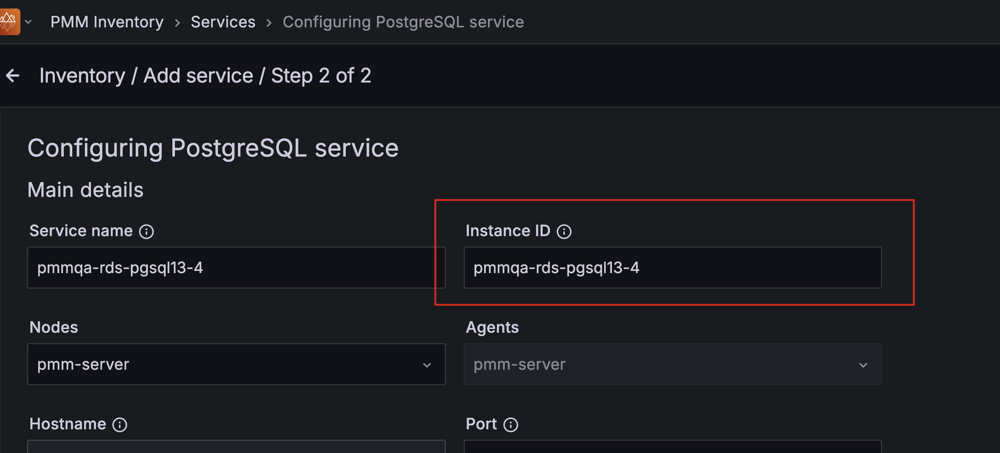

# Percona Monitoring and Management 3.4.0 

**Release date**:  September 16th 2025

Percona Monitoring and Management (PMM) is an open source database monitoring, management, and observability solution for MySQL, PostgreSQL, and MongoDB. PMM empowers you to: 

- monitor the health and performance of your database systems
- identify patterns and trends in database behavior
- diagnose and resolve issues faster with actionable insights
- manage databases across on-premises, cloud, and hybrid environments

## Release summary

This release improves enterprise deployments and monitoring reliability, including better OpenShift support and centralized `vmagent` management. It also enhances RDS tracking, adds RHEL 10 compatibility, and delivers key dashboard updates and bug fixes.

## Release highlights

### OpenShift support for PMM Server

Building on the existing OpenShift compatibility available for PMM Client, PMM 3.4.0 now extends full support to PMM Server as well. All PMM Docker images meet Red Hat certification requirements, including non-root user execution and SecurityContextConstraints (SCC) support. This means that you can seamlessly deploy both PMM Client and PMM Server in OpenShift environments.

While OpenShift 4.16 is fully tested and supported, other versions will likely work but not guaranteed. 
To deploy PMM Server on OpenShift using the standard Percona Helm charts with platform-specific parameters, see the [Install PMM Server on your Kubernetes cluster/Openshift clusters](../install-pmm/install-pmm-server/deployment-options/helm/index.md).

### Centralized `vmagent` settings for all clients

You can now centrally configure `vmagent` settings for all connected PMM Clients using environment variables.

Instead of configuring each client individually, set `VMAGENT_*` variables on the PMM Server to automatically apply `vmagent` settings across your entire monitoring infrastructure. 

This is particularly useful for Kubernetes environments where the default 1GB disk usage per client can overwhelm shared storage. For example, setting `VMAGENT_remoteWrite_maxDiskUsagePerURL=52428800` reduces disk usage to 50MB per client and applies to all connected clients without restarts.

For configuration options and examples, see [Configure environment variables for PMM Server](../install-pmm/install-pmm-server/deployment-options/docker/env_var.md#configure-vmagent-on-pmm-client).

### Enhanced management of RDS instances

PMM now supports tracking RDS Instance IDs when adding Amazon RDS databases to monitoring, making it easier to correlate instances between PMM and the AWS console.

When adding RDS instances via **Inventory > Add Service**, the instance ID that you specify will now be persisted. This optional field helps you manage large RDS deployments by providing a clear reference between monitored instances in PMM and their corresponding resources in AWS. 

Behind the scenes, we've added an `instance_id` column to the database and enhanced the `/v1/management/services` API endpoint to accept and return this information. Everything is backward compatible so existing RDS instances continue working normally. 

For technical details about API enhancements, see the [API Release Notes](https://percona-pmm.readme.io/v3/reference/release-notes-3-4-0).

### RHEL 10 support for PMM Client

PMM Client now supports Red Hat Enterprise Linux 10 (RHEL 10), allowing you to monitor databases and systems on the latest RHEL release. You can install native PMM Client packages for RHEL 10 on both AMD64 and ARM64 architectures. For detailed installation instructions, see [Install PMM Client with Package Manager](../install-pmm/install-pmm-client/package_manager.md).

For configuration options and examples, see [Configure environment variables for PMM Server](../install-pmm/install-pmm-server/deployment-options/docker/env_var.md#configure-vmagent-on-pmm-client).

### Support for MySQL Cleartext authentication 

PMM now supports monitoring MySQL instances that require cleartext authentication, including those using PAM authentication plugins (`auth_pam_compat`) or other external authentication methods.

When adding MySQL instances that use PAM or external authentication plugins, include the `allowCleartextPasswords=1` parameter in the DNS. For details, see [Connect MySQL databases to PMM](../install-pmm/install-pmm-client/connect-database/mysql/mysql.md#add-service-to-pmm#__tabbed_8_5).

!!! caution "Security warning"
    Cleartext authentication transmits passwords without encryption. Only use this option when the connection is secured with SSL/TLS or over a trusted network. This is typically required for authentication plugins like `auth_pam_compat` that need access to the actual password for external authentication.

### VMware support removed  

With this release, support for VMware-based PMM Server deployments is deprecated and will be **fully removed in PMM 3.6.0 (expected January 2026).**  

PMM 3 is built on a fully containerized architecture across all platforms for stronger security, simplified upgrades, and tighter alignment with modern DevOps practices. VMware’s proprietary model and recent licensing changes no longer fit this direction, so we are focusing on open, container-native platforms instead.  

#### Recommended alternatives  

For a smoother migration and long-term support, we recommend moving to one of the following supported platforms:  

- **Docker/Podman**: lightweight, container-native deployments designed for PMM 3  
- **Kubernetes/OpenShift**: full cloud-native orchestration at scale  
- **Oracle VirtualBox**: still supported for VM-style deployments, running the same containerized PMM architecture  

For detailed steps, see [Migrating PMM from VMware to alternative platforms](../pmm-upgrade/migrating_from_vmware.md).

## Improvements

- [PMM-14194](https://perconadev.atlassian.net/browse/PMM-14194): Custom filter groups in Query Analytics (QAN) now correctly distinguish between intentional comments and quoted strings containing comment-like characters. Previously, queries with values like `-- street = '123 Main St # app=something'` would incorrectly generate unwanted custom filters. 

Now, only genuine SQL comments such as `-- app='web', team='backend'` create filter options in the **PMM Query Analytics** dashboard sidebar. This means that you get cleaner query categorization when [comment parsing](/documentation/docs/use/qan/panels/filters.md#custom-filter-groups) is enabled.

- [PMM-14048](https://perconadev.atlassian.net/browse/PMM-14048): Reorganized MongoDB dashboards for better usability. The **MongoDB PBM Details** and **PBM Backup Details** dashboards are now available directly from the main navigation for easier access, while the **MongoDB InMemory Details** and **MongoDB WiredTiger Details** dashboards are now relocated to **Other Dashboards**.

- [PMM-13990](https://perconadev.atlassian.net/browse/PMM-13990): MongoDB monitoring now uses less CPU resources on your systems. We've optimized how the MongoDB exporter collects metrics, reducing its CPU usage by over 10% without affecting the data you see in dashboards.

- [PMM-11826 ](https://perconadev.atlassian.net/browse/PMM-11826 ): You can now configure `vmagent` settings on PMM Clients by setting `VMAGENT_` environment variables on the PMM Server. These variables automatically apply to all connected clients, allowing you to tune disk usage limits and other parameters centrally.

- [PMM-11826](https://perconadev.atlassian.net/browse/PMM-11826): Added support for PMM Client on Red Hat Enterprise Linux 10 (RHEL 10) for both AMD64 and ARM64 architectures.

- [PMM-13980](https://perconadev.atlassian.net/browse/PMM-13980): Improved [Back up PMM Server Docker container](../install-pmm/install-pmm-server/deployment-options/docker/backup_container.md) documentation for all PMM Server deployment types, including `pmm-data volume` procedures essential for migrating from PMM 2 to PMM 3.

## Components upgrade

- [PMM-14015](https://perconadev.atlassian.net/browse/PMM-14015): PMM now ships with Grafana 11.6.3 for enhanced security and improved performance.

## Fixed issues

- [PMM-14141](https://perconadev.atlassian.net/browse/PMM-14141): Fixed a critical issue where the MongoDB exporter would sometimes ignore connection timeouts. This prevented **MongoDB Down** alerts from triggering when MongoDB was unavailable. We've also improved the MongoDB down alert rule to work more reliably in timeout scenarios.

- [PMM-13885](https://perconadev.atlassian.net/browse/PMM-13885): You can now reliably enable and disable advisors on the **Advisors > Advisor Insights** page, as the toggle issue has been fixed. 

- [PMM-14178](https://perconadev.atlassian.net/browse/PMM-14178): Fixed inconsistent service status reporting for stopped MongoDB instances. Previously, stopped MongoDB services showed as **Unspecified** while MySQL and PostgreSQL correctly showed as **Down**. Now all database services consistently display **Down** when stopped.

- [PMM-14166 ](https://perconadev.atlassian.net/browse/PMM-14166): Fixed Grafana Image Renderer functionality for generating dashboard panel images and corrected the **View all snapshot** link. 

- [PMM-14137](https://perconadev.atlassian.net/browse/PMM-14137): Fixed an issue where the **MongoDB WiredTiger Details** dashboard would show empty data after page refresh. Dashboard variables now maintain their values correctly during refresh cycles.

- [PMM-14087](https://perconadev.atlassian.net/browse/PMM-14087): Fixed a PostgreSQL deadlock issue that sometimes occurred during PMM Server startup, which blocked adding remote instances.

- [PMM-14085](https://perconadev.atlassian.net/browse/PMM-14085): Fixed an issue where exported PMM data dumps from **PMM Home > Help > PMM Dump** were missing OS/host metrics and Query Analytics (QAN) data. Exports now include all metric types, providing complete data for troubleshooting and analysis.

- [PMM-14075](https://perconadev.atlassian.net/browse/PMM-14075): Fixed an issue where the **Oplog Recovery Window** chart appeared twice on the **MongoDB Oplog Details** dashboard. 

- [PMM-14065](https://perconadev.atlassian.net/browse/PMM-14065): Fixed an issue where the **Failed Advisors** panel on the **Home** dashboard would not update when using **Refresh** button on the dashboard. The panel now correctly displays updated advisor results when the dashboard is refreshed, without requiring a full page reload.

- [PMM-13997](https://perconadev.atlassian.net/browse/PMM-13997): Fixed an issue where upgrades failed for deployments using Helm chart version 1.4.0. Upgrades from this version now complete successfully.

- [PMM-13994](https://perconadev.atlassian.net/browse/PMM-13994): Fixed an issue where PMM agent would show **Disconnected** status after network problems, even when connectivity was restored. The agent now reconnects properly without having to restart it manually.

- [PMM-13654](https://perconadev.atlassian.net/browse/PMM-13654): The `pmm-dump version` command would display empty version and build information. This issue is now fixed. 

- [PMM-13828](https://perconadev.atlassian.net/browse/PMM-13828): Fixed an issue where the **MongoDB Sharded Cluster Summary** dashboard would incorrectly display replica set information when monitoring non-sharded MongoDB clusters. The dashboard now shows empty panels for replica set environments to prevent confusion between cluster types.

##  🚀  Ready to upgrade to PMM 3.4.0?

- **New installation:** [Install PMM with our quickstart guide](../quickstart/quickstart.md)

- **Upgrading from PMM 2:** [Migrate from PMM 2 to PMM 3](../pmm-upgrade/migrating_from_pmm_2.md)

- **Upgrading PMM 3:** [Upgrade your existing PMM 3 installation](../pmm-upgrade/index.md)