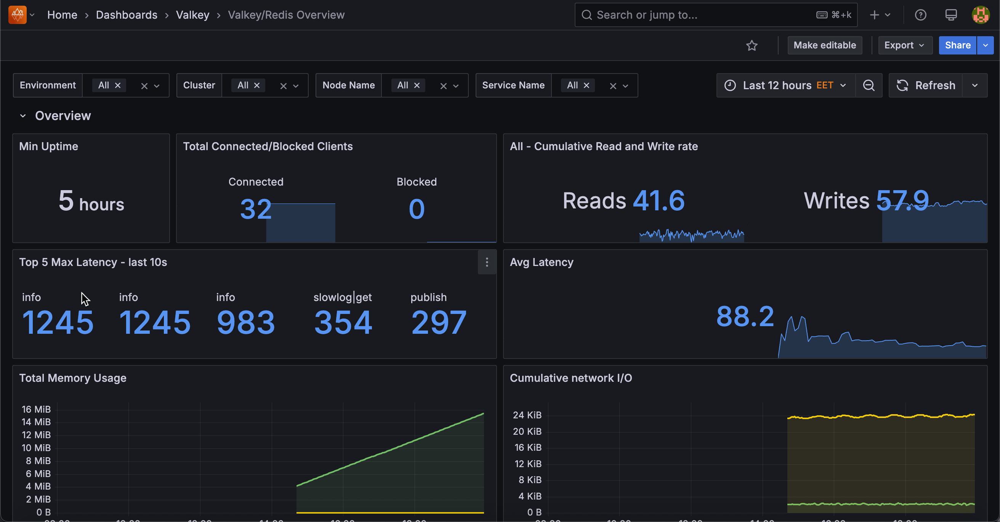

# Percona Monitoring and Management 3.5.0

**Release date**: 19 November 2025

Percona Monitoring and Management (PMM) is an open source database monitoring, management, and observability solution for MySQL, PostgreSQL, MongoDB, Valkey and Redis. PMM empowers you to: 


- monitor the health and performance of your database systems
- identify patterns and trends in database behavior
- diagnose and resolve issues faster with actionable insights
- manage databases across on-premises, cloud, and hybrid environments

## 📋 Release summary
This release introduces full Redis and Valkey monitoring, PostgreSQL 18 support, new built-in advisors and alert templates, and major MongoDB dashboard improvements. 

It also delivers enhanced TLS flexibility, improved Nomad GC configuration, and multiple performance fixes.

## ✨ Release highlights

### Free built-in advisors and alert templates replace Percona Platform

We're making Percona Monitoring and Management (PMM) more powerful and self-sufficient. 

As we prepare for the discontinuation of Percona Platform services in March 2026, we've migrated all database advisors, checks, and alert templates directly into PMM. They are now included by default, work completely offline, and require no subscription. 

This transition delivers a simpler PMM that runs all checks and alerts locally, without relying on internet access or external dependencies. Here’s what to expect from this change:

- **PMM 3.5.0+:** [Advisors](../advisors/advisors.md) and [alert templates](../alert/templates_list.md) are now built-in with every installation—completely free, with no subscription required. All advisors (previously across Basic, Standard, and Premium tiers) work seamlessly with no service interruption or changes to your workflow.

- **PMM 3.0.0 - 3.4.x:** Internet-connected PMM instances will continue receiving free advisors and templates from the Platform until its discontinuation in PMM 3.7.0. Once the Platform shuts down, you'll be prompted to upgrade to 3.5.0+ for continued access to advisors and templates. 

- **PMM 2.x:** PMM 2 is discontinued and Platform connectivity for advisors and templates will cease after its official End Of Life. To continue using advisors and alert templates, [upgrade using the recommended path](../pmm-upgrade/migrating_from_pmm_2.md).

- **Percona Account authentication:** With the Platform's discontinuation, the ability to sign into PMM using Percona Account credentials will no longer be available. [Migrate to a supported authentication method](../admin/manage-users/edit_users.md#migrate-from-percona-account-authentication-deprecated) before then to maintain access. PMM supports all authentication methods available in Grafana, including basic auth, LDAP, OAuth and SAML.

### Valkey and Redis monitoring support

PMM now provides native support for monitoring Valkey and Redis databases. Valkey is a high-performance open-source alternative to Redis that maintains full protocol compatibility, enabling PMM to monitor both databases using the same proven infrastructure.

For this, PMM includes ten dedicated Valkey/Redis dashboards that help you monitor performance, detect latency spikes, identify replication issues, and troubleshoot bottlenecks across your deployments:

- [**Overview**](../reference/dashboards/dashboard-valkey-redis-overview.md): summarizes deployment health and performance.
- [**Clients**](../reference/dashboards/dashboard-valkey-redis-clients.md): shows client connections, blocked clients, and buffer usage.
- [**Cluster Details**](../reference/dashboards/dashboard-valkey-redis-cluster-details.md): displays cluster topology, node roles, and replication offsets.
- [**Command Details**](../reference/dashboards/dashboard-valkey-redis-command-detail.md): analyzes command throughput, execution time, and latency patterns so you can optimize queries.
- [**Load**](../reference/dashboards/dashboard-valkey-redis-load.md): tracks workload distribution, read/write patterns, and CPU/I/O usage.
- [**Memory**](../reference/dashboards/dashboard-valkey-redis-memory.md): monitors memory use, eviction policies, and keyspace metrics.
- [**Network**](../reference/dashboards/dashboard-valkey-redis-network.md): shows network bandwidth and traffic patterns.
- [**Persistence**](../reference/dashboards/dashboard-valkey-redis-persistence-details.md): reviews RDB and AOF operations and rewrite performance.
- [**Replication**](../reference/dashboards/dashboard-valkey-redis-replication.md): tracks replication lag, synchronization status, and backlog.
- [**Slowlog**](../reference/dashboards/dashboard-valkey-redis-slowlog.md): identifies slow commands and pinpoints performance bottlenecks. Full Query Analytics (QAN) support for Valkey/Redis is planned for a future release. Use Valkey's built-in SLOWLOG command for detailed query analysis in the meantime.

To get started, see [Connect Valkey and Redis databases to PMM](../install-pmm/install-pmm-client/connect-database/valkey-redis.md).


### PostgreSQL 18 Community support

PMM now supports PostgreSQL 18 Community Edition, with full compatibility for dashboards and Query Analytics. 
Full support for all PostgreSQL 18 variants, along with enhanced metrics collection, is planned for PMM 3.6.0.

To connect your PostgreSQL 18 database to PMM, see [Connect PostgreSQL databases to PMM](../install-pmm/install-pmm-client/connect-database/postgresql.md).

### MongoDB dashboard improvements

We've made several enhancements to improve MongoDB monitoring:

- Renamed **Query Execution Times** panel to **Operation Latencies** in **Router Summary**, **Sharded Cluster Summary**, and **Replica Set Summary** dashboards for clarity
- Fixed duplicate service counts in MongoDB dashboards and node filtering issues in **Replica Set Summary**, **Cluster Summary**, and **Router Summary** dashboards
- Added idle connections metric to the **Connections** panel in **Cluster Summary** and **Replica Set Summary** dashboards to help identify performance issues:


### Query Analytics shows only your monitored databases

Query Analytics (QAN) now provides a cleaner view by excluding PMM Server's internal PostgreSQL queries from the default display.

This helps you focus on your database performance without the distraction of PMM's operational activity. If you need to monitor PMM Server queries for troubleshooting or High Availability scenarios, re-enable the option in **PMM Configuration > Settings > Advanced Settings**.

For details, see [QAN for PMM Server](../use/qan/index.md#qan-for-pmm-servers-internal-postgresql).


### Support for partial certificates for remote MySQL monitoring
PMM now supports adding remote MySQL instances using partial TLS configurations. You can configure TLS connections using only the CA certificate, without requiring client certificate and key files. 

This enables you to:

- monitor Azure MySQL Flexible Server and Google Cloud SQL (MySQL) using only the downloaded CA certificate file.

- simplify TLS setup by connecting with just the CA certificate, no client certificate or key required.

For instructions, see [Connect MySQL databases to PMM](../install-pmm/install-pmm-client/connect-database/mysql/mysql.md).

Similar support for PostgreSQL will be available in a future release.

### Improved data privacy: Disable query examples in the UI 

You can now enhance data privacy in PMM by disabling the collection and display of sensitive SQL queries when adding MySQL or PostgreSQL services.

The new **Disable query examples** option prevents PMM from showing full SQL queries containing real data in QAN.

When this option is enabled, the **Examples** tab in QAN will not display any query examples, helping protect sensitive information while still providing valuable performance insights.

To enable, go to **PMM Configuration > PMM Inventory > MySQL/PostgreSQL > Add Service > Additional Options** and select **Disable query examples**: 


### Configurable Nomad Garbage Collection

PMM now supports configuring Nomad client-side garbage collection (GC) through environment variables.

You can tune cleanup intervals, disk and inode thresholds, and allocation limits to reduce resource buildup and keep Nomad running efficiently over time.

For setup instructions, see [Configure Nomad GC settings](../install-pmm/install-pmm-server/deployment-options/docker/env_var.md#nomad-garbage-collection-gc-settings).

### New “Stale PBM Backup” alert template

Added a new alert template **Stale PBM Backup**, which triggers when no successful backup has occurred within your configured time window. 

This helps you ensure MongoDB backups run on schedule.

For details, see [Percona Backup for MongoDB templates](../alert/templates_list.md#pbm-percona-backup-for-mongodb-templates).

## 📦 Components upgrade

### ClickHouse 25.3.6.56
Upgraded from 23.8.2.7 to fix **CVE-2024-24790**. The new build uses Go 1.24.9, removes the vulnerable `clickhouse-diagnostics` tool, and includes performance, storage, and security improvements.

### Go runtime 1.24.9
All PMM components now use Go 1.24.9, resolving the following vulnerabilities in Go 1.24.7 (CVE-2025-47912, CVE-2025-58183, CVE-2025-58186, CVE-2025-58187, CVE-2025-58188, CVE-2025-61724). This update also provides general performance improvements.

### Watchtower
Upgraded to support Docker API 1.44+, resolving compatibility issues with modern Docker installations for reliable automatic PMM Server container updates.

## 🔒 Security updates

### Nomad Denial-of-Service vulnerability (CVE-2025-8959, CVE-2025-47913, CVE-2025-31133, CVE-2025-52565, CVE-2025-52881)
PMM 3.5.0 ships with Nomad v1.10.5, which is affected by a vulnerability in Go's crypto library. At the time of this release, Nomad v1.11.0 which contains the fix was not yet available.

For most PMM environments, the risk remains low because Nomad is disabled by default. We strongly recommend keeping Nomad disabled to avoid any potential exposure.

PMM 3.6.0 will include Nomad v1.11, which resolves this vulnerability.

### False-positive reported CVEs (PMM not affected)
Security scanning tools may flag the following CVEs. After a thorough review, we have confirmed that PMM 3.5.0 is not affected by these vulnerabilities.

#### OpenSSL cipher processing (CVE-2023-5363)
PMM is not affected by this vulnerability.

The `openssl-libs` package included in PMM's Oracle Linux 9 base operating system already contains the necessary security fix for this OpenSSL cipher processing issue. You can verify this in [Oracle's official security advisory ELSA-2024-0627](https://linux.oracle.com/errata/ELSA-2024-0627.html).

#### Remote code execution in Python Setuptools (CVE-2024-6345)
PMM is not affected by this vulnerability.

The PMM image's base OS, Oracle Linux 9, ships with `python3-setuptools` version 53.0.0-13.el9_6.1, which already includes the fix that addresses this vulnerability. You can confirm this through [Oracle's security advisory ELSA-2024-5534](https://linux.oracle.com/errata/ELSA-2024-5534.html).

#### Container runtime race conditions in Node Exporter (CVE-2025-31133, CVE-2025-52565, CVE-2025-52881)
PMM is not affected by these vulnerabilities.

Security scanning tools may flag race condition vulnerabilities in the `opencontainers/selinux`, which were fixed in this version.

### Accepted risk: OpenSSL buffer overflow vulnerabilities (CVE-2022-3786 and CVE-2022-3602)
These vulnerabilities affect the `openssl-libs` package that comes with PMM's Oracle Linux 9 base image.

Oracle has released patches for these vulnerabilities, but they are distributed exclusively through Ksplice, Oracle's live patching service, available only to customers with Premier Support.

Because PMM uses only publicly available repositories, we cannot include these Ksplice-only updates in the current release.

We assess this risk as low, as PMM is usually deployed in controlled environments. We will apply the updates as soon as Oracle releases them publicly for Oracle Linux.

## 📈 Improvements

- [PMM-14348](https://perconadev.atlassian.net/browse/PMM-14348): Added **Enable QAN for PMM Server** toggle in **PMM Configuration > Settings > Advanced Settings** to easily enable or disable Query Analytics for PMM Server's internal PostgreSQL database. Previously, this required API calls. The setting can also be controlled via the `PMM_ENABLE_INTERNAL_PG_QAN` environment variable.

- [PMM-14118](https://perconadev.atlassian.net/browse/PMM-14118) PMM now automatically generates SSL certificates for ClickHouse database connections to improve security and eliminate certificate error messages in ClickHouse logs.

- [PMM-10461](https://perconadev.atlassian.net/browse/PMM-10461): Improved compatibility with proxy servers. All Nginx redirects now use relative paths instead of a mix of absolute and relative redirects. This prevents issues with external proxies and aligns behavior with Grafana.

- [PMM-6659](https://perconadev.atlassian.net/browse/PMM-6659): Query Analytics now hides PMM Server's internal PostgreSQL queries by default, keeping the view focused on your monitored databases. You can re-enable this in **PMM Configuration > Settings > Advanced Settings** for troubleshooting or HA scenarios.

- [PMM-13782](https://perconadev.atlassian.net/browse/PMM-13782): We've removed **MySQL Query Response Time Details** from the main navigation menu. You can still access this dashboard in **Dashboards > MySQL** if you're a MariaDB user with the Query Response Time plugin enabled.
This change streamlines your navigation experience, as the dashboard only supports outdated Percona Server for MySQL 5.7. If you're using MySQL 8.0 or later, use Query Analytics (QAN) with Performance Schema.

- [PMM-14108](https://perconadev.atlassian.net/browse/PMM-14108): Added idle connections metric to the **Connections** panel available in **MongoDB Cluster Summary** and **Replica Set Summary** dashboards. Idle connections are now displayed alongside Available and Current connections to help identify potential performance issues.

- [PMM-14107](https://perconadev.atlassian.net/browse/PMM-14107): Renamed the **Query Execution Times** panel to **Operation Latencies** in **MongoDB Router Summary**, **Sharded Cluster Summary**, and **Replica Set Summary** dashboards to better reflect the actual metrics being displayed.

- [PMM-14271](https://perconadev.atlassian.net/browse/PMM-14271): Fixed misleading status indicators for disabled agents in PMM Inventory. Disabled agents now display <b style="color:#6C757D;">Disabled</b> status with grey background instead of **Unknown**, clearly indicating they are intentionally disabled rather than failing. The **Services** tab **Monitoring** status has been improved: services show <b style="color:#73BF69;">OK</b> (green) when only non-critical agents are disabled, <b style="color:#FF9830;">Warning</b> (orange) when multiple agents are disabled, and <b style="color:#e02f44;">Failed</b> (red) when agents are actually failing.

- [PMM-14006](https://perconadev.atlassian.net/browse/PMM-14006): Added **Disable query examples** checkbox when adding MySQL and PostgreSQL services. Enable this to prevent PMM from collecting full SQL queries with literal data values in Query Analytics, showing only query fingerprints instead. Available under **PMM Configuration > PMM Inventory > Add Service > Advanced Settings**.

- [PMM-14231](https://perconadev.atlassian.net/browse/PMM-14231): PMM now automatically includes a type label (`logical` or `physical`) in PBM backup metrics, so you can easily identify backup types and troubleshoot MongoDB backups more efficiently.

- [PMM-14157](https://perconadev.atlassian.net/browse/PMM-14157): Added the ***Stale PBM Backup** alert template to monitor missed or delayed MongoDB backups.

- [PMM-14355](https://perconadev.atlassian.net/browse/PMM-14355): Updated the **Home Dashboard** to show Valkey/Redis service counts in the **Monitored DB Services** and **Monitored DB Instances** panels. The layout was adjusted to prevent text overlap and hide services with a “0” count for a cleaner, more accurate overview.

- [PMM-14309](https://perconadev.atlassian.net/browse/PMM-14309): We’ve removed the **Connect to Percona Platform** banner to simplify the Advisors interface and reflect PMM’s new built-in, offline advisors.

- [PMM-13943](https://perconadev.atlassian.net/browse/PMM-13943): Added unique identifiers (UIDs) for datasources
Each datasource now has a fixed UID defined in datasources.yml. This prevents Grafana from generating random UIDs during provisioning and ensures consistent references across dashboards, upgrades, and alerts.

- [PMM-13781](https://perconadev.atlassian.net/browse/PMM-13781): Updated the navigation menu to remove the outdated **TokuDB** entry and restore **MyRocks**. PMM now correctly reflects support for MyRocks, an actively used storage engine, and no longer lists the deprecated TokuDB.

- [PMM-13103](https://perconadev.atlassian.net/browse/PMM-13103): PMM now allows adding remote MySQL instances using only a CA certificate, without requiring client certificate and key files. This simplifies TLS setup and enables monitoring for services like Azure MySQL Flexible Server and Google Cloud SQL (MySQL) using a single certificate.

## ✅ Fixed issues

- [PMM-14305](https://perconadev.atlassian.net/browse/PMM-14305): Fixed QAN service failures during PMM Server upgrades caused by interrupted database schema migrations. When the ClickHouse schema migration was interrupted, QAN would fail to start with "Dirty database version x" errors. PMM now automatically detects and completes the interrupted migration, allowing QAN dashboards to load normally.

- [PMM-14022](https://perconadev.atlassian.net/browse/PMM-14022): Fixed duplicate service counts in MongoDB dashboards and the MongoDB down alert rule on the **Alert rules** page caused by high-resolution and low-resolution exporter jobs being counted separately.

- [PMM-14106](https://perconadev.atlassian.net/browse/PMM-14106): Fixed **MongoDB Command Operations** and **Collection Details** panels in **Replica Set Summary**, **Cluster Summary**, and **Router Summary** dashboards to correctly apply the node filter selection. The panels now display data only for the selected node instead of always showing all nodes.

- [PMM-14504](https://perconadev.atlassian.net/browse/PMM-14504): Fixed an issue where QAN stopped working after adding or removing columns. QAN now handles column additions and removals correctly without triggering *"No queries available for this combination of filters"* errors.

- [PMM-14498](https://perconadev.atlassian.net/browse/PMM-14498): Fixed an issue where adding external services using `pmm-admin add external` would fail with an internal server error. You can now add external services successfully through both the command line and the user interface.

- [PMM-14435](https://perconadev.atlassian.net/browse/PMM-14435): Fixed Nginx routing issue that showed *"Unauthorized"* error instead of redirecting you to the login page when accessing PMM Server for the first time or after session expiration.

- [PMM-14430](https://perconadev.atlassian.net/browse/PMM-14430): Fixed the **Execution Time** panel in the **PostgreSQL Instances Overview** dashboard that was not displaying any data. The panel now correctly shows execution time metrics for all PostgreSQL services.

- [PMM-14265](https://perconadev.atlassian.net/browse/PMM-14265): Fixed an issue where the **MongoDB Router Summary** dashboard showed the Kubernetes node uptime instead of the actual mongos pod uptime. PMM now correctly reports the real uptime, CPU, and memory usage for each mongos pod.

- [PMM-14260](https://perconadev.atlassian.net/browse/PMM-14260): Fixed an issue where PostgreSQL metrics from `queries-hr.yml` were duplicated after upgrading to PMM 3.3.1. PMM now correctly labels metrics from different databases to prevent duplication errors and ensure accurate dashboard data.

- [PMM-14260](https://perconadev.atlassian.net/browse/PMM-14260): Fixed an issue preventing PMM Server from starting in OpenShift when using the `namespaceOverride` Helm option.

- [PMM-14205](https://perconadev.atlassian.net/browse/PMM-14205): Fixed Helm upgrade issues from PMM 2 where the PMM Server pod failed to start due to a missing `pmm-service-account`. The Helm chart now correctly handles service account creation during upgrades. If you’re upgrading from PMM 2, make sure you use the latest `values.yaml` or explicitly set `serviceAccount.create=true`.

- [PMM-14134](https://perconadev.atlassian.net/browse/PMM-14134): Fixed a bug in the **MySQL Replication Summary dashboard** where the **SQL Delay** metric in the **Replication Lag** panel could show incorrect values. It now accurately reflects the selected time range.

- [PMM-14081](https://perconadev.atlassian.net/browse/PMM-14081): Corrected a typo in the `azure_database_exporter` that prevented monitoring of Azure Database for MySQL Flexible Server instances. These servers are now properly discovered and monitored.
  
- [PMM-14071](https://perconadev.atlassian.net/browse/PMM-14071): Fixed broken **Service Summary** chart in the **MongoDB Instance Summary** dashboard that showed an error instead of data. It now displays metrics correctly.

- [PMM-14014](https://perconadev.atlassian.net/browse/PMM-14014): The **Open Source** link in the **Help** menu  now correctly opens the Grafana OSS page in a new tab.

- [PMM-11406](https://perconadev.atlassian.net/browse/PMM-11406): The **Service Summary** panel in the **MongoDB Instance Summary** dashboard now loads correctly for MongoDB 6.x and newer versions.

## 🔶 Known issues

### Docker v29.0.0 compatibility

PMM 3.5.0 has limited Watchtower support for Docker v29.0.0 due to API version incompatibility. If you're using Docker v29.0.0, work around this issue by setting the following environment variable when running PMM:

```sh
docker run -e DOCKER_API_VERSION=1.45 ...
```

A full Docker v29.0.0 update to Watchtower is planned for PMM 3.6.0.

### PMM Server restart issues on macOS Sequoia with Docker Desktop 4.49.0
- [PMM-14438](https://perconadev.atlassian.net/browse/PMM-14438): PostgreSQL and Grafana may fail to start on macOS Sequoia 15.7.1 (M2) with Docker Desktop 4.49.0. See [Troubleshooting](../troubleshoot/config_issues.md#pmm-server-inaccessible-after-docker-restart-on-macos-sequoia) for diagnostic steps.

## 🚀 Ready to upgrade to PMM 3.5.0?

- **New installation:** [Install PMM with our quickstart guide](../quickstart/quickstart.md)
- **Upgrading PMM 3:** [Upgrade your existing PMM 3 installation](../pmm-upgrade/index.md)
- **Upgrading from PMM 2:** [Migrate from PMM 2 to PMM 3](../pmm-upgrade/migrating_from_pmm_2.md)
